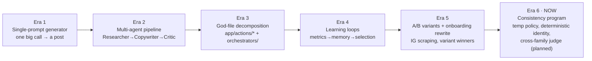
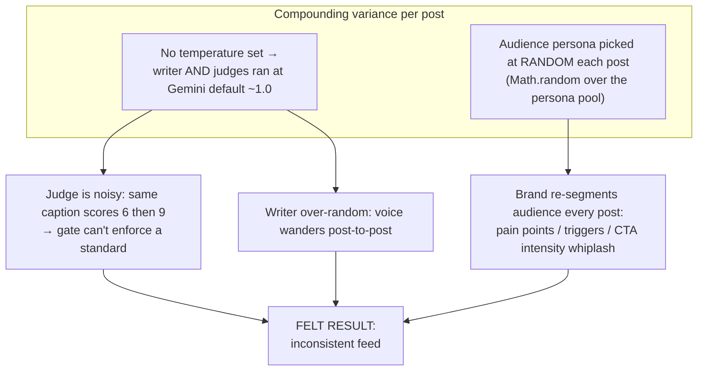
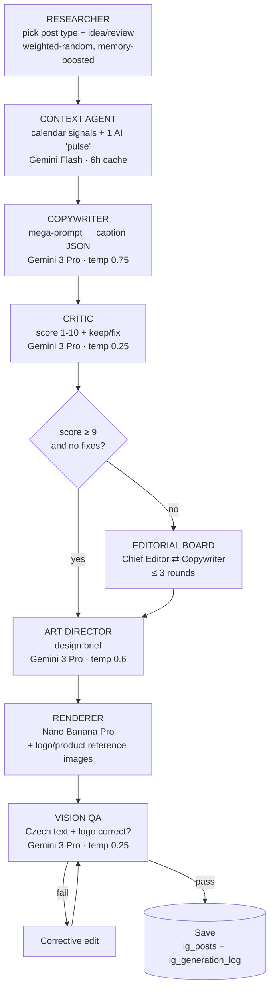
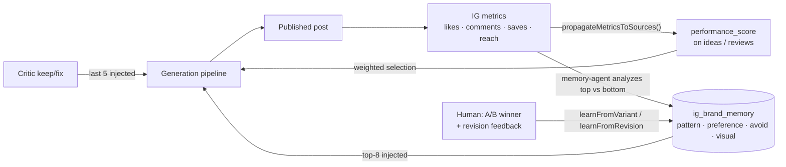
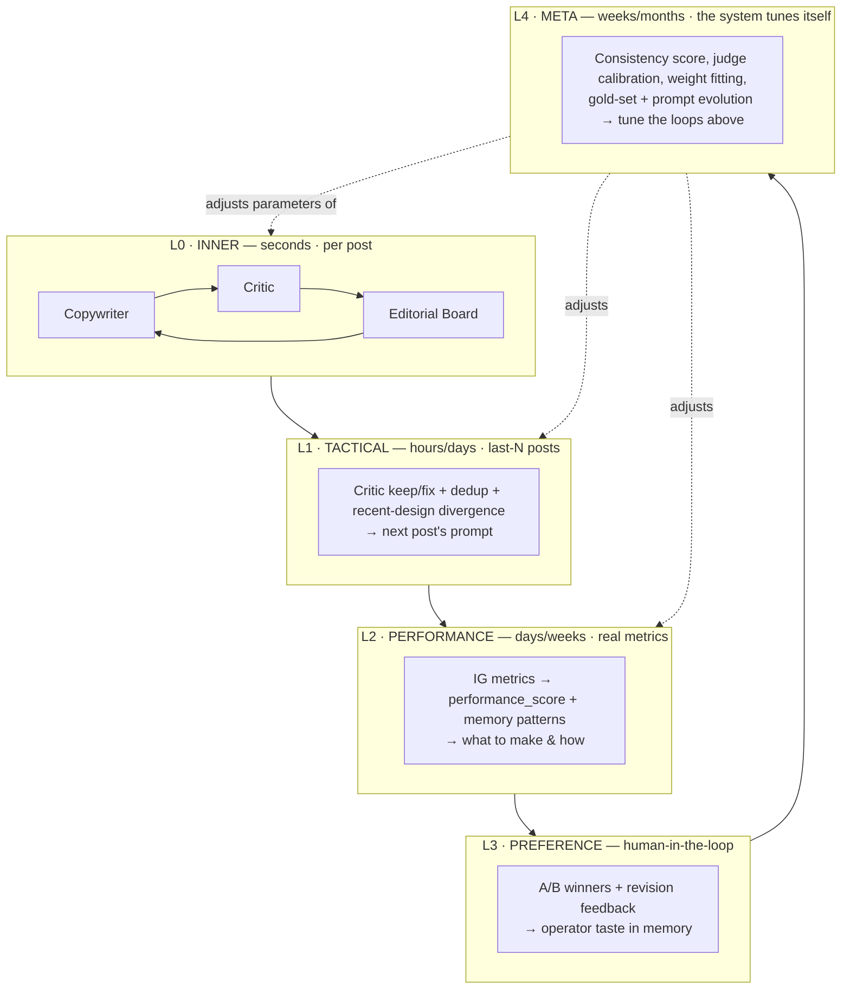
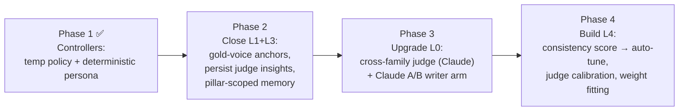
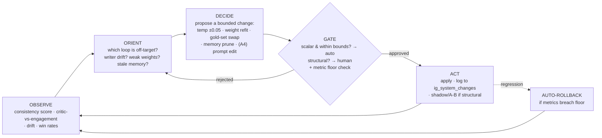
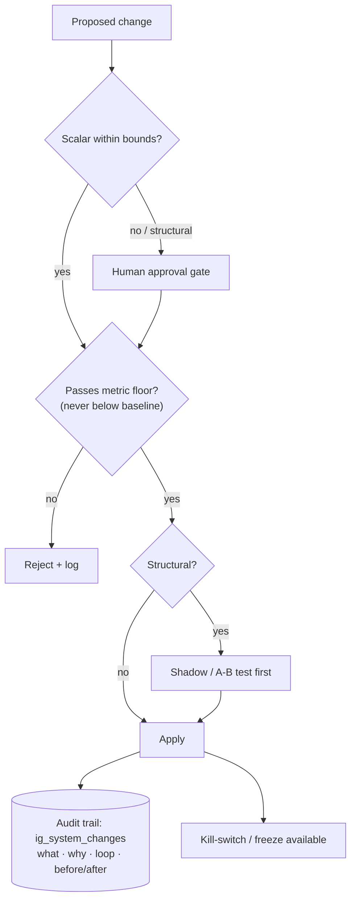
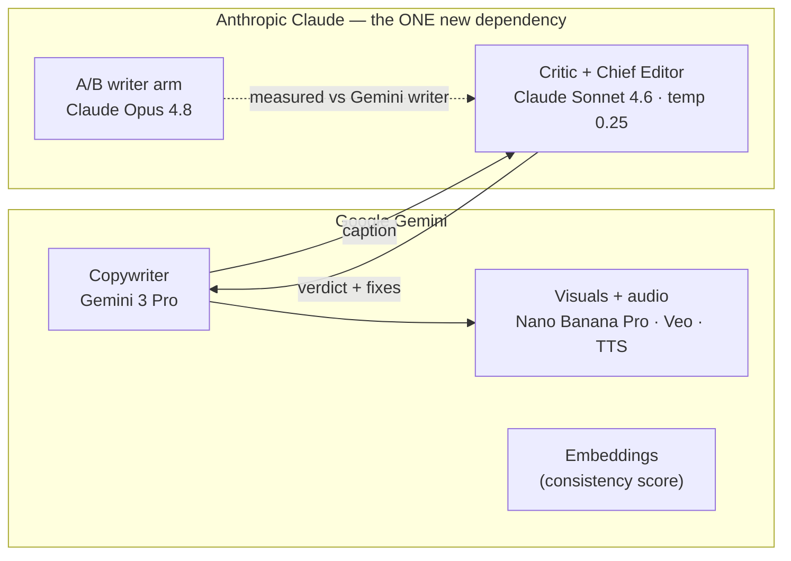

# Agent System & Loop Engineering — Past · Present · Plan

> **What this is.** The systems view of Chrlit's content engine: how the agents are wired, why it's built this way, and — the heart of the doc — the **feedback loops that let the system upgrade itself** over time ("loop engineering"). Companion to `docs/AI_PROVIDER_STRATEGY.md` (the provider audit + decisions).
>
> **Diagrams are [Mermaid](https://mermaid.js.org/)** — they render on GitHub and in VS Code (install "Markdown Preview Mermaid Support"). Ask if you want PNG/SVG exports.
>
> **Reading order:** Part I = *what happened* · Part II = *what is happening* · Part III = *loop engineering (the concept)* · Part IV = *the plan / self-upgrading* · Part V–VI = providers + observability.

---

# Part I — What happened (the past)

## I.1 How the architecture got here

The engine wasn't designed as a multi-agent system on day one — it **evolved** under pressure, and each step left a structural fingerprint that explains today's behavior.

| Era | What was added | Why (the pressure) | Fingerprint it left |
|---|---|---|---|
| 1 | One prompt → one post | Ship fast | No quality gate; voice = whatever the prompt said |
| 2 | Researcher / Copywriter / Critic / Editorial Board | "Posts feel generic" | Agents that *negotiate* quality, but all same model family |
| 3 | Split god-files into `app/actions/*`, `instagram/orchestrators/` | Maintainability; 800s budget | Clean seams to insert agents/loops |
| 4 | Metrics → `performance_score` → weighted selection; `memory-agent` | "Make what works, not random" | The first real **feedback loops** |
| 5 | A/B variant system; onboarding scrapes IG | "Let data/operator pick the winner" | A **human-in-the-loop** learning channel + the A/B rail we'll reuse |
| 6 | Temperature policy, deterministic persona; Claude judge (planned) | **"Posts aren't consistent"** | This document |

## I.2 The diagnosis — why posts drift

Two root causes, both **verified in code**, both structural rather than "the model is bad":

> **The insight that reframes everything:** consistency is a *control* problem (keep variance inside a band) layered on a *creativity* problem (keep enough variance to stay fresh). The pipeline had the creativity but no controller. Loop engineering is how we add the controller without killing the creativity.

---

# Part II — What is happening (the present)

## II.1 The agent assembly line

One post flows through eight roles. This is the current, post-Phase-1 reality (temperatures shown):

**Agent roster (contract per agent):**

| Agent | Model · temp | Sees | Produces | File |
|---|---|---|---|---|
| Researcher | n/a (weighted RNG) | post types, perf scores, post-type memory boosts | chosen type + idea/review | `autopilot.ts`, `service.ts` |
| Context | Flash · creative | industry, city, calendar, personas | 4 "pulse" bullets | `context-agent.ts` |
| Copywriter | Pro · **0.75** | brand voice, **deterministic persona**, memories, last-5 critic notes, recent captions | caption JSON | `caption-generator.ts` |
| Critic | Pro · **0.25** | the caption + brand voice | 1-10 + keep/fix | `caption-generator.ts` |
| Chief Editor | Pro · **0.25** | caption + critic + history | verdict + fix instructions | `editorial-board.ts` |
| Art Director | Pro · **0.6** | caption + brand kit + visual memories + recent design fingerprints | design brief | `image-pipeline.ts` |
| Renderer | Nano Banana Pro | brief + reference images | the image | `orchestrators/*` |
| Vision QA | Pro · **0.25** | rendered image | pass/fail + fix hint | `image-pipeline.ts` |

## II.2 The feedback loops that already exist

The system is **not** stateless — five loops already feed outcomes back into generation. This is the substrate loop engineering builds on:

## II.3 What Phase 1 just changed

Shipped and build-verified (Era 6, step 1):

- **Temperature controller** — `TEMPERATURES` / `getTemperature()` in `instagram/models.ts`. Judges **0.25** (reliable gate), Copywriter **0.75** (bounded creativity), Designer **0.6** (coherent vibe, rotate layout not brand). Env-overridable via `GEMINI_TEMP_<ROLE>`.
- **Deterministic identity** — `selectPersonaForPost()` + `ContentPillar.targetPersona`: a pillar pins its segment; otherwise the same post type always speaks to the same persona. The audience stops re-segmenting per post.

> These are the first two *controller* gains: a trustworthy judge + a stable speaker. Everything in Part IV makes those controllers **self-adjusting**.

---

# Part III — Loop engineering (the concept)

## III.1 Why "loops"

A self-improving system is a stack of feedback loops, each closing the gap between *intended* and *actual* at a different **timescale** and **autonomy level**. Borrowed from control theory + OODA (Observe → Orient → Decide → Act). The art is matching each decision to the **slowest loop that can still react in time** — fast loops for per-post quality, slow loops for strategy and self-tuning.

## III.2 The loop ledger — current state vs. gap

| Loop | Closes the gap on | Timescale | Today | Gap to fix |
|---|---|---|---|---|
| **L0 Inner** | per-post quality | seconds | ✅ Copywriter→Critic→Board, ≤3 rounds | Judge was noisy (fixed in P1); not yet cross-family |
| **L1 Tactical** | repetition, last-mistakes | per post | ✅ critic notes (last 5) + dedup | Insights **expire after 5 posts**, never persist; word-overlap dedup is weak |
| **L2 Performance** | "make what works" | days/weeks | ✅ metrics→score→weighted pick + memory | Weights are **hand-set constants**; memory **not pillar-scoped**; reach/saves under-weighted |
| **L3 Preference** | operator taste | human | ✅ A/B + revision learning | Stored as **generic** prefs (no post-type scope); gold examples not captured |
| **L4 Meta** | the system's own tuning | weeks+ | ⚠️ **mostly absent** — temps/weights/prompts are static | **This is the build-out** (Part IV) |

> **The headline:** L0–L3 exist but are *open* in important places (insights leak, weights are guessed, no scoping). **L4 barely exists.** Loop engineering = close the leaks in L0–L3 and *build L4*, the loop that tunes the others.

---

# Part IV — The plan (agent evolution & self-upgrading)

## IV.1 Roadmap mapped to loops

| Phase | Loop(s) | Core change | Outcome |
|---|---|---|---|
| 1 ✅ | L0 | Explicit temperatures; deterministic persona | Reliable judge + stable speaker |
| 2 | L1, L3 | **Few-shot gold examples** in the prompt; persist Critic/Editor `fix` to memory; scope memory by pillar; proven-biased hook/CTA | Voice anchored to real examples; insights stop leaking |
| 3 | L0 | **Critic + Chief Editor → Claude** (writer≠judge); Claude writer as A/B arm | Gate catches what Gemini can't see about its own output |
| 4 | L4 | Embedding **consistency score**; auto-tune within guardrails; judge calibration; fit selection weights | The system tunes itself |

## IV.2 The autonomy ladder

Where each capability sits today and where it's headed (SAE-style levels):

| Level | Name | Who decides | Examples now → target |
|---|---|---|---|
| **A0** | Manual | Human writes everything | Onboarding config text |
| **A1** | Assisted | System drafts, human approves each | Single-post review/publish |
| **A2** | Supervised loops | System learns, human reviews outcomes | ✅ metrics→weights, memory learning, A/B |
| **A3** | Self-tuning *(plan)* | System adjusts **scalars** within bounds; human audits | temps, selection weights, gold-set membership, memory pruning |
| **A4** | Self-evolving *(frontier)* | System proposes **structure**, A/B-tests, promotes winners | new hook templates / anti-patterns mined from data; prompt edits behind a gate |

> We deliberately stop scalar auto-tuning at **A3** and keep **A4 (structural/prompt/provider changes) behind a human gate.** Autonomy is earned per-capability by proving it beats control on *both* engagement and consistency.

## IV.3 The self-upgrading meta-loop (L4)

This is the "self upgrading of the system itself." A single OODA loop runs on a schedule (e.g., the existing cron worker) and tunes the loops beneath it:

**Concrete L4 mechanisms (each tied to existing infra):**

1. **Consistency-driven temp auto-tune** — if the brand-consistency score (Phase 4) drifts below a floor over N posts, nudge copywriter temp down one step / raise gold-set weight. Bounded, logged, reversible.
2. **Gold-set auto-promotion** — A/B winners + top-quartile-engagement posts get *nominated* to the canonical voice set; human curates; underperformers demoted. (Reuses the variant + metrics rails.)
3. **Memory hygiene job** — decay stale, prune to top-N, merge duplicates, **scope by pillar**. Partly exists; promote to a scheduled, reported job.
4. **Selection-weight fitting** — the `2×/3×` performance multipliers are guesses. Fit them to *realized lift* so the explore/exploit balance is learned, not assumed.
5. **Judge calibration ("judging the judge")** — periodically check whether the judge's 9s actually out-engage its 6s. If not, the rubric/threshold is recalibrated. Critical once the judge is Claude.
6. **Prompt/agent evolution (A4)** — mine new hook templates from winners and anti-patterns from rejected posts; shadow-test via the A/B arm; promote only if it beats control on engagement **and** consistency — human gate.

## IV.4 Guardrails (non-negotiable for a self-changing system)

- **Bounded steps** — scalar changes move in small increments inside hard `[min,max]`.
- **Metric floors + auto-rollback** — any change that pushes engagement/consistency below baseline is reverted automatically.
- **Human gate for structure** — prompts, agents, providers never change autonomously.
- **Full audit trail** — new `ig_system_changes` row per change (what, why, which loop, before/after). Self-changes must be *explainable*.
- **Shadow before promote** — structural changes prove themselves on the A/B arm first.
- **Freeze switch** — one flag halts all self-tuning.

---

# Part V — Provider evolution (writer ≠ judge)

The provider topology is itself a loop-engineering decision: the **judge must be a different model family from the writer**, so the quality gate sees the writer-family's blind spots. (Full reasoning: `docs/AI_PROVIDER_STRATEGY.md`.)

> If the writer ever moves to Claude, the judge flips back to Gemini — the **cross-family invariant** is the rule, not the specific vendor.

---

# Part VI — How we'll know it's working (observability)

Loop engineering is only real if it's measured. Target dashboard, logged to `ig_generation_log` / `ig_system_changes`:

| Signal | Question it answers | Loop it watches |
|---|---|---|
| **Brand-consistency score** (embedding vs gold set) | Is voice drifting? | L0/L4 |
| Critic score distribution + variance | Is the gate stable and discriminating? | L0 |
| Critic-score ↔ realized-engagement correlation | Is the judge *right*? | L4 (calibration) |
| A/B win rate (Claude vs Gemini writer) | Who writes better, by data? | L3/L4 |
| Selection explore/exploit ratio + lift | Are weights well-fit? | L2/L4 |
| Memory size / staleness / pillar coverage | Is memory healthy? | L2 |
| `ig_system_changes` outcomes | Are self-changes net-positive? | L4 |

---

## Appendix — file map

| Concern | File(s) |
|---|---|
| Model + temperature registry | `instagram/models.ts` |
| AI gateway (Gemini) | `instagram/gemini-client.ts` |
| Pipeline orchestration | `instagram/autopilot.ts` |
| Copywriter / Critic / persona | `instagram/caption-generator.ts` |
| Editorial board | `instagram/editorial-board.ts` |
| Art Director / image QA | `instagram/image-pipeline.ts`, `instagram/orchestrators/*` |
| Learning / memory | `instagram/memory-agent.ts` |
| Metrics → selection | `instagram/service.ts`, `instagram/metrics-sync.ts` |
| A/B variants | `app/actions/variant-actions.ts` |
| Provider decisions | `docs/AI_PROVIDER_STRATEGY.md` |

*Living document — update as phases land and loops close.*
