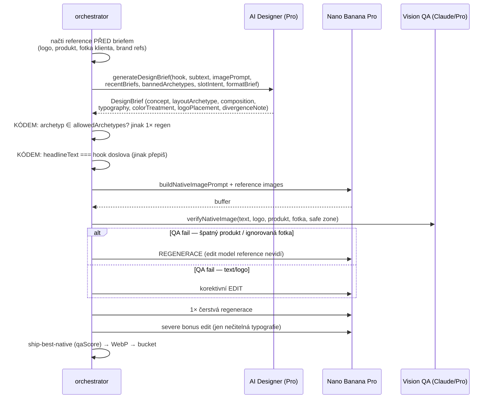

# Audit promptového řetězce — Chrlit Studio

**Datum:** 2026-08-05 · **Rozsah:** všech ~14 700 řádek `instagram/` + promptové vrstvy v `app/actions/` a `app/onboarding/`
**Metoda:** čtení kódu vrstva po vrstvě + dva empirické testy proti živému Gemini API (viz §0.1)

Tenhle dokument dělá dvě věci: **(A)** kompletní mapu toho, jak prompty na sebe navazují od zadání webu až po tiskový podklad, a **(B)** seznam míst, kde na sebe vrstvy nesedí — s důkazem, dopadem a opravou.

---

## ✅ Stav oprav (v8.7, 2026-08-05)

**Opraveno:** K1 · K2 · K3 · K4 · K5 · K6 · V1 · V2 · V4 · V6 · V7 · S1 · S2 · S4 · S5 — plus jeden nález, který se objevil až při opravě (viz níže).

Dál odloženo: **V5** (`slotIntent` do mega promptu), **S3** (print QA čeká logo, které render vynechal), **H1–H7**.

## ✅ Stav oprav (v8.8, 2026-08-07) — reelové blokátory

**V3 opraveno.** `refineVideoPrompt` běží na `textPro` ladderu přes `generateTextQuality` (dřív syrové `generateContent` na flash tieru — bez tvrdého retry, bez fallbacku, bez `QualityUnavailableError`) a dostává `CtaPolicy`. Když politika zakazuje web (REACH/CONNECT pilíř), závěrečné vteřiny videa dostanou explicitní zákaz URL místo natvrdo vypáleného `config.website`. Policy se do reelu dostane přes nové `RenderContext.ctaPolicy`; její resolve se v `autopilot.ts` **vyzvedl nad checkpoint větev**, aby ji měl i post obnovený z caption checkpointu (ten copywriterskou větev celou přeskakuje).

### ⚠️ Korekce auditu: `ffmpeg-static` nebyl rozbitý

Audit vedl chybějící `ffmpeg-static` v `outputFileTracingIncludes` jako podmínku pro zapnutí reels. **Změřeno 2026-08-07 a to tvrzení neplatí:** build s odebraným záznamem má `node_modules/ffmpeg-static/ffmpeg` v `.next/server/app/api/ig-run-job/route.js.nft.json` i tak — nft si tuhle závislost dohledá sám. Původní tvrzení stálo na úvaze o runtime `require()`, ne na měření.

Záznam v `next.config.ts` **zůstává jako pojistka** (runtime-resolved binárka je přesně ten tvar závislosti, který může příští heuristika nft tiše přestat vidět), ale je označený za pojistku, ne za opravu.

Co z toho **je** reálné a měřením nepokryté: jestli je binárka v Vercel sandboxu i **spustitelná** (práva). To ověří až první reel na produkci. Proto:

- `getFfmpegPath()` už nevrací naslepo `"ffmpeg"` — ověří existenci binárky a hodí diagnostikovatelnou chybu; systémový fallback zůstává jen pro lokální dev, kde balík není nainstalovaný.
- Pád post-processingu se v `reel-orchestrator.ts` **hlásí do Sentry** (`area: reel`, `step: ffmpeg-postprocess`). Surové video se pořád odešle — reel bez titulků je lepší než žádný — ale degradace postu za 5 kreditů přestala být řádkem v konzoli, který nikdo nečte.

### Nález navíc: `ig_posts.engagement_score` neexistuje

Audit vedl S4 jako „dvě definice top hooks". Při opravě se ukázalo, že je to horší: sloupec `engagement_score` je v celém repu **čten na jediném místě a zapisován nikde**, a dotaz proti prod DB potvrdil, že **v databázi neexistuje**. `content-plan-actions.ts` z něj četl „nejlepší hooky", chyba se zahazovala (`const { data }` bez `error`) a sekce „PŘÍKLADY NEJLEPŠÍCH HOOKŮ" se v plánovacím promptu **nikdy neobjevila** — přestože 26 postů reálné metriky má. Opraveno na tentýž vzorec, jaký používá zbytek systému (`likes + 3×comments + 5×saves`).

### Jak to bylo ověřeno

| Co | Jak |
|---|---|
| `responseSchema` zahazuje nedeklarovaná pole | volání `gemini-pro-latest` — prompt si dvakrát vyžádal `narration`, model vrátil jen 4 klíče schématu |
| Test na to reálně chytí regresi | dočasná reintrodukce chyby → `test-prompt-assembly.ts` zčervenal na správné asserci → fix vrácen |
| K5 (vizuální paměť) | prod klient `kvetiny-nad-museem-0uq9`: starý postup 2 ze 3 vizuálních pamětí, nový 3 ze 3 |
| K3 (přeskórování) | vynucené revizní kolo: `4/10 → 8/10`, druhé kolo soudilo čerstvou rubriku |
| V4 (rotace kontextu) | `--dry-run` s `DEBUG_PROMPT=1`: 2 body kontextu místo 4 |
| `engagement_score` | dotaz proti prod: `column ig_posts.engagement_score does not exist` |

---

## 0. Jak číst nálezy

Každý nález má:

- **Důkaz** — konkrétní `soubor:řádek`, ne dojem.
- **Proč je to špatně** — která vrstva co slíbí a která vrstva to nesplní.
- **Dopad** — co uvidí zákazník / co se rozbije v datech.
- **Oprava** — nejmenší zásah, který to řeší.

Závažnost:

| | význam |
|---|---|
| 🔴 **KRITICKÉ** | funkce je mrtvá nebo lže do dat, a nikdo se to nedozví — selhává potichu |
| 🟠 **VYSOKÉ** | model dostává protichůdné nebo neexistující zadání, výsledek je měřitelně horší |
| 🟡 **STŘEDNÍ** | plýtvání, nekonzistence, mrtvý parametr |
| ⚪ **HYGIENA** | zavádí příští úpravu, dnes neškodí |

### 0.1 Co bylo ověřeno experimentem, ne úvahou

Dvě tvrzení stála na chování Gemini structured output, tak jsem je změřil skutečnými voláními API (probe skript spuštěn a smazán):

**1. Malá písmena v `responseSchema` (`type: "object"`) API přijímá.**
→ `editorial-board.ts:664`, `idea-generator.ts:109`, `review-generator.ts:82` a onboarding **nejsou** rozbité. Vypadá to jako chyba, není.

**2. `responseSchema` je *whitelist*, ne minimum** — pole, které prompt vyžaduje, ale schéma nedeklaruje, model **nevrátí**.

Test použil přesný tvar `buildVideoSchema` (položka scény bez `narration`/`soundEffect`) a prompt, který obě pole označil jako POVINNÁ u každé scény. Výsledek na `gemini-pro-latest`, tedy na modelu, který copywriter skutečně používá:

```
[pro] raw: {"hook":"Nejlepší ranní káva pro vás.","scenes":[{"timeRange":"0-3s",
           "visual":"Čerstvě pražená kávová zrna padají.","camera":"Detailní zpomalený
           záběr shora.","mood":"Energická a probouzející atmosféra."}, …]}
[pro] scene[0] keys: [ 'timeRange', 'visual', 'camera', 'mood' ]
[pro] narration: false | soundEffect: false
```

Prompt si o `narration` řekl dvakrát a explicitně; schéma ho neuvedlo; model ho nevrátil. Tohle je základ nálezů 🔴 **K1** a 🔴 **K2** — nejde o odhad, ale o změřené chování.

**Vedlejší pozorování (nedokázané v produkci, ale reprodukované 2/2):** oba flash běhy téhož promptu ujely do ~220 kB výstupu, přičemž do stringového pole prosáklo uvažování modelu (`"…atmosféra. containment. Let's keep it simple. Let's write the exact JSON…"`) a `JSON.parse` spadl na *Unterminated string*. Pro tier to neudělal ani jednou. Viz ⚪ **H7**.

---

## 1. MAPA — jak to funguje od A do Z

### 1.1 Celkový tvar

```mermaid
flowchart TB
    subgraph V0["VRSTVA 0 — Konfigurace (jednou při onboardingu)"]
        W[Web + IG scrape] --> AN[analyzeWebsite<br/>flash] --> CFG[configPrompt<br/>textPro]
        CFG --> CC[(clients.config<br/>ClientConfig)]
        IGV[feed-vision<br/>vision] --> CFG
        CFG --> SEED[seedOnboardingMemories<br/>+ seedIdeaBank]
    end

    subgraph V1["VRSTVA 1 — Plán kampaně (plan-pipeline.ts)"]
        CC --> CTXB[contextBlock<br/>content-plan-actions]
        CTXB --> ST[1. Stratég → arc + postFocus<br/>planner Pro]
        ST --> CO[2. Koncepty → hook/angle/topic<br/>planner Pro]
        CO --> JU[3. Soudce → skóre 1-10<br/>cross-family Claude]
        JU --> RE[4. Revize slabých + přesouzení]
        RE --> DRAFT[(ig_campaigns<br/>status=draft)]
    end

    subgraph V2["VRSTVA 2 — Generování postu (autopilot.ts)"]
        DRAFT --> WK[campaign-worker cron]
        WK --> GOP[generateOnePost]
        GOP --> CTX[0. Context Agent<br/>flash, cache 6h]
        CTX --> RES[1. Researcher<br/>typ + nápad + produkt]
        RES --> FMT[2. Formát + clampy + slotIntent]
    end

    subgraph V3["VRSTVA 3 — Text"]
        FMT --> MP[buildMegaPrompt<br/>+ 7 injektážních bloků]
        MP --> CW[Copywriter<br/>textPro, best-of-2]
        CW --> DD[dedup hook/body]
        DD --> CR[Critic / rankDrafts<br/>judge]
        CR --> EB[Editorial Board<br/>max 3 kola]
    end

    subgraph V4["VRSTVA 4 — Vizuál"]
        EB --> AD[AI Designer → DesignBrief<br/>designer Pro]
        AD --> NP[buildNativeImagePrompt]
        NP --> NB[Nano Banana Pro<br/>+ logo/produkt/foto reference]
        NB --> QA[verifyNativeImage<br/>vision judge]
        QA -->|fail| FIX[korektivní edit → fresh regen → severe bonus]
        FIX --> QA
        QA -->|ship-best| UP[upload WebP]
    end

    subgraph V5["VRSTVA 5 — Učení"]
        UP --> POST[(ig_posts)]
        POST --> ME[metriky IG]
        ME --> PROP[propagateMetricsToSources]
        ME --> LEARN[analyzeAndLearn<br/>+ analyzeVisualPatterns]
        LEARN --> BM[(ig_brand_memory)]
        BM -.-> MP
        BM -.-> AD
        PROP -.-> RES
    end

    style V0 fill:#0d1117,stroke:#30363d
    style V1 fill:#0d1117,stroke:#30363d
    style V2 fill:#0d1117,stroke:#30363d
    style V3 fill:#0d1117,stroke:#30363d
    style V4 fill:#0d1117,stroke:#30363d
    style V5 fill:#0d1117,stroke:#30363d
```



### 1.2 Vrstva 0 — Konfigurace je *kořen všech promptů*

Onboarding (`app/onboarding/actions.ts`) vyrobí `ClientConfig`, který se pak čte **v každém jednom promptu níže**. Klíčové je pochopit, že tady vzniká slovník celého systému:

| Pole v configu | Kdo ho čte | Kde se projeví |
|---|---|---|
| `brandVoice.persona` | copywriter, kritik, ranking judge, šéfredaktor, revize, nápady, print brief | první řádek mega promptu (`caption-generator.ts:725`) |
| `brandVoice.antiPatterns` | copywriter, kritik, ranking judge, šéfredaktor, nápady | „ZAKÁZÁNO" |
| `brandVoiceExamples` | copywriter + kritik + ranking judge | few-shot voice anchor (`caption-generator.ts:219`) |
| `contentPillars[x].ctaStrategy` | **CTA politika** — jediný zdroj pravdy o CTA | `cta-policy.ts:44` → 5 různých promptů |
| `feedAesthetic.*` | AI Designer, karusel/story designer, print brief | „BRAND KIT" (`image-pipeline.ts:314`) |
| `postTypeDefs[].structure` | copywriter (nahrazuje obecnou kostru média) | `caption-generator.ts:819/869/905/939` |
| `postTypeDefs[].visualStyle` | oba designéři jako `formatBrief` | `image-pipeline.ts:326` |
| `feedPattern` | `computeSlotIntent` → archetypová rodina | `image-pipeline.ts:298` |
| `imageInstructions` | legacy per-typ fallback vizuálu | `caption-generator.ts:954` |

**Jediné volání modelu tady rozhoduje o kvalitě všeho ostatního.** `configPrompt` běží na `textPro` (`actions.ts:878`), ale `analyzeWebsite` a IG insights běží na flash (`:280`, `:572`) — vstup do configu je tedy flash-grade, výstup Pro-grade.

### 1.3 Vrstva 1 — Plán (`instagram/plan-pipeline.ts`)

Čtyřstupňová pipeline, architektonicky nejčistší část systému:

```
contextBlock (brand voice + produkty + persony + brand memory + IG baseline
              + zásobník nápadů + top hooky + dedup + cíl + produktový fokus)
        │
        ├── 1. runStrategist   → { arc, postFocus[] }        planner Pro, temp 0.6
        ├── 2. koncepty        → [{hookPreview, angle, topic, qualityScore, ideaIndex}]
        │                        planner Pro, temp 0.75, responseSchema
        ├── 3. judgeConcepts   → Map<index, {score, fix}>     Claude Sonnet 5 (cross-family)
        └── 4. revize hooků < 7 → přesouzení → vyhraje lepší
```

Failure semantics jsou promyšlené: koncepty jsou jádro (chyba propaguje, **nikdy** flash), stratég/soudce/revize jsou enhancery (chyba = log + skip).

Výstup putuje dál jako:
- `hookPreview` → `options.approvedHook` → **PRIORITA 1** v mega promptu (`caption-generator.ts:773`)
- `topic` → `options.topic` → přeskočí weighted výběr nápadu (záměrně)
- `ideaIndex` → `ideaId` → atribuce k `ig_post_ideas`
- `strategySummary` → `campaignContext.campaignArc` → dostane **každý** post včetně #1

### 1.4 Vrstva 2+3 — Text jednoho postu (`autopilot.ts` → `caption-generator.ts`)

Mega prompt se skládá z **báze + sedmi injektážních bloků** — a pořadí je významné, protože poslední blok má u LLM největší váhu:

```
buildMegaPrompt() ── báze ────────────────────────────────────
  persona · úkol · PRIORITY 1-5 · brand voice · zákazy · tón
  produkt (priorita 2) · zdrojový nápad / téma / schválený hook (priorita 1)
  recenze · zlatý standard (few-shot) · learning data · persona · psycholog
  hook šablony · CTA POLITIKA · dedup seznam · angle commit
  medium-specifický blok (reel / karusel / story / obrázek) + JSON tvar
       │
  ++ 1. fotka uživatele            autopilot.ts:601
  ++ 2. brand memory               autopilot.ts:618
  ++ 3. critic feedback (5 logů)   autopilot.ts:659
  ++ 4. feed kontinuita (5 postů)  autopilot.ts:683
  ++ 5. kontext (sezóna/svátky)    autopilot.ts:700
  ++ 6. kampaňová návaznost + arc  autopilot.ts:714
  ++ 7. dedup regenerace (jen při duplicitě) autopilot.ts:836
```

Pak: **best-of-2** (2 návrhy paralelně → pairwise soudce vybere) *nebo* legacy single draft → dedup kontrola → `scorePost` → **Editorial Board** (šéfredaktor ↔ copywriter, max 3 kola, s možností pushbacku).

### 1.5 Vrstva 4 — Vizuál (native engine)



Tři obranné mechanismy, které jsou udělané správně a je důležité je nerozbít:

1. **Verbatim typography guard** (`image-pipeline.ts:397-405`) — designér nesmí parafrázovat hook, protože QA porovnává proti `captionData`; kdyby se prompt a očekávání rozešly, žádný retry by nikdy neuspěl.
2. **Archetypová rotace vynucená v kódu** (`:375`) — prompt sám nestačí, model rád napíše nový koncept nad stejným layoutem.
3. **Ship-best-native** (`qaScore`, `:852`) — nikdy prázdný post, nikdy Satori fallback.

### 1.6 Vrstva „produkty a tisk" (samostatný engine)

```mermaid
flowchart LR
    subgraph IDEAS["Nápady na produkty"]
        PI[generateProductIdeas<br/>temp 1.3, flash] --> RATE[👍/👎 rateProductIdea]
        RATE --> WPI[getWeightedProductIdeas<br/>clientId explicitně]
    end

    subgraph LINE["Produktová řada (v8.3)"]
        WPI --> LG[generateLine<br/>designer Pro]
        LG --> VAL[validateLine<br/>kroky 1..N · unikátní názvy ·<br/>žádný cenový zig-zag · role ≠ název]
        VAL --> DR[(ig_product_lines<br/>status=draft)]
        DR --> APP[approveLine<br/>podmíněný claim]
    end

    subgraph PRINT["Tisk (print-pipeline.ts)"]
        APP --> GEO[resolvePrintGeometry<br/>z ig_product_categories<br/>NIKDY hardcoded ratio]
        GEO --> PB[generatePrintBrief<br/>designer Pro]
        PB --> RA[renderPrintArtwork<br/>PLOCHÁ grafika, chroma key #FF00FF]
        RA --> PQA[verifyPrintArtwork<br/>text · plochost · logo · safe area]
        PQA --> SHIP[ship-best → finalizePrintFile<br/>chroma→alpha · cover resize · 300 DPI]
        SHIP --> MOCK[renderProductMockup<br/>artwork jako reference]
    end
```



Klíčová doktrína, která je tu zapsaná správně: `finalizePrintFile` používá **`cover`, nikdy `fill`** (`print-pipeline.ts:567`) — model umí jen pět pevných poměrů, takže `fill` by 75×160 mm etiketu zdeformoval o ~17 % přesně v typografii, kterou QA právě ověřila.

### 1.7 Vrstva 5 — Zpětné vazby (co kam teče)

| Smyčka | Zdroj | Cíl | Kde se to projeví v promptu |
|---|---|---|---|
| Metriky → zdroje | `propagateMetricsToSources` | `performance_score` na ideas/reviews/post_types | weighted výběr (`service.ts:538`), váha formátu ×[0.5,1.6] (`autopilot.ts:311`) |
| Kritik → prompt | `ig_generation_log.critic_keep/fix` | posledních 5 logů, nejprve stejný formát | `autopilot.ts:659` |
| Kritik → paměť | `learnFromCriticInsights` | `avoid` memory @ 0.3 (pod prahem 0.4) | až po opakování překročí práh |
| Metriky → paměť | `analyzeAndLearn` | pattern/preference/avoid + visual | `formatMemoriesForPrompt` |
| A/B výběr → paměť | `learnFromVariantSelection` | preference | mega prompt |
| Revize → paměť | `learnFromRevision` | avoid/preference | mega prompt |
| Tisk → IG | `selectDesignWinner` | `visual` memory | AI Designer |

---

## 2. NÁLEZY

### 🔴 K1 — Reels: `narration` a `soundEffect` schéma zahazuje, takže voiceover ani titulky nikdy nevzniknou

**Důkaz.**
- `caption-generator.ts:325-350` — položka `scenes` má v schématu **jen** `timeRange`, `visual`, `camera`, `mood`.
- `caption-generator.ts:851-859` — prompt ve stejném souboru výslovně vyžaduje `"narration": "Český text pro voiceover"` a `"soundEffect"`.
- `gemini-client.ts:152` — `responseSchema` se předává modelu.
- **Změřeno:** structured output je whitelist; nedeklarované pole model nevrátí (§0.1).

**Proč je to špatně.** Spotřebitelé těch polí existují a jsou celý smysl reelové pipeline:

| Kód | Co dělá | Co se stane |
|---|---|---|
| `reel-orchestrator.ts:105-107` | `scenes.filter(s => s.narration)` | prázdné pole → `generateVoiceover` se **nikdy nezavolá** |
| `reel-orchestrator.ts:131` | podmínka post-processingu `voiceoverBuffer \|\| scenes.some(s => s.narration)` | obě false → **FFmpeg krok se přeskočí celý** |
| `reel-orchestrator.ts:135` | `scenesToSubtitles(scenes)` | nikdy se nespustí → **žádné vypálené titulky** |
| `image-pipeline.ts:1013-1014` | video director dostane `Audio: ambient` a `Narration hint: ""` | režisér skládá prompt bez zvukové stopy |

**Dopad.** „Reels v8: voiceover + titulky + multi-clip" je v produkci mrtvé. Reel se vyrenderuje jako němé Veo video bez českého komentáře a bez titulků — tedy přesně to, co odlišuje hotový reel od klipu. Sedí to s poznámkou v paměti *„engine render not yet live-verified"*. Navíc `COSTS.ttsVoiceover` se nikdy nenaúčtuje, takže ani nákladová telemetrie neukáže, že se TTS neděje.

**Oprava.** Do `buildVideoSchema` doplnit do `items.properties` a do `required`:
```ts
narration:   { type: Type.STRING, description: "Český text pro voiceover (1-2 věty, přirozená řeč)" },
soundEffect: { type: Type.STRING, description: "Ambient sound or effect for this scene" },
```
a přidat aserci do `test-beta-e2e.ts`: klíče v JSON příkladu promptu ⊆ klíče schématu.

---

### 🔴 K2 — Editorial board nemůže opravit karusel ani reel; u reelu svou práci navíc zahodí

**Důkaz.**
- `editorial-board.ts:663-676` — `copywriterRevisionSchema` obsahuje jen `action, explanation, hook, body, cta, hashtags, imagePrompt, imageSubtext`.
- `editorial-board.ts:495-500` — prompt ale podmíněně vyžaduje `slides`, `visualTheme`, `scenes`, `videoScript`, `caption`.
- `editorial-board.ts:717-721` — `if (revision.slides) …`, `if (revision.scenes) …`, `if (revision.caption) …` → **nikdy nenastanou** (viz §0.1).

**Proč je to špatně.** Dvě různé škody:

1. **Karusel.** Šéfredaktor vidí slidy (`:377-379`) a smí napsat „slide 3 neposouvá příběh". Copywriter to fyzicky nemůže provést — vrátí opravený hook/body, slidy zůstanou původní. Vzniká rozpor: caption mluví o něčem jiném než slidy, které ho ilustrují.
2. **Reel — tichá ztráta práce.** `autopilot.ts:892` po editorialu provede `if (isReel && captionData.caption) captionData.body = captionData.caption`. Protože `caption` schéma nevrátilo, drží se **původní** hodnota → `body` se přepíše zpátky na text před editoriálem. **Celé kolo šéfredaktora se u reelu zahodí** a ještě se zaplatí.

**Dopad.** Nejdražší krok pipeline (Pro ladder, až 3 kola) je u dvou ze čtyř médií buď neúčinný, nebo kontraproduktivní.

**Oprava.** Skládat schéma stejně podmíněně jako prompt:
```ts
const schema = { type: "object", properties: { ...base,
  ...(isCarousel ? { slides: {...}, visualTheme: { type: "string" } } : {}),
  ...(isReel ? { scenes: {...}, videoScript: { type: "string" }, caption: { type: "string" } } : {}),
}, required: [...] }
```
A v `autopilot.ts:892` sjednotit směr: `caption` a `body` jsou u reelu totéž — nastavovat je vedle sebe, ne jedno z druhého po každé mutaci.

---

### 🔴 K3 — `finalScore` z editorial boardu je vždy původní skóre kritika

**Důkaz.** `editorial-board.ts` — `lastScore` se přiřadí jednou na řádku 529 a už **nikdy** (grep: výskyty 529, 580, 735 — dvě čtení, žádný zápis).

**Proč je to špatně.** Dvě vrstvy tím trpí:

- **Šéfredaktor ve 2. a 3. kole** dostává na řádku 580 skóre a `criticResult.detail` (keep/fix) **k textu, který už neexistuje** — copywriter ho v 1. kole přepsal. Rozhoduje o publikaci podle rubriky předchozí verze.
- **Data.** `autopilot.ts:896` → `finalScore` → `logGeneration({ finalScore })` → `ig_generation_log.final_score`. Metrika „posunul editorial kvalitu?" je konstrukčně neschopná se pohnout: `final_score === critic_score` vždy. Jakákoli analýza přínosu editorial boardu je bezcenná.

**Dopad.** Platí se za 1–3 Pro kola, jejichž efekt nelze změřit, a poslední kola se rozhodují podle zastaralého vstupu.

**Oprava.** Po každé revizi zavolat `scorePost` na novou verzi a `lastScore` přepsat (1 judge volání na kolo). Levnější varianta: vrátit `finalScore: undefined`, když se nepřehodnocovalo — lepší `null` než nepravda.

---

### 🔴 K4 — „Data z reálného výkonu" se do promptu injektují i když žádná data neexistují

**Důkaz.**
- `performance.ts:91-98` — `engagement = likes + 3×comments + 5×saves`. Post bez metrik → **0**.
- `performance.ts:116-119` — `bestHooks` = hooky **top-5 podle engagementu**. Když mají všechny 0, je to prostě 5 postů v pořadí, v jakém je vrátila DB.
- `performance.ts:139-145` — `topPatterns` z naivních substringů („obsahuje `?`" → „Questions in hook").
- `caption-generator.ts:682` — sekce se zapne na `topPatterns.length > 0 || bestHooks.length > 0`. **Nikoli** na `avgEngagement > 0` (ta podmínka existuje, ale jen o řádek níž, pro jeden textový řádek).

**Proč je to špatně.** Copywriter dostane:

```
## 📊 DATA Z REÁLNÉHO VÝKONU (PRIORITA 4)
Toto jsou historicky nejúspěšnější formáty pro tuto značku. Stavěj na nich:
**Zlaté Hooky (Nejlepší dosah):**
- "…"   ← hook s nula naměřenými zobrazeními
**INSTRUKCE:** …použij stejnou psychologii, strukturu a rytmus.
```

To je fabrikovaný signál: „nejlepší dosah" o postech, které nikdo neměřil. A protože jde o posledních 5 postů, prompt zároveň **nutí model kopírovat rytmus nedávných postů** — v přímém rozporu se sekcí „⚠️ NEOPAKUJ SE!" o pár řádků níž, která ty samé posty zakazuje. Model dostane dvě opačné instrukce ke stejným datům.

**Dopad.** U každého klienta, který nezadává metriky (tedy u většiny na začátku), systém aktivně tlačí feed do konvergence a tváří se, že se učí.

**Oprava.** Jednořádková:
```ts
if (performance.avgEngagement > 0 && (performance.topPatterns.length > 0 || performance.bestHooks.length > 0))
```
Stejná podmínka patří i do `buildSmartWeekPlan` — tam už je (`caption-generator.ts:499`), takže jde jen o sjednocení.

---

### 🔴 K5 — Vizuální paměť se k designérovi prakticky nikdy nedostane (limit se aplikuje před filtrem)

**Důkaz.**
- `image-pipeline.ts:42-45` — `getBrandMemories(5, clientId)` a **teprve pak** `.filter(m => m.memory_type === "visual")`.
- `memory-agent.ts:82-95` — limit jde do SQL, řazeno `confidence DESC` **napříč všemi typy**.
- Zdroje textových pamětí bijí ty vizuální na objem: `analyzeAndLearn` píše až 3 text memories na běh (`memory-agent.ts:565`), `learnFromCriticInsights` píše `avoid` po **každém** postu (`autopilot.ts:1083`), `learnFromVariantSelection` a `learnFromRevision` píší `preference` s confidence až 0.8.

**Proč je to špatně.** Jakmile má klient 5 textových pamětí s confidence > než ta vizuální (typicky po pár týdnech), `getVisualMemoriesSection` vrátí prázdný řetězec — navždy. Sekce „💡 VISUAL MEMORY (co vizuálně fungovalo u této značky)" prostě zmizí z promptu AI Designera a **nic to nezaloguje**.

Stejná chyba v tisku: `print-pipeline.ts:243-244` (`getBrandMemories(6)` → filtr `visual`).

A **zrcadlově** u textu: `autopilot.ts:616` vezme 8 pamětí, `formatMemoriesForPrompt` (`memory-agent.ts:131-134`) vizuální **zahodí** → vizuální paměti ujídají sloty z rozpočtu textového promptu.

**Dopad.** Celá vizuální větev učení (`analyzeVisualPatterns`, `selectDesignWinner` → `visual` memory) zapisuje do tabulky, ze které už nikdo nečte. Včetně vazby tisk → Instagram, kterou CLAUDE.md popisuje jako feature.

**Oprava.** Přidat typový filtr do dotazu:
```ts
export async function getBrandMemories(limit, clientId?, pillar?, topic?, types?: BrandMemory["memory_type"][])
// …a v getMemoriesByConfidence:  if (types?.length) query = query.in("memory_type", types)
```
Volání: `getVisualMemoriesSection` → `["visual"]`, copywriter → `["pattern","preference","avoid"]`.

---

### 🔴 K6 — Brand memory se nikdy nedostane do generátoru nápadů z UI

**Důkaz.**
- `idea-generator.ts:34` — `getBrandMemories(5)` **bez `clientId`**.
- `memory-agent.ts:50` — spadne na `getActiveProject()`.
- `service.ts:33-36` — mimo `AsyncLocalStorage` scope **vyhodí výjimku**.
- `idea-generator.ts:39` — `catch { /* Non-fatal */ }` ji spolkne bez logu.
- `ig-generate-action.ts:235` — `triggerAIIdeasGeneration` (tlačítko v UI + denní auto-replenish agent) volá `generateAIIdeas` **bez** `withActiveProject`.
- `ig-generate-action.ts:281` — `seedIdeaBank` (onboarding) ho naopak obaluje a v komentáři na řádku 279-280 tenhle přesný hazard popisuje.

**Proč je to špatně.** Kód sám dokumentuje, že bez obalení paměti „silently skip" — a pak to na hlavní cestě neudělá. `clientId` je přitom na řádku 14 už vyřešené a leží vedle.

**Dopad.** Zásobník nápadů se učí jen při onboardingu. Každá pozdější dávka nápadů — včetně automatického doplňování — ignoruje všechno, co se značka o sobě naučila. Bez jediného varování v logu.

**Oprava.** `getBrandMemories(5, clientId)` na `idea-generator.ts:34`. A obecně: `catch {}` bez logu je v této codebase opakovaný vzor tichého selhání — minimálně `console.warn`.

---

### 🟠 V1 — Mega prompt pořád popisuje zrušený Satori overlay engine

**Důkaz.** `caption-generator.ts:942-957`, blok pro medium `image`:
```
## 🎨 OBRÁZEK
### Layout (kromě meme):
- **POZADÍ:** Full-bleed relevantní fotografie (1:1 square)
- **OVERLAY:** Barevný gradient — {colorPalette}
- **TEXT DOLE:** Velký bílý tučný headline + menší subtext
- **Font:** {feedAesthetic.font}
```

**Proč je to špatně.** Každý ze čtyř bodů je dnes nepravdivý:

| Tvrzení v promptu | Realita |
|---|---|
| „1:1 square" | default je `4:5` (`caption-generator.ts:48`), clampy vynucují feed-safe poměry |
| „OVERLAY: barevný gradient" | Satori/`text-overlay.ts` byly odstraněny; layout určuje AI Designer |
| „TEXT DOLE" | `typography.placement` si volí designér, a `logoPlacement`/`placement` má rotovat |
| „Font: X" | native engine používá `typographyStyle` jako *vibe*, ne font soubor (`configs/types.ts:92` to označuje jako `@deprecated`) |

K tomu `imagePrompt` ve schématu (`:296`) říká **„NO TEXT in image"**, zatímco renderer text do obrázku vypaluje. Copywriter tedy popisuje pozadí bez textu — a ten popis pak jde designérovi jako „Copywriter's raw visual idea" (`image-pipeline.ts:330`) do briefu na kompletní plakát. U typografického feed slotu (`image-pipeline.ts:246`, „TYPE IS THE SUBJECT") je to přímý protiklad zadání.

Navíc `buildFeedAesthetic()` (`image-pipeline.ts:58-92`) je tentýž zastaralý text — exportovaný a **odnikud nevolaný** (ověřeno grepem). 35 řádků mrtvého promptu, který svede příští úpravu.

**Dopad.** Copywriter je briefován na pipeline, která neexistuje. Nejde o pád, jde o soustavné tření: `imagePrompt` míří jinam, než co se renderuje.

**Oprava.** Blok „OBRÁZEK" nahradit tím, co copywriter opravdu ovlivňuje (téma vizuálu, produkt, nálada) a explicitně říct, že **layout, typografii a logo řeší AI Designer**. `buildFeedAesthetic` smazat.

---

### 🟠 V2 — Karusel: prompt si sám odporuje a QA za to trestá každý slide

**Důkaz.**
- `image-pipeline.ts:448` — „⚠️ … **Do not add any other text, words, watermarks or labels anywhere in the image.**"
- `carousel-orchestrator.ts:138-139` — bezprostředně za to se připojí: „Render a small, subtle `1/5` indicator".
- `image-pipeline.ts:917` — QA má hledat „**extra unwanted text**" a o indikátoru **neví**.

**Proč je to špatně.** Model dostane v jednom promptu zákaz i příkaz téhož. Ať udělá cokoli, jedna větev prohraje — a když indikátor vykreslí, QA ho může nahlásit jako nechtěný text.

**Dopad.** Falešné QA propady na slidech. Rozpočet oprav je přitom společný pro celý karusel a malý (`MAX_CORRECTIVE_EDITS = 2` na až 6 slidů, `carousel-orchestrator.ts:29`), takže se spotřebuje na neproblém a skutečná chyba diakritiky na slide 4 už opravu nedostane. Karusel skončí jako `native_forced`.

**Oprava.** V karuselu přepsat větu ze `buildNativeImagePrompt` na „no text other than the strings above **and the slide indicator**", a do `verifyNativeImage` přidat `expectedExtraText?: string`, aby QA indikátor tolerovala.

---

### 🟠 V3 — Video director běží na flash a přebíjí CTA politiku

**Důkaz.** `image-pipeline.ts:1050-1053`:
```ts
const response = await ai.models.generateContent({ model: getModel("text"), contents: refinementPrompt })
```

**Proč je to špatně.** Dvě věci najednou:

1. **Kvalita.** `getModel("text")` je flash tier. `refineVideoPrompt` přitom **přepisuje celý scénář** do jediného Veo promptu — je to jediný kreativní krok mezi copywriterem a videem. Všechno ostatní na téhle úrovni (copywriter, designér, kritik, QA) běží na Pro ladderu, tady se ta doktrína tiše láme. Navíc bez `generateTextQuality` = bez tvrdého retry, bez fallbacku, bez `QualityUnavailableError`.
2. **CTA.** `image-pipeline.ts:1035`: „Final 2-3 seconds MUST include `${config.website}` branding". Natvrdo, bez ohledu na `CtaPolicy`. `cta-policy.ts:101` u REACH pilíře explicitně říká „**NIKDE** v postu (hook, body, CTA, scény) nezmiňuj web ani URL" — a video director tu URL vypálí do posledních vteřin videa. Celý `cta-policy.ts` vznikl přesně proto, aby tyhle rozpory zmizely; reelová větev zůstala mimo.

**Dopad.** Reel z REACH pilíře porušuje vlastní CTA politiku ve vizuálu, kde ji nikdo nezkontroluje (kritik vidí jen text).

**Oprava.** Převést na `generateTextQuality` s `textPro` ladderem a předat `CtaPolicy` do `refineVideoPrompt` — jeho podpis stejně už bere `config` a `postType`.

---

### 🟠 V4 — Kontext je pro všechny posty kampaně identický, a větev podle typu postu je nedosažitelná

**Důkaz.**
- `autopilot.ts:218` — `gatherContext(config, "single")`, **bez** `postType` (záměrně: kontext se sbírá jako stage 0, před výběrem typu).
- `context-agent.ts:73` — cache klíč `${config.id}:single:_`, TTL 6 h.
- `context-agent.ts:153` — `${postType ? \`Typ postu: ${postType}\` : ""}` → vždy prázdné.

**Proč je to špatně.** Sedmipostová kampaň se vygeneruje během jednoho běhu workeru, tedy uvnitř jedné 6h cache. Všech sedm postů dostane **identické čtyři odrážky kontextu** — hned vedle instrukce „Vyber si z kontextu CO SEDÍ… generický post odtržený od reality = selhání" (`context-agent.ts:229`). Sedm postů, jeden sezónní úhel, a prompt je tlačí ho použít.

**Dopad.** Systémový zdroj opakování v kampaních — a dedup vrstva ho nechytí, protože pracuje s hooky, ne s tématem kontextu.

**Oprava.** Buď kontext pro kampaň sbírat jednou a rozdělit body mezi posty (`pulse[i % pulse.length]`), nebo mít `plan` režim, který vygeneruje `count` úhlů najednou (ten už existuje — `mode: "plan"` dělá přesně to a používá ho `idea-generator.ts:66`). Cache klíč pak dává smysl.

---

### 🟠 V5 — `slotIntent` se nedostane ke copywriterovi

**Důkaz.** `buildMegaPrompt` (`caption-generator.ts:633-649`) nemá parametr `slotIntent`. Přitom:
- plánovač o slotu ví (`content-plan-actions.ts:347-353`: „TYPOGRAFIE (hook musí unést celý obrázek — krátký, úderný, max ~6 slov)"),
- designér o slotu ví (`image-pipeline.ts:217`, `buildSlotIntentSection`),
- copywriter ne.

**Proč je to špatně.** U postu z plánu to částečně zachrání `approvedHook` (hook už je krátký). U **jednorázového** postu (Generate tab) se `slotIntent` počítá z živého feedu (`autopilot.ts:417-426`) a copywriter napíše hook podle schématu „max 15 slov" (`caption-generator.ts:279`). Designér pak dostane zadání „TYPE IS THE SUBJECT — huge, deliberate" na patnáctislovnou větu.

**Dopad.** Typografické buňky mřížky vycházejí u jednorázových postů přeplácané.

**Oprava.** Předat `slotIntent` do `buildMegaPrompt` a u `typography`/`graphic` zpřísnit délku hooku v promptu i ve `description` schématu.

---

### 🟠 V6 — Best-of-2: šéfredaktor si myslí, že má tři kola, a má jedno

**Důkaz.**
- `autopilot.ts:887` — `strategyUsed === "bestof2" ? 1 : undefined` → `maxRounds = 1`.
- `editorial-board.ts:397` — v promptu `kolo ${round}/${MAX_POST_ROUNDS}` — **natvrdo 3**.
- `editorial-board.ts:420` — „Na posledním kole (3/3): buď tolerantnější — lepší publikovat OK post než žádný."

**Proč je to špatně.** Při `maxRounds = 1` je první kolo zároveň poslední, ale prompt tvrdí opak. Instrukce o toleranci se nikdy neuplatní, editor klidně vrátí „revise" — a smyčka hned skončí (`:628`), takže se `fixInstructions` **zahodí**. Zaplatí se judge volání, jehož výstup nemá kam jít.

**Oprava.** Předat `maxRounds` do `buildPostReviewPrompt` a psát `kolo ${round}/${maxRounds}`.

---

### 🟠 V7 — Vizuální učení čte pole, které vizuál neřídí

**Důkaz.** `memory-agent.ts:370-373` — `analyzeVisualPatterns` čte `ig_posts.image_prompt` a hledá korelaci se `saves`.

**Proč je to špatně.** V native enginu je `image_prompt` = `captionData.imagePrompt` (`autopilot.ts:1034`), tedy **surový nápad copywritera** označený ve schématu jako „NO TEXT in image". Co se skutečně vyrenderovalo, je `design_brief` (`autopilot.ts:1040`) — `layoutArchetype`, `typography.placement`, `colorTreatment`, `composition`. Strukturovaný, porovnatelný, a ignorovaný.

**Dopad.** Vizuální pravidla se učí z popisu, který render jen volně inspiroval. Pravidlo typu „typografie vlevo dole má 2× vyšší saves" — jediné, co by šlo použít přímo — nikdy nevznikne, protože ten údaj se do analýzy nedostane.

**Oprava.** V `analyzeVisualPatterns` přidat `design_brief` do selectu a do promptu podávat `layoutArchetype | typography.placement | colorTreatment` místo (nebo vedle) `image_prompt`.

---

### 🟡 S1 — `accentWords` jsou u karuselu mrtvý parametr

`image-pipeline.ts:473` deklaruje `accentWords?: string[]`, `carousel-orchestrator.ts:94` ho posílá — a **tělo promptu ho nikdy nepoužije** (grep v souboru: 273, 329, 473; řádek 329 je jednoobrázková větev). Cover karuselu tak přichází o zvýraznění klíčových slov brand akcentem, které jednoobrázkový post má.

Souvisí: `buildCarouselSchema` (`caption-generator.ts:430`) `accentWords` **nemá v `required`** a JSON příklad v promptu (`:884-897`) je vůbec nezmiňuje — takže je model obvykle ani nevygeneruje. Buď obojí doplnit, nebo pole z karuselové cesty odstranit.

---

### 🟡 S2 — `[object Object]` v print briefu

`print-pipeline.ts:290`:
```ts
${config.imageInstructions ? `Pokyny k vizuálu: ${config.imageInstructions}` : ""}
```
`imageInstructions` je `Record<string, string>` (`configs/types.ts:323`). Do promptu se tedy vypíše doslova `Pokyny k vizuálu: [object Object]`.

Navíc jsou to instrukce **per typ IG postu** — pro tiskový artwork nedávají smysl ani po opravě serializace. Nejčistší je řádek smazat; pokud má zůstat, tak `Object.values(config.imageInstructions).join(" · ")`.

---

### 🟡 S3 — Print QA očekává logo, které render vědomě vynechal

`print-pipeline.ts:410-421` — když render s logem selže, spadne se tiše na render **bez loga** (a prompt se přestaví na `withLogo = false`). Ale `runPrintArtwork:760` volá QA s `logoExpected = !!logoBuffer`, tedy pořád `true`.

QA tedy zaručeně nahlásí „logo chybí", spotřebuje se korektivní edit (`:768-784`) na chybu, kterou nelze editem opravit (edit model logo jako referenci nedostane), a výsledek skončí jako `native_forced`. Oprava: nechat `renderPrintArtwork` vrátit, jestli logo skutečně použil.

---

### 🟡 S4 — Dva různé pojmy „nejlepší hooky"

| Vrstva | Zdroj | Kód |
|---|---|---|
| Plán | `ig_posts.engagement_score` (sloupec v DB) | `content-plan-actions.ts:312-318` |
| Post | `likes + 3×comments + 5×saves` počítáno v JS | `performance.ts:92` |

Dvě definice téhož mohou dát různé pořadí. Plánovač může dostat jako „ověřený" hook, který copywriter ve svém seznamu vůbec nevidí. Sjednotit na jedno místo (nejlépe `engagement_score` a jeho výpočet jednou při zápisu metrik).

---

### 🟡 S5 — Tichý výpadek kritika vypadá jako průměrný post

`caption-generator.ts:1104-1106` — když `scorePost` selže (parse, model, timeout), vrací:
```ts
return { score: 7, feedback: "Scoring failed - passing through" }
```
Bez `detail`. Důsledky: šéfredaktor se dozví „Score: 7/10" o postu, který nikdo nehodnotil; `learnFromCriticInsights` nedostane nic; `ig_generation_log.critic_score = 7` je nerozeznatelné od skutečné sedmičky. Stačí `criticScore: null` + příznak, aby se výpadek dal v datech najít.

---

### ⚪ H1 — Dvě různé autority pro řešení konfliktů v jednom promptu

`caption-generator.ts:733-739` zavádí žebříček „🧭 PRIORITY (při konfliktu VŽDY vyhrává nižší číslo)" s brand voice na 3. místě. O pár stovek znaků níž `buildCtaPolicySection` (`cta-policy.ts:91`) prohlašuje: „**JEDINÝ ZDROJ PRAVDY: při rozporu s čímkoli jiným v zadání platí TOHLE**". Nejsou v přímém sporu (CTA je priorita 2), ale dvě meta-pravidla o tomtéž jsou zbytečná nejistota. Sloučit: CTA politika = priorita 2, řečeno jednou.

### ⚪ H2 — Míchání jazyků v promptu designéra

`generateDesignBrief` je anglický prompt, do kterého se vkládá `getVisualMemoriesSection` (česky, `image-pipeline.ts:47-51`) a `buildPhotoFidelitySection` (česky, `photo-fidelity.ts:40-46`). Funguje to, ale u instrukčních bloků, které mají *přebít* kreativní volnost, je jednojazyčnost spolehlivější.

### ⚪ H3 — Dva počty slidů v jednom promptu

`caption-generator.ts:867` a `:880` říkají „4-6 slidů (vč. coveru)", schéma `:406` říká „3 to 5 steps" pro `slides` (bez coveru). Dohromady to sedí, ale model to musí odvodit. Napsat jednou a explicitně: „`slides` = 3–5 vnitřních, cover je zvlášť".

### ⚪ H4 — `getPostTypeBoosts` matchuje podřetězcem

`memory-agent.ts:269-279` porovnává text paměti se jménem typu přes `includes()`. Paměť zmiňující „story" nabudí každý typ, jehož jméno obsahuje `story` (`story_tip`, `pribehy_story`). A protože `learnFromCriticInsights` sype do `avoid` doslovné poznámky kritika, mohou náhodná slova typy penalizovat. Nízké riziko (boost je ±0.3–0.4), ale je to nedeterministické a netestované.

### ⚪ H5 — `times_used` se inkrementuje read-then-write

`autopilot.ts:1050-1056` — `(await select).data?.times_used + 1 || 1`. Dva souběžné posty na stejný produkt o jeden inkrement přijdou; a když select selže, `undefined + 1 = NaN` → `NaN || 1` → čítač se **resetuje na 1**. Řeší to RPC `increment` nebo `raw sql`.

### ⚪ H7 — Flash tier + `responseSchema`: pozorovaný runaway výstup

Při ověřovacím testu (§0.1) `gemini-3.5-flash` **v obou pokusech** ujel do ~220 kB JSONu a do textového pole prosáklo vlastní uvažování modelu, takže `JSON.parse` spadl. `gemini-pro-latest` na tomtéž promptu a schématu odpověděl čistě.

Netvrdím, že to takhle vypadá i v produkci — vzorek jsou dva běhy jednoho promptu. Ale cesty, které kombinují **flash + `responseSchema` + volný český prompt**, jsou přesně tenhle tvar a mají různě tvrdý dopad podle toho, jak parsují:

| Volání | Chování při runaway |
|---|---|
| `idea-generator.ts:133` | dvojitý `try/catch` na parse → `throw` → chyba v UI |
| `product-actions.ts:918` | dtto |
| `app/onboarding/actions.ts:280` | selhání analýzy webu v onboardingu |
| `memory-agent.ts:403,580,723` | `catch` → učení se tiše přeskočí |

Levná pojistka: do `generateText` doplnit `maxOutputTokens` úměrné schématu. Za zvážení stojí i to, jestli má být pád parsování v učicích cestách vůbec tichý.

### ⚪ H6 — `COSTS` neodpovídají skutečné cestě

`caption-generator.ts:38` — `perPost: 0.27` = 3× text + kontext + designér + 1 obrázek + 1 QA. Skutečná horší cesta jednoho obrázku je designér + **až 3 generování** + **až 4 QA** + 2 edity (`image-orchestrator.ts:193-279`). Telemetrie nákladů v `ig_generation_log` tedy podstřeluje právě u postů, které stály nejvíc.

---

## 3. Souhrn

| # | Nález | Závažnost | Soubor |
|---|---|---|---|
| K1 | Reel narration/soundEffect zahozeno schématem → žádný voiceover ani titulky | 🔴 | `caption-generator.ts:325` |
| K2 | Editorial nemůže opravit karusel; u reelu se revize zahodí | 🔴 | `editorial-board.ts:663`, `autopilot.ts:892` |
| K3 | `finalScore` = vždy původní skóre kritika | 🔴 | `editorial-board.ts:529` |
| K4 | „Zlaté hooky" se injektují bez jakýchkoli metrik | 🔴 | `performance.ts:116`, `caption-generator.ts:682` |
| K5 | Vizuální paměť odříznuta limitem před filtrem | 🔴 | `image-pipeline.ts:42`, `memory-agent.ts:82` |
| K6 | Brand memory nikdy nedorazí do generátoru nápadů z UI | 🔴 | `idea-generator.ts:34` |
| V1 | Mega prompt popisuje zrušený Satori overlay | 🟠 | `caption-generator.ts:942` |
| V2 | Karusel: zákaz textu vs. příkaz vykreslit indikátor | 🟠 | `carousel-orchestrator.ts:138` |
| V3 | Video director na flash + natvrdo web proti CTA politice | 🟠 | `image-pipeline.ts:1035,1050` |
| V4 | Identický kontext pro celou kampaň | 🟠 | `autopilot.ts:218`, `context-agent.ts:73` |
| V5 | `slotIntent` se nedostane ke copywriterovi | 🟠 | `caption-generator.ts:633` |
| V6 | Best-of-2: „kolo 1/3", které je poslední | 🟠 | `editorial-board.ts:397` |
| V7 | Vizuální učení čte `image_prompt`, ne `design_brief` | 🟠 | `memory-agent.ts:370` |
| S1 | `accentWords` mrtvé u karuselu | 🟡 | `image-pipeline.ts:473` |
| S2 | `[object Object]` v print briefu | 🟡 | `print-pipeline.ts:290` |
| S3 | Print QA čeká logo, které render vynechal | 🟡 | `print-pipeline.ts:410` |
| S4 | Dvě definice „top hooks" | 🟡 | `content-plan-actions.ts:312` |
| S5 | Výpadek kritika = tiché „7/10" | 🟡 | `caption-generator.ts:1104` |
| H1–H7 | Hygiena promptů, telemetrie, runaway u flash | ⚪ | viz §2 |

### Doporučené pořadí

**Dávka 1 — tiché smrti (jeden den, malé diffy, velký efekt).**
K1 (schéma scén), K6 (jeden parametr), K5 (typový filtr v `getBrandMemories`), K4 (jedna podmínka), S2. Tohle jsou opravy o 1–10 řádcích, které oživují funkce, za které se dnes platí a nefungují.

**Dávka 2 — editorial board.**
K2 + K3 + V6 dohromady, protože sahají do stejné smyčky. Bez K3 nelze změřit, jestli K2 pomohlo.

**Dávka 3 — sjednocení vizuální vrstvy.**
V1 (přepsat blok OBRÁZEK, smazat `buildFeedAesthetic`), V2, V5, V7. Tady se nejvíc vyplatí přidat aserce do `test-beta-e2e.ts`.

**Dávka 4 — reels.**
V3 spolu s ověřením K1 na živém renderu. Reelová větev je jediná, která se nikdy neověřila end-to-end (viz poznámka v paměti) — a K1 vysvětluje proč to nikdo nepoznal.

### Vzor, který se opakuje

Pět z šesti kritických nálezů má stejný tvar: **kód řekne modelu A a systém pak čte B, přičemž rozdíl nic nezaloguje.** Buď to schová `catch {}` bez varování (K6), nebo strukturovaný výstup potichu ořízne (K1, K2), nebo se prázdný výsledek nedá odlišit od legitimně prázdného (K5).

Nejlevnější systémová pojistka: **schéma a JSON příklad v promptu musí být odvozené ze stejného zdroje.** Aserce v `test-beta-e2e.ts`, která pro každý `build*Schema` zkontroluje, že klíče v ukázce promptu ⊆ klíče schématu, by sama chytila K1 i K2.
