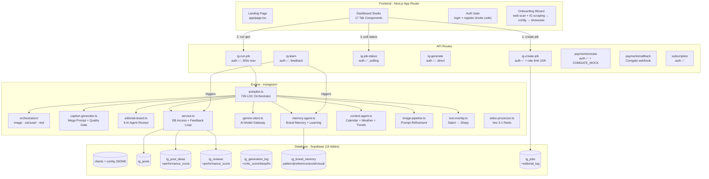
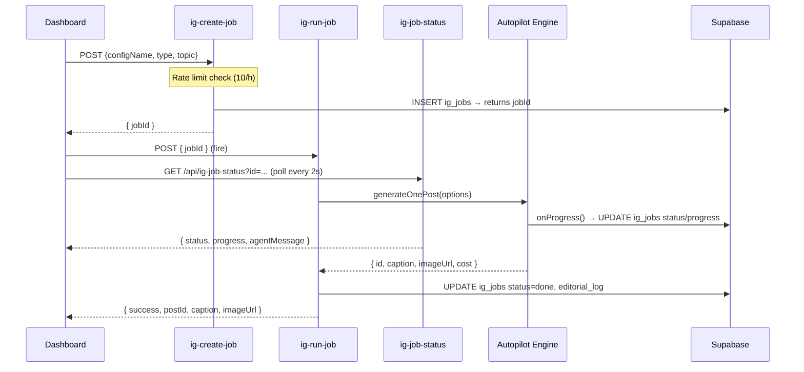

# 🧠 System Knowledge Base — Chrlit Studio

> **Codename:** ProdameVas  
> **Stack:** Next.js 16 (App Router) · Supabase (Postgres + Auth + Storage) · Google Gemini 3.5 Flash · Nano Banana Pro · Veo 3.1  
> **Last Updated:** 2026-06-10 (v4.1 — A/B varianty, dekompozice god files, onboarding + IG scraping)

---

## 1. High-Level Architecture



---

## 2. Multi-Tenancy Model

> [!IMPORTANT]
> **Every `ig_*` table uses `client_id uuid` FK to `clients.id`.** The dashboard passes a **projectId** (UUID), which maps to a client record. Config is stored as JSONB in `clients.config`.

| Layer | Identifier | Type |
|---|---|---|
| UI (StudioContext) | `projectId` | UUID string |
| API Routes | `clientId` from body/params | UUID |
| DB Queries | `client_id` | uuid FK |
| Config loader | `loadConfig(slug)` → `validateConfig()` | slug → ClientConfig |

> [!WARNING]
> Config lives ONLY in DB (`clients.config` JSONB). No config files in codebase — only `configs/types.ts` (TypeScript interface) and `configs/index.ts` (DB loader with caching + runtime validation).

---

## 3. Generation Pipeline (2-Step API)



### Agent Pipeline (inside generateOnePost)

| Step | Agent | Model | Progress |
|------|-------|-------|----------|
| 1. Post type selection | Researcher | — | 5% |
| 2. Idea/Review selection | Researcher (weighted) | — | 15% |
| 3. Dedup check (Levenshtein) | Researcher | — | 20% |
| 4. Context gathering | Context Agent | `gemini-3.5-flash` | 20% |
| 5. Caption generation | Copywriter | `gemini-3.5-flash` | 25% |
| 6. Quality gate scoring | Critic | `gemini-3.5-flash` | 45% |
| 6b. Editorial Board review | Chief Editor + Copywriter | `gemini-3.5-flash` | 50% |
| 7. Image prompt refinement | Art Director | `gemini-3.5-flash` | 60% |
| 8. Image generation | Renderer | Nano Banana Pro / Nano Banana 2 | 75% |
| 9. Text overlay | Renderer | Satori + Sharp | 90% |
| 10. Upload + save | Uploader | Supabase Storage | 95% |

---

## 4. Feedback Loop Architecture

The system is **self-improving**. Metrics propagate back into future generations:

```
User enters metrics (likes, comments, saves) → updateIGPostMetrics()
    ↓ AUTO-TRIGGER (fire & forget)
    ├── propagateMetricsToSources()
    │       ├── ig_post_ideas.performance_score  (Idea Ranker)
    │       └── ig_reviews.performance_score     (Review Ranker)
    └── analyzeAndLearn()
            └── ig_brand_memory (new pattern/avoid/visual rules)

ig_generation_log
    └── critic_score, critic_keep[], critic_fix[]
        → autopilot reads last 5 scores → injects keep/fix into mega prompt

buildSmartWeekPlan()
    └── pillar ratios ×1.5 (top) / ×0.5 (under) based on real engagement
```

> [!NOTE]
> Feedback loop is **automatic** — triggered when user saves metrics via `updateIGPostMetrics()`. Manual trigger: `POST /api/ig-learn { configName }`.

---

## 5. AI Model Registry

| Role | Model | Fallback | Notes |
|------|-------|----------|-------|
| **Text gen** (all agents) | `gemini-3.5-flash` | `gemini-2.5-flash-lite` | On 503/429 |
| **Image gen** (primary) | `gemini-3-pro-image-preview` | `gemini-3.1-flash-image-preview` | Nano Banana Pro → Nano Banana 2 |
| **Image edit** (product→scene) | `gemini-3-pro-image-preview` | — | editExistingImage() |
| **Image with refs** | `gemini-3-pro-image-preview` | — | generateImageWithReferences() |
| **Vision** (logo placement) | `gemini-3.5-flash` | — | detectLogoPlacementArea() |
| **Video** (reels) | `veo-3.1-fast-generate-001` | `veo-3.1-generate-001` | fast=$0.15/s, std=$0.40/s |
| **TTS** (voiceover) | `gemini-3.1-flash-tts-preview` | — | Czech narration, voice: Kore |

> [!CAUTION]
> `gemini-2.0-flash` is **DEPRECATED**. `imagen-4.0-ultra` was **sunset June 2026** — replaced by Nano Banana Pro. `gemini-3.1-pro-preview` was replaced by `gemini-3.5-flash`.

---

## 6. Database Schema (16 tables)

| Table | Key Columns | Notes |
|---|---|---|
| `clients` | `id` (uuid PK), `slug` (unique), `config` (jsonb) | Multi-tenant root |
| `user_clients` | `user_id`, `client_id`, `role` | RBAC |
| `ig_post_types` | `name`, `display_name`, `emoji`, `frequency` | Per-client post types |
| `ig_post_ideas` | `title`, `content`, `performance_score`, `times_used_with_metrics` | Idea Ranker (weighted) |
| `ig_reviews` | `quote`, `is_approved`, `performance_score`, `times_used_with_metrics` | Review Ranker (weighted) |
| `ig_products` | `name`, `type`, `slug`, `price`, `image_urls[]` | Products + photos |
| `ig_product_ideas` | `name`, `concept`, `design_url` | AI product design concepts |
| `ig_product_categories` | `name`, `client_id` | Product categories |
| `ig_posts` | `caption`, `image_url`, `status`, `idea_id`, `review_id`, `product_id`, `likes`, `saves`, `reach` | FK to ideas/reviews/products |
| `ig_content_calendar` | `date`, `post_id`, `time_slot` | Calendar scheduling |
| `ig_generation_log` | `prompt_used`, `model_used`, `critic_score`, `critic_keep[]`, `critic_fix[]` | Critic feedback for learning |
| `ig_brand_memory` | `memory_type` (pattern/preference/avoid/visual), `content`, `confidence` | Long-term learning |
| `ig_jobs` | `status`, `progress`, `agent_message`, `editorial_log` (jsonb), `result` (jsonb) | Progress + editorial board log |
| `subscription_plans` | `id`, `name`, `price_czk`, `features` | Plan definitions |
| `subscriptions` | `client_id`, `plan_id`, `status`, `plan_posts_unlocked` | Active subscriptions |
| `payments` | `comgate_trans_id`, `amount`, `status` | Comgate payments |

---

## 7. File Reference

### AI Engine (`instagram/`)

| File | LOC | Role |
|---|---|---|
| `autopilot.ts` | 1849 | **Core orchestrator** — generateOnePost(), generateBatch() |
| `caption-generator.ts` | 791 | Mega prompt builder, caption schemas, scorePost(), selectOverlayVariant() |
| `editorial-board.ts` | 777 | reviewPost(), reviewContentPlan(), reviewOverlayComposition() |
| `text-overlay.ts` | 683 | Satori SVG → Sharp PNG overlay + logo watermark |
| `product-generator.ts` | 643 | Product ideas, design concepts, mockups |
| `service.ts` | 617 | DB access — getWeightedIdeas(), createPost(), propagateMetrics() |
| `memory-agent.ts` | 459 | getBrandMemories(), analyzeAndLearn(), getPostTypeBoosts() |
| `gemini-client.ts` | 455 | AI gateway — generateText(), generateImage(), editExistingImage(), generateVideo(), generateVoiceover() |
| `image-pipeline.ts` | 346 | refineImagePrompt(), refineCarouselPrompts(), getVisualMemoriesSection() |
| `video-processor.ts` | 247 | processReelVideo(), scenesToSubtitles() |
| `context-agent.ts` | 232 | gatherContext() — svátek, počasí, trendy |
| `content-planner.ts` | 223 | planWeek() — AI content planning |
| `performance.ts` | 186 | Per-pillar engagement analytics |
| `idea-generator.ts` | 145 | generateAIIdeas() with brand memory |
| `review-generator.ts` | 142 | generateAIReviews() with brand memory |
| `brand-tagger.ts` | 128 | tagBrandImages() — vision auto-tagging |
| `configs/index.ts` | — | loadConfig(), validateConfig(), resolveClientId(), invalidateConfigCache() |
| `configs/types.ts` | — | ClientConfig interface (brandVoice, contentPillars, feedAesthetic, imageInstructions, ...) |

### API Routes

| Route | Auth | Duration | Purpose |
|-------|------|----------|---------|
| `POST /api/ig-create-job` | ✅ + rate limit | 10s | Create job record, return jobId |
| `POST /api/ig-run-job` | ✅ | 300s | Run full generation pipeline |
| `GET /api/ig-job-status` | ✅ | 10s | Poll job progress |
| `POST /api/ig-generate` | ✅ | 300s | Direct generation (no job) |
| `POST /api/ig-learn` | ✅ | 60s | Trigger feedback loop |
| `POST /api/payments/create` | ✅ | 10s | Create Comgate payment (or mock) |
| `POST /api/payments/callback` | ❌ (webhook) | 10s | Comgate status callback |
| `GET /api/payments/return` | ❌ (redirect) | 10s | Post-payment redirect |
| `GET /api/subscription` | ✅ | 10s | Client subscription info |

### Server Actions (`app/actions/`)

| File | LOC | Key Exports |
|---|---|---|
| `admin-actions.ts` | 2366 | getDashboardStats(), getIGPostsList(), updateIGPostMetrics(), revisePost(), generatePostVariant(), generateContentPlan(), getEditorialLog(), updateClientConfig() |
| `product-actions.ts` | 537 | getProducts(), saveProduct(), deleteProduct() |
| `ig-generate-action.ts` | 519 | triggerBatchGeneration(), triggerIdeaGeneration(), triggerReviewGeneration() |
| `credit-guard.ts` | 197 | creditGuard(), creditGuardBatch() |
| `calendar-actions.ts` | 180 | planWeekCalendar() |
| `product-brief-actions.ts` | 154 | generateProductBrief() → DOCX |

---

## 8. Security

| Layer | Protection |
|---|---|
| **Middleware** | Redirects unauthenticated to `/login` for `/dashboard/*`, `/onboarding` |
| **API Routes** | `requireAuth()` on all routes (except payment webhooks) |
| **Rate Limiting** | 10 jobs/hour per client (DB-based, admin bypass) on `ig-create-job` |
| **Supabase RLS** | Enabled on all tables |
| **Service Role** | `supabase/admin.ts` — bypasses RLS for engine operations |
| **Invite Codes** | Registration requires valid invite code (`invite_codes` table) |
| **Mock Payments** | `COMGATE_MOCK=true` → fake payment page, no real charges |
| **Config Validation** | `validateConfig()` fills safe defaults for 11+ required fields |

### Supabase Clients

| Client | File | When to Use |
|--------|------|-------------|
| **Browser** | `supabase/client.ts` | ONLY frontend `"use client"` components |
| **Server** | `supabase/server.ts` | Server actions — has auth context (cookies) |
| **Admin** | `supabase/admin.ts` | Engine backend — service role, bypasses RLS |

---

## 9. Environment Variables

| Variable | Required | Used By |
|---|---|---|
| `NEXT_PUBLIC_SUPABASE_URL` | Yes | All |
| `NEXT_PUBLIC_SUPABASE_ANON_KEY` | Yes | Frontend, middleware |
| `SUPABASE_SERVICE_ROLE_KEY` | Yes | Server actions, engine |
| `GEMINI_API_KEY` | Yes for gen | gemini-client.ts |
| `SUPER_ADMIN_EMAILS` | Yes | auth-guard.ts, subscription.ts |
| `COMGATE_MERCHANT` | Yes for payments | lib/comgate.ts |
| `COMGATE_SECRET` | Yes for payments | lib/comgate.ts |
| `COMGATE_MOCK` | Optional | payments/create, payments/callback |
| `NEXT_PUBLIC_SITE_URL` | Yes | auth callback, payments |

---

## 10. Cost Model (Per Generation)

| Operation | Model | Cost |
|---|---|---|
| Caption + Critic + Art Dir | gemini-3.5-flash | ~$0.02 |
| Image gen (Nano Banana Pro) | gemini-3-pro-image-preview | ~$0.05 |
| Image edit (product scene) | gemini-3-pro-image-preview | ~$0.05 |
| Video 8s | veo-3.1-fast | ~$1.20 |
| **Total per image post** | — | **~$0.10** |
| **Total per reel** | — | **~$1.25** |
| **Total per carousel (5 slides)** | — | **~$0.37** |
