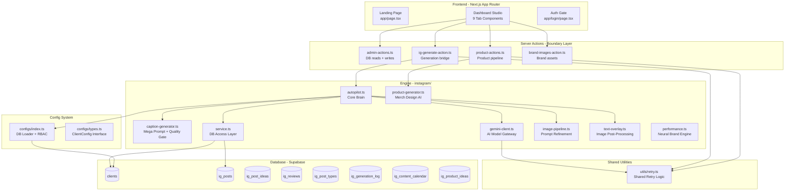
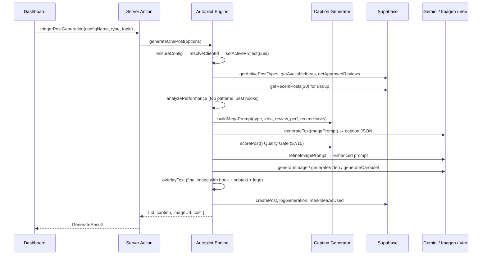

# 🧠 System Knowledge Base — Instagram Autopilot SaaS

> **Codename:** ProdameVas  
> **Stack:** Next.js 16 (App Router) · Supabase (Postgres + Auth + Storage) · Google Gemini 3.1 Pro · Imagen 4 Ultra · Veo 3.1  
> **Last Updated:** 2026-02-27

---

## 1. High-Level Architecture

---

## 2. Multi-Tenancy Model

> [!IMPORTANT]
> **Every `ig_*` table uses `client_id uuid` FK to `clients.id`.** The dashboard passes a human-readable **slug** (e.g. `"mobilnamiru"`), which is resolved to a uuid via `resolveClientId(slug)` at the server-action boundary.

| Layer | Identifier | Type | Example |
|---|---|---|---|
| UI Dropdown | `projectId` | slug string | `"mobilnamiru"` |
| Server Actions | `resolveClientId(slug)` | translator | slug → `"9a3f-..."` |
| DB Queries | `client_id` | uuid FK | `WHERE client_id = '9a3f-...'` |
| Autopilot Engine | `getActiveProject()` | uuid string | Set once per run via `ensureConfig` |

### Adding a New Client

1. Insert row into `clients` table via Supabase Dashboard (slug, name, website, config JSONB)
2. Link user via `user_clients` table or `scripts/setup-user.ts`
3. The dashboard auto-discovers it via `getAvailableClients()` (RBAC-filtered)
4. Super-admins (defined by `SUPER_ADMIN_EMAILS` env var) see all clients

> [!WARNING]
> Config is stored as JSONB in the `clients.config` column in Supabase DB. There are NO config files in the codebase — only `configs/types.ts` (TypeScript interface) and `configs/index.ts` (DB loader with caching).

---

## 3. Generation Pipeline

### Key Decision Points

| Step | What Happens | Fallback |
|---|---|---|
| **Idea Selection** | Picks least-used idea outside 90-day cooldown | Gemini invents its own topic |
| **Quality Gate** | `scorePost()` rates 1-10 | If <7, regenerates with criticism feedback |
| **Dedup Check** | Compares hook + body to last 30 posts (Levenshtein) | Regenerates with "avoid this" instruction |
| **Image Gen** | Imagen 4 Ultra 2K / Veo 3.1 reels / multi-slide carousel | Retries via shared `withRetry()` |
| **Text Overlay** | Satori + resvg-js typography with gradient + logo | Falls back to raw image |

---

## 4. File Reference — Critical Files

| File | Role | Key Notes |
|---|---|---|
| `autopilot.ts` | **Core brain** — orchestrates full pipeline | Uses `supabaseAdmin` for all DB access |
| `caption-generator.ts` | **Text engine** — mega prompt, schemas, quality gate | `buildMegaPrompt()` is the heart of content generation |
| `service.ts` | **DB access layer** — CRUD for ig_* tables | Every query filters by `client_id` via `getActiveProject()` |
| `gemini-client.ts` | **AI gateway** — text, image, video gen | Lazy-init (no crash if API key missing); uses shared `withRetry()` |
| `image-pipeline.ts` | **Prompt refinement** — feed aesthetic, carousel cohesion | Refines raw prompts into professional Imagen prompts |
| `text-overlay.ts` | **Image post-processing** — Satori + resvg-js | Fonts in `fonts/`, logos in `assets/` |
| `performance.ts` | **Analytics** — Neural Brand Engine | Uses `supabaseAdmin`; analyzes engagement, reach, conversion per pillar |
| `product-generator.ts` | **Merch AI** — idea→design→mockup pipeline | 3 pipelines: ideas, print-ready design, product mockup |
| `configs/index.ts` | **Config registry** — loads from DB, caches, RBAC | `isSuperAdmin()` reads from `SUPER_ADMIN_EMAILS` env var |
| `configs/types.ts` | **Type system** — `ClientConfig` interface | Any new feature likely needs a config field here |
| `utils/retry.ts` | **Shared retry** — single source of truth for retry logic | Used by gemini-client, ig-generate-action, product-actions, route.ts |

---

## 5. AI Agent Rules — MUST READ Before Any Change

> [!CAUTION]
> **Every change has cascading effects.** Follow these rules strictly.

### Rule 1: Tenant Isolation is Sacred
- **NEVER** query an `ig_*` table without a `client_id` filter
- New tables **MUST** have `client_id uuid REFERENCES clients(id) ON DELETE CASCADE`
- Use `resolveClientId(slug)` at the server-action boundary, never in the engine

### Rule 2: Config Lives in DB Only
- `ClientConfig` drives **everything**: brand voice, post types, pillars, CTAs, aesthetic, products, formats
- Config is stored as JSONB in `clients.config` column in Supabase
- **There are NO config files in the codebase** — only `configs/types.ts` (interface) and `configs/index.ts` (loader)
- If a feature depends on per-client behavior, add a field to `ClientConfig`

### Rule 3: The MegaPrompt is the Heart
- `buildMegaPrompt()` in `caption-generator.ts` constructs the entire AI instruction
- Injects: brand voice, performance data, ideas, reviews, recent captions, products, CTA strategy
- **New data sources** must be wired into this function

### Rule 4: Server-Side Only
- Backend files (`autopilot.ts`, `performance.ts`, `service.ts`) use `supabase/admin` (service role key)
- **Never** use `supabase/client` (browser anon key) in backend code
- Server actions in `app/actions/` handle auth checks via `supabase/server`

### Rule 5: No Hardcoding
- Admin emails → `SUPER_ADMIN_EMAILS` env var
- Storage buckets → `config.storageBucket`
- Retry logic → `utils/retry.ts` (single source)
- Logo files → `config.logoFile` (resolved from `instagram/assets/`)

### Rule 6: Asset Organization
- **Fonts** (`*.ttf`): `instagram/fonts/`
- **Logos** (`*.png`): `instagram/assets/`
- **Runtime data** (generated images, scraped products): gitignored, not in repo

---

## 6. Database Schema

| Table | Key Columns | FK |
|---|---|---|
| `clients` | `id` (uuid PK), `slug` (unique), `config` (jsonb), `is_active` | — |
| `user_clients` | `user_id`, `client_id`, `role` | → auth.users, → clients |
| `ig_post_types` | `name`, `display_name`, `emoji`, `frequency` | → clients |
| `ig_post_ideas` | `title`, `content`, `category`, `cooldown_days`, `used_count` | → clients |
| `ig_reviews` | `quote`, `rating`, `is_approved`, `used_at` | → clients |
| `ig_posts` | `caption`, `image_url`, `status`, `likes`, `saves`, `reach` | → clients, → ig_post_types |
| `ig_generation_log` | `prompt_used`, `model_used`, `tokens_used` | → clients, → ig_posts |
| `ig_content_calendar` | `date`, `time_slot`, `notes` | → clients, → ig_posts |
| `ig_product_ideas` | `name`, `type`, `status`, `design_url`, `mockup_url` | → clients |

---

## 7. Environment Variables

| Variable | Required | Used By | Purpose |
|---|---|---|---|
| `NEXT_PUBLIC_SUPABASE_URL` | Yes | All | Supabase project URL |
| `NEXT_PUBLIC_SUPABASE_ANON_KEY` | Yes | Frontend, middleware | Public API access (RLS) |
| `SUPABASE_SERVICE_ROLE_KEY` | Yes | Server actions, engine | Admin access (bypasses RLS) |
| `GEMINI_API_KEY` | Yes for gen | gemini-client.ts | Google AI Platform key |
| `SUPER_ADMIN_EMAILS` | Yes | configs/index.ts | Comma-separated admin emails for RBAC |

---

## 8. Toward Full Autonomy

### Current State: Semi-Autonomous
- AI generates captions, images, videos, carousels
- Performance feedback loop learns from metrics
- Idea cooldown and dedup prevent repetition
- Quality gate prevents low-quality output
- Posting is manual (copy from dashboard to IG)
- Metrics are manually entered

### Path to Full Autonomy

| Feature | Implementation Path |
|---|---|
| **Auto-posting** | Instagram Graph API → `ig_posts.status = 'scheduled'` → cron publishes |
| **Auto-metrics** | Instagram Insights API → cron pulls engagement data every 24h |
| **Cron scheduler** | Vercel Cron or Supabase Edge Function → triggers `generateBatch()` daily |
| **A/B testing** | Generate 2 variants per slot → post higher-scored one |
| **Client onboarding** | Self-service form → creates `clients` row → AI fills brand voice |

---

## 9. Cost Model (Per Generation)

| Operation | Model | Cost |
|---|---|---|
| Caption generation | Gemini 3.1 Pro | ~$0.01 |
| Image refinement prompt | Gemini 3.1 Pro | ~$0.005 |
| Quality scoring | Gemini 3.1 Pro | ~$0.005 |
| Image generation | Imagen 4 Ultra 2K | ~$0.06 |
| Video generation 7s | Veo 3.1 Fast | ~$1.05 |
| **Total per image post** | — | **~$0.08** |
| **Total per reel** | — | **~$1.07** |
| **Total per carousel 4 slides** | — | **~$0.26** |
