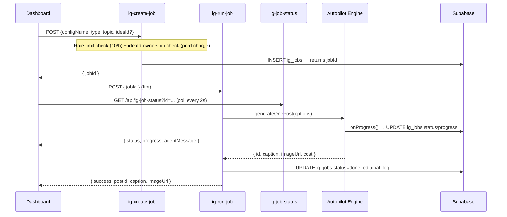

# 🧠 System Knowledge Base — Chrlit Studio

> **Codename:** ProdameVas  
> **Stack:** Next.js 16 (App Router) · Supabase (Postgres + Auth + Storage) · Google Gemini 3.5 Flash · Nano Banana Pro · Veo 3.1  
> **Last Updated:** 2026-06-10 (v4.1 — A/B varianty, dekompozice god files, onboarding + IG scraping)

---

## 1. High-Level Architecture


---

## 2. Multi-Tenancy Model

> [!IMPORTANT]
> **Every `ig_*` table uses `client_id uuid` FK to `clients.id`.** The dashboard passes a **projectId** (UUID), which maps to a client record. Config is stored as JSONB in `clients.config`.

| Layer | Identifier | Type |
|---|---|---|
| UI (StudioContext) | `projectId` | UUID string |
| API Routes | `clientId` from body/params | UUID |
| DB Queries | `client_id` | uuid FK |
| Config loader | `loadConfig(slug)` → `validateConfig()` | slug → ClientConfig |

> [!WARNING]
> Config lives ONLY in DB (`clients.config` JSONB). No config files in codebase — only `configs/types.ts` (TypeScript interface) and `configs/index.ts` (DB loader with caching + runtime validation).

> `ClientConfig.igBaseline` (optional) = snapshot z onboarding IG scrapu (followerCount, avgEngagementRate, topHashtags, contentMix, bestPostingTimes, scrapedAt). Cold-start fallback: `generateContentPlan` ho injektuje jako brand grounding, dokud nejsou interní performance data.

---

## 3. Generation Pipeline (2-Step API)



### Agent Pipeline (inside generateOnePost)

| Step | Agent | Model | Progress |
|------|-------|-------|----------|
| 1. Post type selection | Researcher | — | 5% |
| 2. Idea/Review selection | Researcher (weighted; skip při explicitním `topic`, přímý fetch při `ideaId`) | — | 15% |
| 3. Dedup check (Levenshtein) | Researcher | — | 20% |
| 4. Context gathering | Context Agent | `gemini-3.5-flash` | 20% |
| 5. Caption generation | Copywriter | `gemini-3.5-flash` | 25% |
| 6. Quality gate scoring | Critic (via `judgeText`) | **Claude `claude-sonnet-5`** / Gemini `textPro` fb | 45% |
| 6b. Editorial Board review | Chief Editor (via `judgeText`) + Copywriter | Chief Editor: Claude `claude-sonnet-5` / Gemini `textPro` fb; revize: Gemini `textPro` | 50% |
| 7a. Design brief (native engine, default) | AI Designer | `gemini-2.5-pro` | 55% |
| 7b. Image prompt refinement (overlay engine / fallback) | Art Director | `gemini-3.5-flash` | 60% |
| 8. Image generation | Renderer | Nano Banana Pro (native: incl. Czech typography + logo) | 75% |
| 9a. Vision QA + corrective edit (native) | Renderer | `gemini-3.5-flash` vision → `gemini-3-pro-image` edit | 78% |
| 9b. Text overlay (overlay engine / fallback) | Renderer | Satori + Sharp | 90% |
| 10. Upload + save | Uploader | Supabase Storage | 95% |

---

## 4. Feedback Loop Architecture

The system is **self-improving**. Metrics propagate back into future generations:

```
User enters metrics (likes, comments, saves) → updateIGPostMetrics()
    ↓ AUTO-TRIGGER (fire & forget)
    ├── propagateMetricsToSources()
    │       ├── ig_post_ideas.performance_score  (Idea Ranker)
    │       └── ig_reviews.performance_score     (Review Ranker)
    └── analyzeAndLearn()
            └── ig_brand_memory (new pattern/avoid/visual rules)

ig_generation_log
    └── critic_score, critic_keep[], critic_fix[]
        → autopilot reads last 5 scores → injects keep/fix into mega prompt
        → learnFromCriticInsights() (v6.8): recurring critic `fix` → ig_brand_memory
          (avoid @ confidence 0.3 → reinforces past 0.4 → standing "avoid" rule; pillar-scoped)

buildSmartWeekPlan()
    └── pillar ratios ×1.5 (top) / ×0.5 (under) based on real engagement

A/B Variant Loop (variant-actions.ts)
    generateMultipleVariants() → N draft variant postů (revision_of + link_type='variant')
        → uživatel vybere vítěze: selectVariantWinner()
            ├── winner → draft, losers → rejected
            └── learnFromVariantSelection(winner, losers, clientId)
                    → ig_brand_memory (preference)
    Pozn.: revisePost() linkuje přes revision_of + link_type='revision' —
    revize se do A/B srovnání ani učení NEpočítají.

Targeted Edit Loop (post-edit-actions.ts, v8.6)
    editPost(scope, instruction, preserve?, region?) → JEDEN řádek, upravený in-place
        ├── text  → reviseCaption({keepHook:true})   … 0 kreditů
        └── image → fetchImageBuffer(image_url)
                    → editExistingImage(buffer, buildPostEditPrompt(...))
                    → verifyNativeImage (zásah jen u severity='severe', max 1 korekce)
                    → uploadPostImage → splice zpět na slideIndex   … 1 kredit
        → předchozí stav na ig_posts.edit_history (max 10) → revertPostEdit()
        → learnFromRevision(...) fire & forget (feedback = nejsilnější signál)
    Pozn.: NIKDY renderImage/generateDesignBrief a NIKDY čerstvá regenerace —
    to je revisePost(), samostatné opt-in tlačítko „Vygenerovat úplně znovu".
```

> [!IMPORTANT]
> Learning trigger v `updateIGPostMetrics()` čte předchozí metriky PŘED updatem
> (jinak jsou delty vždy 0 a učení se nikdy nespustí) a běží přes `waitUntil()`
> z `@vercel/functions`, aby ho serverless neukončil s odpovědí.

> [!NOTE]
> Feedback loop is **automatic** — triggered when user saves metrics via `updateIGPostMetrics()`. Manual trigger: `POST /api/ig-learn { configName }`.

### Pravidla atribuce nápadů (v7.5, rozšířeno v7.6)

Aby `propagateMetricsToSources` nekreditoval nápad za post, který nedriveoval:

- **Bez `topic` i `ideaId`** → weighted výběr (`getWeightedIdeas`), `idea_id` se linkuje, `markIdeaAsUsed` cooldownuje. (Beze změny.)
- **Explicitní `topic`, bez `ideaId`** (ruční zadání) → výběr nápadu se **přeskočí** (`buildMegaPrompt` nápad při `userTopic` stejně ignoruje) — žádný `idea_id` link, žádný cooldown, žádná falešná metrika.
- **Explicitní `ideaId`** (uživatel vybral v GenerateTab, NEBO plánová položka odvozená z nápadu — viz níže) → `getIdeaById` (client-scoped; miss = throw v single-post cestě; campaign worker miss = drop atribuce, ne fail) — nápad je poctivě linkován + marknut jako použitý. `ideaId`+`topic` současně je zde ZÁMĚRNÁ poctivá atribuce (topic z nápadu vznikl).
- Cooldown je per-idea: `cooldown_days ?? 90` (jednotné pravidlo v `getWeightedIdeas` i `getAvailableIdeas`; dashboard `ideasAvailable` počítá stejně).

### Plán ↔ Zásobník témat (v7.6 — uzavřená strategická smyčka)

```
Zásobník (ig_post_ideas) ──getWeightedIdeas(count)──▶ generateContentPlan
    ▲   (prompt sekce "ZÁSOBNÍK TÉMAT", model vrací ideaIndex → clamp → ideaId na ContentPlanItem)
    │
    │ deposit-back: startCampaign uloží VYMYŠLENÁ témata schváleného plánu jako nové nápady
    │ (explicitní client_id, cooldown_days 30; POUZE v startCampaign — worker nikdy, resume nesmí duplikovat)
    │
ig_campaigns.plan[*].ideaId ──campaign-worker──▶ generateOnePost({ideaId}) → ig_posts.idea_id + markIdeaAsUsed
    │
    └── metriky → propagateMetricsToSources → performance_score → příští getWeightedIdeas → příští plán
```

- **Preview je bez side-effectů** — `generateContentPlan` banku jen čte; deposit + validace ideaIds (ownership) probíhá až v `startCampaign`.
- Onboarding seeduje banku (`seedIdeaBank`: 2 nejvyšší pilíře × 6 nápadů, zdarma) PŘED prvním plánem.
- Editace/regenerace plánové položky v UI čistí její `ideaId` (upravené téma ≠ nápad).

---

## 4b. Agent Infrastructure (core hardening, Fáze 0–5)

Shared substrate beneath both content channels (IG/LinkedIn/FB) and future business-ops
agents (email, ads, daně…). Built 2026-06-20, all live. Principle: additive, never rewrites —
the content path (`ig_jobs`/`ig_campaigns`) is untouched; new agents ride this substrate.

| Pilíř | Kde | Co |
|---|---|---|
| **Identita** (Fáze 0) | `instagram/service.ts` | `setActiveProject` zapisuje do request-scoped `AsyncLocalStorage` (`enterWith`), ne modul-globálu → konec křížení tenantů. Preferuj `withActiveProject(clientId, fn)` |
| **Connections** (Fáze 1) | `ig_connections`, `instagram/ig-connection.ts`, `lib/ig-token-crypto.ts` | Multi-provider šifrovaný credential vault |
| **Task runner** (Fáze 2) | `agent_tasks`, `lib/agent-runner.ts`, `/api/cron/agent-worker`, `lib/agents/handlers.ts` | Durable fronta: `registerHandler(type,fn)` + `enqueueTask` + `drainTasks` (lease/heartbeat/retry) |
| **Safety rails** (Fáze 3) | `agent_actions`, `lib/agent-safety.ts`, `approval-actions.ts`, dashboard **Schválení** tab | `requestAction()` gate-uje dle risk tieru; high-risk čeká na human approval; default-deny peníze/zákazník |
| **Events** (Fáze 4) | `domain_events`, `lib/events.ts`, `lib/events/subscribers.ts` | `emit`/`on` pub-sub; metrics→učení přepojeno na `metrics.updated` event |
| **Channel adapter** (Fáze 5) | `lib/channels/*`, `ig_posts.channel` | `ChannelAdapter` interface + IG impl; nový kanál = implementovat interface |

**Tok reálné akce agenta:** `requestAction()` → (audit do `agent_actions`) → low-risk auto / high-risk
čeká na schválení → po schválení `enqueueTask()` → `agent-worker` spustí handler. Publikování/metriky
IG adaptéru jsou zatím `ChannelNotEnabledError` (čekají na 2. Meta App Review). Plný plán:
`~/.claude/plans` + brain `[[Core hardening - bezpečný základ pro agenty]]`.

### Ops agenti (v8.1, 2026-07-22) — „nic se nerozbije potichu + revenue bez dotyku"

Registrované handlery (`lib/agents/handlers.ts`): `noop`, `weekly_report`, `health_check`,
`lifecycle_scan`, `send_lifecycle_email`, `auto_publish_arm`, `idea_replenish`. Denní cron
**`/api/cron/daily-ops`** (05:30 UTC, `vercel.json`) dispatchuje přes `requestAction` čtyři
interní tasky:

- **`health_check`** (`lib/agents/health-check.ts`) — 7 kontrol za posledních 24 h (selhané
  `ig_jobs`, joby visící uprostřed pipeline >2 h [okno 7 dní], kampaně stuck running/pending,
  selhané `agent_tasks`, dunning `billing_failures`, schválení čekající >24 h **včetně
  `client_id NULL`**). E-mail zakladateli JEN když něco nesedí; chyba dotazu = vlastní problém
  (nikdy tiché „healthy"). Manuální read-only běh: `npx tsx scripts/run-health-check.ts`.
- **`lifecycle_scan`** (`lib/agents/lifecycle.ts`) — najde lifecycle momenty (aktivace 2–14 d
  bez vlastní kampaně [showcase nepočítá], kredity ≤10 %, winback 14–30 d po expiraci,
  waitlist >7 d) a **navrhne** outbound e-maily přes safety rails (`outbound` tier → schválení).
  Dedupe = samotný audit trail (`agent_actions` řádek stejného kind+příjemce v okně blokuje
  re-návrh; rejection se respektuje). Zakladateli jde JEDEN digest s one-click odkazy.
  Skutečné odeslání až po schválení: task `send_lifecycle_email` → `sendNotification`
  (opt-outy + unsubscribe footer). Šablony česky v `buildLifecycleEmail`.
- **`auto_publish_arm`** (`lib/agents/auto-publish.ts`) — poslední míle flywheelu:
  pipeline generuje posty do `ready` (nic se nepublikuje bez lidského ready→scheduled).
  Pro klienty s **`config.autoPublish === true` A živým `ig_connection`** naarmuje
  `ready` posty → `scheduled` na kadenci `postsPerWeek` (`distributeSchedule`), drží
  **bounded forward buffer ~2 týdny** → účet publikuje sám, ale 149-post backlog
  **nezaplaví** (drénuje po kadenci, zakladatel může budoucí `scheduled` post vetovat).
  Safety: opt-in (default `false` ve `validateConfig`), connection-guarded (bez
  připojení no-op), reels vyloučené (auto-publish nemá video cestu), FIFO. Ověřeno:
  opt-in + connection guard + buffer math (E2E na throwaway klientovi).
  **Per-klient self-service:** SettingsTab → **„Auto-publikování"** panel
  (`AutoPublishSection`) přepíná `config.autoPublish`, `postsPerWeek` (1–14; 14 =
  2×/den) a `config.postingTimes` (per-klient časy, jinak defaulty 09/17/19) přes
  `updateClientConfig`. Časy jsou **Prague-local** — `toScheduledFor`
  (`lib/schedule-planner.ts`) je převádí na UTC instant (DST-aware), takže „09:00"
  = 09:00 ČR. `distributeSchedule` clamp 1–14 (`MAX_POSTS_PER_WEEK`); perWeek>7 →
  `ceil/7` postů/den na distinct sloty. Kadence je tak plně per-klient bez DB.
- **`idea_replenish`** (`lib/agents/idea-replenish.ts`) — zásobník nápadů se sám
  nevyčerpá potichu: banka (`ig_post_ideas`) se seeduje jen při onboardingu a pak
  roste jen vratkami z plánů / ručním klikem, takže při vyšší kadenci dostupný
  pool (aktivní + mimo cooldown) klesá rychleji, než se doplňuje. Agent denně
  per-klient dorovná pool na **runway `max(10, postsPerWeek × 2)`** — refill jde
  do pilířů nejvíc pod svým ratio-fair podílem (čistá matematika
  `computeReplenishPlan`, testy `npx tsx scripts/test-idea-replenish.ts`).
  Safety: **zdarma** (žádný creditGuard — maintenance jako `seedIdeaBank`, akce
  bez kliku uživatele nikdy nehýbe kreditem), **bounded** (max 2 batche × 8
  nápadů/klient/den), threshold-gated (plná banka no-op), dormant-skip (bez
  postu za 60 d se netokenuje), opt-out `config.autoReplenishIdeas === false`
  (default `true` ve `validateConfig`), per-klient izolace, výstup inertní
  (řádky v Nápadech, nic nepublikuje ani neúčtuje). Dedup: `generateAIIdeas`
  nově injektuje do promptu ~40 existujících titulů pilíře („UŽ V ZÁSOBNÍKU")
  — bez toho by opakovaná generace konvergovala k duplikátům (platí i pro
  ruční klik v Nápadech).

**Real-time alerting:** `agent-runner.runTask` catchne chybu handleru (zapíše do `agent_tasks.error`),
takže se nikdy nepropaguje do Sentry `onRequestError`. Proto **terminální** selhání (vyčerpané
retry) + `no_handler` volají `Sentry.captureException` napřímo (tagy `agent_task_type`/`task_id`);
retry se nereportuje (očekávané, self-heal). health_check = denní digest, Sentry = real-time — dvě
poloviny „nic se nerozbije potichu".

**Schvalovací smyčka (rychlá):** `requestAction` s high-risk tierem pošle zakladateli e-mail
(`lib/agents/approval-notify.ts`, potlačitelné `notify:false`) s podepsanými odkazy
`/api/agent-approval` (`lib/agent-approval-link.ts` — HMAC nad actionId+decision+expiry 7 d;
GET jen zobrazí potvrzení, **stav mění až POST** — mail scannery prefetchují GET). Decision je
single-use (jen `status='proposed'`). Dashboard **Schválení** tab je super-admin-wide: ukazuje
VŠECHNY pending akce včetně systémových `client_id NULL` (dřív neviditelné — listing byl
client-scoped). Testy: `npx tsx scripts/test-agent-approval-link.ts` (token properties + šablony).

---

## 5. AI Model Registry

**Single source of truth: `instagram/models.ts`** (`MODELS` constant + `getModel()`). Per-env override without deploy: `GEMINI_MODEL_<ACTION>` / `GEMINI_MODEL_<ACTION>_FALLBACK`.

| Action | Model | Fallback | Notes |
|------|-------|----------|-------|
| `text` (interactive: plan preview, onboarding, product, ideas, context, memory) | `gemini-3.5-flash` | `gemini-2.5-flash` | FAST tier — keeps the dashboard responsive (Pro here made multi-call previews lazy) |
| `textPro` (copywriter — caption only, in-job) | `gemini-pro-latest` (alias → GA Pro) | `gemini-2.5-pro` | Pro for caption quality; latency hidden by 800s job budget; fallback is a 2nd Pro (never flash — quality ladder) |
| `designer` (AI Designer) | `gemini-pro-latest` | `gemini-2.5-pro` | Design briefs — Pro for best structured-creative reasoning |
| `judge` (**Critic + Chief Editor**, cross-family — v6.8) | **Claude `claude-sonnet-5`** (only when `ANTHROPIC_API_KEY` set) | Gemini `textPro` ladder @ temp 0.25 | `judgeText()` (`instagram/judge.ts`) — different model family than the Gemini copywriter = no self-preference bias (writer ≠ judge). Sonnet 5 = 5-gen (no `temperature`/`thinking`; `effort:"low"`). Kill switch `CLAUDE_JUDGE=off` |
| `image` | `gemini-3-pro-image` | `gemini-3.1-flash-image` | Nano Banana Pro GA → Nano Banana 2 GA; also editExistingImage() + generateImageWithReferences() |
| `imageCheap` | `gemini-3.1-flash-image` | — | 512px tier |
| `vision` (logo placement, tagging, overlay review) | `gemini-3.5-flash` | — | detectLogoPlacementArea(), reviewOverlayComposition(), brand-tagger |
| `visionQA` (native QA gate) | `gemini-pro-latest` | `gemini-2.5-pro` | verifyNativeImage() — Pro judge zachytí jemné CZ typo/logo defekty; 2nd-Pro fallback, pak fail-open |
| `videoLite`/`videoFast`/`videoPremium` | `veo-3.1-lite-generate-preview` / `veo-3.1-fast-generate-preview` / `veo-3.1-generate-preview` | — | ~$0.06 / $0.15 / $0.40 per second; tier via `ClientConfig.videoTier` (default `fast`; `premium` = best). Veo 3.1 jen jako `-preview` |
| `tts` (voiceover) | `gemini-3.1-flash-tts-preview` | `gemini-2.5-flash-preview-tts` | Czech narration, voice: Kore, expressive audio tags |
| `embedding` | `gemini-embedding-2` (GA) | `gemini-embedding-001` (GA) | Memory relevance retrieval + consistency score (pipeline v2); vždy 768 dims (`EMBEDDING_DIMS` — musí sedět s pgvector sloupci); live-verified 2026-07-02 |

> [!CAUTION]
> `gemini-2.0-flash` is **DEPRECATED**. `imagen-4.0-ultra` was **sunset June 2026**. `gemini-3-pro-image-preview` / `gemini-3.1-flash-image-preview` **shut down June 25, 2026** — replaced by GA IDs. `gemini-3-pro-preview` **404'd "no longer available" June 18, 2026**; the Pro tier (`textPro`/`designer`/`visionQA`) now uses the **`gemini-pro-latest` alias** (auto-rotates to current GA Pro — never pin a preview ID). `gemini-3.1-pro-preview` deprecated.

---

## 6. Database Schema (24 tables)

| Table | Key Columns | Notes |
|---|---|---|
| `clients` | `id` (uuid PK), `slug` (unique), `config` (jsonb) | Multi-tenant root |
| `ig_billing_details` | `client_id` (PK), `customer_type` (company/consumer), `name`, `ico`, `dic`, `street`, `city`, `zip`, `country_code`, `instant_access_consent_at`, `instant_access_consent_text` | **v8.5** (`20260730_billing_invoices.sql`). Na koho se vystavuje doklad — jeden řádek na tenanta. `instant_access_consent_*` je důkaz souhlasu se zahájením plnění před uplynutím 14denní lhůty (§ 1837 obč. zák.): bez něj právo spotřebitele na odstoupení **trvá**. Ukládá se čas i **znění** (boolean by v případném sporu nic nedokázal) a zápis je **podmíněný** (`.is(instant_access_consent_at, null)`), aby opakované potvrzení nepřepsalo původní čas |
| `invoices` | `client_id`, `payment_id`, `provider`, `provider_invoice_id`, `number`, `total_czk` (**haléře**), `status` (pending/issued/failed), `pdf_url`, `public_url`, `error`, `attempts` | **v8.5.** Evidence vystavených dokladů. **UNIQUE index na `payment_id` je nárok na vystavení** — přehraný Comgate callback dostane konflikt a skončí (`status:"duplicate"`). Číselná řada je nevratná, takže duplicitu nejde smazat, jen stornovat → **nikdy nepřidávat insert fallback**. Řádek se zakládá PŘED voláním Fakturoidu, takže neúspěch zůstane viditelný jako `failed` místo tichého zmizení; jen `failed` se smí zkusit znovu, a to na témže řádku |
| `user_clients` | `user_id`, `client_id`, `role` | RBAC |
| `ig_post_types` | `name`, `display_name`, `emoji`, `frequency` | Per-client post types |
| `ig_post_ideas` | `title`, `content`, `performance_score`, `times_used_with_metrics` | Idea Ranker (weighted) |
| `ig_reviews` | `quote`, `is_approved`, `performance_score`, `times_used_with_metrics` | Review Ranker (weighted) |
| `ig_products` | `name`, `type`, `slug`, `price`, `image_urls[]`, `line_id`, `line_step`, `line_role`, `specs` jsonb, `last_used_at`, `times_used` | Products + photos. **v8.3:** `line_*` = membership in a product line (`line_step` = 1-based position in the line's process, `line_role` = what that step does); `specs` = `{volume, application, surface, claims[]}` verified facts for caption grounding. `last_used_at`/`times_used` drive the cooldown rotation in `autopilot.ts` — they existed only in prod (added by hand) until `20260729_product_lines.sql` declared them, so any DB provisioned from this repo had **silently broken product rotation** |
| `ig_product_lines` | `name`, `slug`, `positioning`, `target_audience`, `price_tier`, `naming_convention`, `system_logic`, `brief` jsonb, `skus` jsonb, `status` (draft/generating/active/archived/failed), `progress` | **v8.3.** A product line = an ORDERED SYSTEM of SKUs (autokosmetika: mytí → dekontaminace → leštění → ochrana → údržba), not a tag. `skus` holds the proposal until approval writes real `ig_products` rows. Same draft doctrine as `ig_campaigns`: approval is a **conditional claim** (`UPDATE … WHERE id=? AND client_id=? AND status='draft'`) so a double-click is refused instead of writing the catalog twice — **never add an insert fallback**. Slug uniqueness is scoped to non-draft rows (abandoned drafts would otherwise collide on auto-slugs) |
| `ig_product_ideas` | `name`, `tagline`, `design_url`, `rating`, `performance_score`, `used_count`, `last_used_at`, `cooldown_days`, `is_active`, `line_id` | AI product concepts. **v8.3:** feedback columns mirror `ig_post_ideas` so `getWeightedProductIdeas(clientId, limit)` can mirror `getWeightedIdeas` instead of forking the scoring vocabulary. `rating` (👍 +1 / 👎 −1 / NULL = unrated) is the only signal — product ideas are never published, so there are no metrics; before this, saved/rejected was recorded and influenced **nothing** |
| `ig_product_categories` | `slug`, `label`, `design_guide`, `mockup_prompt`, `material_hint`, `manufacturing_hint`, `artwork_kind`, `aspect_ratio`, `print_size_mm`, `panels` jsonb, `safe_margin_mm`, `bleed_mm` | Render templates per product type (`client_id NULL` = global default). **v8.3:** print geometry is now data — the old renderer hardcoded `aspectRatio: "1:1"` four times regardless of product, so a 75×160 mm bottle label was generated square. `artwork_kind ∈ flat/label/wrap/poster` decides whether the artwork gets chroma-keyed to alpha (only `flat` sits ON a product). Seeded packaging categories: `lahev-500`, `etiketa-ovin`, `kanystr-5l`, `sprej-750`, `set-box` |
| `ig_product_designs` | `brief` jsonb, `artwork_url`, `artwork_print_url`, `dieline_url`, `mockup_url`, `print_spec` jsonb, `variant_group`, `is_winner`, `rating`, `qa_score`, `qa_status`, `status`, `progress` | **v8.3.** Print design history. Designs used to live only in React state + a bucket URL, so a refresh threw away a paid render, there was no corpus for anti-repetition, and A/B had nowhere to record a winner. `variant_group` groups an A/B pair; `selectDesignWinner` distils the winning brief into a `visual` `ig_brand_memory` — so a print decision also improves the Instagram art director |
| `ig_posts` | `caption`, `image_url`, `status`, `channel`, `idea_id`, `review_id`, `product_id`, `likes`, `saves`, `reach`, `feedback`, `revision_of`, `link_type`, `design_brief` (jsonb) | `channel` (default `'instagram'`) = channel-adapter discriminator (Fáze 5). `revision_of` + `link_type` ('revision'/'variant') link revisions & A/B variants; `design_brief` = AI Designer output (anti-repetition source: concept + `layoutArchetype` + typografie + color fingerprint; archetypy posledních 3 postů jsou pro další post hard-banned); `edit_history` (jsonb, v8.6) = zásobník předchozích stavů před každým `editPost()` (nejnovější poslední, max 10 v kódu) — zdroj pro `revertPostEdit()` |
| `ig_content_calendar` | `date`, `post_id`, `time_slot` | Calendar scheduling. **Planner:** content-plan posts get `scheduled_for`/`time_slot` stamped by the campaign worker from each plan item's slot (auto-distributed at approval via `lib/schedule-planner.ts` `distributeSchedule` — weekly-cadence spread, `postsPerWeek` posts per 7-day week on evenly spaced days, not consecutive days; editable per post). Single posts via `schedulePostAction` (calendar-actions); fine-tune by drag (`movePost`). Posting itself stays manual until the `instagram_business_content_publish` App Review clears — `scheduled_for` is the feed for that future publish cron. |
| `ig_generation_log` | `prompt_used`, `model_used`, `critic_score`, `critic_keep[]`, `critic_fix[]`, `qa_status`, `strategy`, `editorial_rounds`, `final_score`, `consistency_score`, `angle` | Critic feedback for learning; `qa_status` = native QA outcome; v7.0: `strategy` ('repair'/'bestof2') + `editorial_rounds` + `final_score` (post-editorial) pro srovnání pipeline cest, `consistency_score` = cosine caption vs gold-voice centroid (`20260703_generation_strategy.sql`, `20260703_embeddings.sql`); `angle` = úhel deklarovaný copywriterem před psaním, kritik proti němu hodnotí Originalitu (`20260704_caption_angle.sql`) |
| `ig_brand_memory` | `memory_type` (pattern/preference/avoid/visual), `content`, `confidence`, `embedding` vector(768) | Long-term learning; `embedding` = relevance retrieval přes RPC `match_brand_memories` (pgvector, lazy self-heal `embedPendingMemories`) |
| `ig_jobs` | `status`, `progress`, `agent_message`, `editorial_log` (jsonb), `result` (jsonb) | Progress + editorial board log |
| `ig_campaigns` | `status` (**draft**/pending/running/done/partial/failed), `plan` (jsonb), `options` (jsonb), `total`, `cursor`, `successes`, `failures`, `worker_lease`, `error` | Durable multi-post campaigns, drained by `/api/cron/campaign-worker` (lease + cursor resume). **`'draft'` (`20260718_plan_drafts.sql`) = a generated plan preview the user hasn't approved** — it survives a refresh/tab close (a plan costs a 1–2 min Pro-ladder run). The worker claims only `pending`/`running`, so a draft structurally **cannot generate or charge**; approval is a **conditional claim** (`UPDATE … WHERE id=? AND status='draft'`) which makes it single-use — a double-click gets refused instead of billing the plan twice (**never add an insert fallback there**). Draft rows hold the full UI-shape plan; approved rows hold the stripped worker `planRows`. GC: drafts >14 days are deleted on the worker's idle tick. `options` is schemaless — carries `configName`, `aspectRatio`, `medium`, `category`, `topic`, `adminBypass`, `strategySummary` (the strategist's campaign arc, handed to every post incl. #1), `goal`. `plan[*].slotIntent` = the post's feed-pattern cell, decided at plan time and **never recomputed by the worker** (a resumed post would flip visual mode mid-grid) |
| `subscription_plans` | `id`, `name`, `price_czk`, `features` | Plan definitions — v4 media-weighted re-budget (`20260702_media_weighted_credits.sql`): `chrlit_start` (490 Kč/**20** kr, image+carousel), `chrlit_rust` (990 Kč/**45** kr, +post_variant +reel +growth_tracking), `chrlit_dominance` (1990 Kč/**110** kr, +product studio +priority); `trial_v2` má nově `allowed_media: image+carousel`. Kredit ≈ $0.30 COGS: image 1 / carousel 3 / reel 5 (`lib/credits.ts`). Features JSON: `allowed_media[]` (chybí = vše povoleno, legacy), `growth_tracking` bool. Staré `chrlit` deaktivováno (grandfathered) |
| `subscriptions` | `client_id`, `plan_id`, `status`, `plan_posts_unlocked`, `recurring_trans_id`, `billing_failures`, **`current_period_start/end`**, **`credit_period_start/end`** | Active subscriptions — `activatePaidPlan(clientId, planId, subId?)` aktivuje zaplacený plán (z pending sub) a cancelne ostatní live subs klienta. `recurring_trans_id` = Comgate INIT token pro auto-renewal (billing-worker), `billing_failures` = dunning counter (migrace `20260702_recurring_billing.sql`).<br>**DVĚ periody, které se nikdy nesmí slít do jedné** (`20260728_credit_periods.sql`): `current_period_*` = **zaplacené** období (měsíční i roční, dle `subscription_plans.interval`) → řídí obnovu; `credit_period_*` = **kreditové okno, vždy měsíční** i u ročního plánu → řídí reset `credits_per_month`. Dřív se kredity resetovaly proti kalendářnímu měsíci, takže kdo zaplatil 25., dostal 1. plnou novou dávku — a roční plán resetoval 12× za jedno zaplacení. Zbytek okna **propadá, nekumuluje se**. Matematika je v `lib/billing-period.ts` (čistá, bez Supabase, testy `scripts/test-billing-periods.ts`) |
| `payments` | `comgate_trans_id`, `amount`, `status` | Comgate payments |
| `waitlist` | `email`, `created_at` | Zájemci z landing page; segment pro admin Mailing panel |
| `email_optouts` | `email` (PK), `created_at` | Globální unsubscribe (per email) — Mailing broadcasty je filtrují; plní public `/api/email/unsubscribe` (`20260703_email_optouts.sql`) |
| `ig_growth_snapshots` | `client_id`, `follower_count`, `following_count`, `media_count`, `captured_at` | Týdenní follower snapshoty (cron po 6:00 UTC) pro plány s `growth_tracking` — growth dashboard v PerformanceTab |
| `ig_connections` | `client_id`, `provider`, unique `(client_id, provider)`, `ig_user_id`, `ig_username`, `access_token` (AES-256-GCM ciphertext), `refresh_token`, `scopes[]`, `token_expires_at`, `status`, `metadata` jsonb | Per-tenant OAuth credential vault. **Multi-provider** (`provider ∈ instagram/linkedin/facebook/email`) — one row per (tenant, provider); core-hardening Fáze 1. IG module (`instagram/ig-connection.ts`) tags rows `'instagram'`. **RLS deny-all** → jen service-role; token nikdy nejde do prohlížeče ani do `clients.config`. Šifrování `lib/ig-token-crypto.ts` |
| `agent_tasks` | `client_id` (nullable), `type`, `payload` jsonb, `status` (pending/running/done/failed), `priority`, `attempts`/`max_attempts`, `scheduled_for`, `lease`, `result`, `error` | **Fáze 2** durable task queue. Generic runner `lib/agent-runner.ts` (`registerHandler`/`enqueueTask`/`drainTasks`, PostgREST-safe two-update lease claim) drained by `/api/cron/agent-worker`. Any new agent = registered `type`. RLS deny-all |
| `agent_actions` | `client_id` (nullable), `agent_type`, `action`, `risk_tier` (reversible/internal/outbound/spending/irreversible), `status` (proposed/approved/executed/rejected/failed), `task_type`, `payload`, `actor`, `result` | **Fáze 3** audit log + approval gate. `lib/agent-safety.ts` `requestAction()` records + gates by tier: reversible/internal auto-dispatch, rest → `proposed`, wait for human (dashboard **Schválení** tab → `approval-actions.ts`). Approved → dispatch via agent_tasks. Default-deny money/customer. RLS deny-all |
| `domain_events` | `name`, `client_id`, `payload` jsonb, `created_at` | **Fáze 4** append-only event log. `lib/events.ts` (`emit`/`on` in-process pub-sub); subscribers in `lib/events/subscribers.ts`. `metrics.updated` is the first event (metrics→learning runs as a subscriber, identical behavior). RLS deny-all |

---

## 7. File Reference

### AI Engine (`instagram/`)

| File | LOC | Role |
|---|---|---|
| `autopilot.ts` | ~730 | **Core orchestrator** — generateOnePost(), generateBatch() |
| `orchestrators/image-orchestrator.ts` | ~430 | Image rendering pipeline (extracted from autopilot) |
| `orchestrators/carousel-orchestrator.ts` | ~165 | Multi-slide carousel rendering |
| `orchestrators/reel-orchestrator.ts` | ~200 | Veo reel rendering |
| `cli.ts` | ~410 | Dev/management CLI (--stats, --feedback, --generate-ideas…) |
| `caption-generator.ts` | ~890 | Mega prompt builder, caption schemas, scorePost(), reviseCaption() |
| `editorial-board.ts` | 777 | reviewPost(), reviewContentPlan(), reviewOverlayComposition() |
| `product-generator.ts` | ~420 | Product ideas + concept visualization. **v8.3:** `generateDesignConcept`/`generateProductMockup`/`runDesignConcept` were REMOVED — they produced the wrong artefact by construction (the prompt forbade flat graphics and forced "Product photography, studio lighting, photorealistic", so "print-ready design" was always a studio photo of a finished product, which the mockup step then pasted onto ANOTHER product). `generateProductIdeas` now takes an explicit `clientId` → live catalog + 👍/👎 feedback section |
| `print-pipeline.ts` | ~640 | **v8.3 print engine** (replaces the removed generator). `generatePrintBrief` (designer Pro ladder, brand memory, anti-repetition, hex palette) → `renderPrintArtwork` (FLAT artwork, aspect ratio from the category, logo as a *faithful* reference — the old prompt told the model to emboss/spray-paint it) → `verifyPrintArtwork` (vision QA: exact Czech diacritics, flatness, logo integrity, safe area) → corrective edit → one fresh regen → **ship-best**, same doctrine as the IG orchestrator → `finalizePrintFile` (chroma-key `#FF00FF` → alpha for `flat` kinds, lanczos3 resize to the physical size, `density: 300`, die-line preview, printer spec) → `renderProductMockup` (artwork as a reference image so the model applies perspective; the old sharp composite was a fixed 40 % rectangle for mugs, posters and socks alike). Geometry helpers are pure and tested: `scripts/test-print-pipeline.ts`. **Honest limit:** the model renders ~1024 px and `imageSize: "2K"/"4K"` verifiably blurs it, so the output is a proposal for a printer at correct physical dimensions, RGB, not resolution-independent production data — the UI and FAQ say exactly that |
| `line-generator.ts` | ~340 | **v8.3 product lines.** `generateProductLine()` on the designer Pro ladder (never flash — one call seeds a whole catalog): the SKUs must form an ordered PROCESS with roles, one naming rule, a readable price ladder and cross-sell between neighbouring steps. `validateLine()` re-checks all of it in code (contiguous 1..N steps, no duplicates, no catalog collision, no price zig-zag, roles that aren't just the name) because "mostly obeys the prompt" is not something a catalog can be built on; one repair round feeds the issues back. `reviseSku()` edits ONE SKU without re-rolling the line. Tests: `scripts/test-product-lines.ts` |
| `service.ts` | 617 | DB access — getWeightedIdeas(), createPost(), propagateMetrics() |
| `memory-agent.ts` | 459 | getBrandMemories(), analyzeAndLearn(), getPostTypeBoosts(), learnFromCriticInsights(), upsertMemory() |
| `gemini-client.ts` | 455 | AI gateway — generateText(), generateImage(), editExistingImage(), generateVideo(), generateVoiceover() |
| `judge.ts` | ~30 | Cross-family judge dispatcher — judgeText() routes Critic + Chief Editor to Claude (or Gemini textPro fallback) |
| `anthropic-client.ts` | ~60 | Claude gateway — judgeWithClaude(), claudeJudgeEnabled() (Sonnet 5, 5-gen API: effort:low, no temperature) |
| `image-pipeline.ts` | ~600 | AI Designer — generateDesignBrief(), generateCarouselDesignBriefs(), buildNativeImagePrompt(), verifyNativeImage(), getVisualMemoriesSection(), `LAYOUT_ARCHETYPES`. **Feed pattern:** an optional `slotIntent` narrows the archetype choice to that slot's family (`ARCHETYPE_GROUPS`); the rotation ban then applies *within* the family, and if the ban would empty it the pattern wins (a broken grid rhythm is more visible than a repeated archetype — divergence is still enforced by `recentBriefs`). Composition rules are slot-conditional: PHOTO-FIRST/NO-EMPTY-VOIDS for photo slots, type-poster rules for typography, fill-the-frame colour-block rules for graphic — applying the photo rules to a typography slot would forbid the very thing the slot asks for |
| `../lib/feed-pattern.ts` | ~200 | **Feed pattern** (pure, client+server safe) — `FEED_PATTERNS` registry, `computeSlotIntent()`/`computeSlotIntents()`, `ghostRolesForPreview()`, `recommendPattern()`, `ARCHETYPE_GROUPS` (visual mode → layout archetypes). Grid math: IG shows newest top-left, so reading position = `total-1-seqIndex`. Tests: `scripts/test-feed-pattern.ts` |
| `video-processor.ts` | 247 | processReelVideo(), scenesToSubtitles() |
| `context-agent.ts` | 232 | gatherContext() — svátek, počasí, trendy |
| `performance.ts` | 186 | Per-pillar engagement analytics |
| `idea-generator.ts` | 145 | generateAIIdeas() with brand memory |
| `review-generator.ts` | 142 | generateAIReviews() with brand memory |
| `brand-tagger.ts` | 128 | tagBrandImages() — vision auto-tagging |
| `configs/index.ts` | — | loadConfig(), validateConfig(), resolveClientId(), invalidateConfigCache() |
| `configs/types.ts` | — | ClientConfig interface (brandVoice, contentPillars, feedAesthetic, imageInstructions, ...) |

### API Routes

| Route | Auth | Duration | Purpose |
|-------|------|----------|---------|
| `POST /api/ig-create-job` | ✅ membership + rate limit | 10s | Create job, **charge media-weighted credit/plan counter** (image 1 / carousel 3 / reel 5; `chargedCredits`+`chargedMedium` v job config; refunded on failure, down-clamp dorovnán přes `reconcileJobCharge`), return jobId |
| `POST /api/ig-run-job` | ✅ job ownership | 800s | Run full generation pipeline |
| `GET /api/ig-job-status` | ✅ job ownership | 5s | Poll progress + **stuck-job reaper** (>8 min silent → failed + refund) |
| `POST /api/ig-learn` | ✅ membership | 60s | Trigger feedback loop |
| `POST /api/payments/create` | ✅ client membership | 10s | Create Comgate payment (mock disabled on prod) |
| `POST /api/payments/callback` | ❌ (webhook) | 10s | Comgate status callback (server-side verification; **idempotentní** — replay PAID je no-op; ukládá `recurring_trans_id` token; CANCELLED renewal neruší živou sub). Po úspěšné aktivaci pošle **receipt e-mail** (`after()`, best-effort, `lib/notifications.ts`) |
| `GET /api/payments/return` | ❌ (redirect) | 10s | Post-payment redirect |
| `GET /api/subscription` | ✅ | 10s | Client subscription info (+ `allowedMedia`, `growthTracking`) |
| `GET /api/plans` | ✅ | 10s | Aktivní plány pro pricing UI (bez trial_v2) |
| `GET /api/cron/growth-snapshot` | ❌ (CRON_SECRET bearer) | 800s | Týdenní follower snapshot pro growth_tracking plány (vercel.json cron `0 6 * * 1`) |
| `GET /api/cron/ig-token-refresh` | ❌ (CRON_SECRET bearer) | 800s | Denní obnova IG long-lived tokenů blížících se expiraci (vercel.json cron `0 5 * * *`) |
| `GET /api/cron/ig-metrics-sync` | ❌ (CRON_SECRET bearer) | 800s | Denní sync IG insights → metriky postů → learning loop (roadmap step 3); caption-match backfill `ig_media_id` pro handoff posty; `instagram/metrics-sync.ts` (vercel.json cron `0 7 * * *`) |
| `GET /api/cron/agent-worker` | ❌ (CRON_SECRET bearer) | 800s | **Fáze 2** drainer fronty `agent_tasks` přes `drainTasks()` (vercel.json cron `* * * * *`) — registrované handlery `lib/agents/handlers.ts` |
| `GET /api/cron/billing-worker` | ❌ (CRON_SECRET bearer) | 300s | Denní renewal + dunning (vercel.json cron `0 8 * * *`): recurring charge přes `chargeRecurring()` (token `subscriptions.recurring_trans_id`), bez tokenu e-mail reminder; po 3 selháních persist `expired` + e-mail (vše přes `lib/notifications.ts`). Grace 3 dny (`BILLING_GRACE_DAYS`).<br>**Krok 0 = `rollLapsedCreditWindows()`** a běží při KAŽDÉM průchodu, nezávisle na tom, jestli je splatná obnova — u ročního plánu je to jediné, co kredity resetuje. Skáče rovnou na okno obsahující `now()`, takže výpadek workera se nedohání měsíc po běhu. Selhání se logují, ale **nezastaví obnovovací průchod** (zaúčtovaná platba je důležitější než uložené okno — čtenáři si ho odvodí sami; zápis workera a odvození čtenáře dávají stejný výsledek, idempotence je pokrytá testem) |
| `GET /api/cron/campaign-worker` | ❌ (CRON_SECRET bearer) | 800s | Durable drainer `ig_campaigns` (vercel.json cron `* * * * *`) — lease + cursor resume. Terminální přechod je **podmíněný claim** (running → done/partial/failed jen jednou); po něm pošle **plan-ready digest e-mail** vlastníkovi (karty s termínem/caption/hashtagy/náhledem + deep link `?project=<id>#calendar`; respektuje `email_optouts`) |
| `GET /api/ig-connect/start` | ✅ requireProjectAccess | 10s | Začátek IG OAuth — podepíše `state` a redirectne na Instagram authorize |
| `GET /api/ig-connect/callback` | ❌ (signed state) | 30s | IG OAuth callback — code→long-lived token, uloží šifrované do `ig_connections` |
| `POST /api/data-deletion` | ❌ (Meta signed_request) | 10s | Meta data deletion callback — smaže `ig_connections` daného ig_user_id |
| `GET /api/email/unsubscribe` | ❌ (HMAC podpis emailu) | 10s | Public one-click unsubscribe — ověří podpis (`lib/email-sign.ts`), zapíše `email_optouts`, vrátí CZ potvrzení |
| `GET /api/cron/daily-ops` | ❌ (CRON_SECRET bearer) | 60s | Denní ops dispatch (vercel.json cron `30 5 * * *`): `health_check` (alert jen při problému) + `lifecycle_scan` (návrhy outbound e-mailů → schválení) + `auto_publish_arm` (arming ready postů) + `idea_replenish` (dorovnání zásobníku nápadů na runway) přes `requestAction`, běží je agent-worker |
| `GET+POST /api/agent-approval` | ❌ (HMAC token, `lib/agent-approval-link.ts`) | 10s | One-click approve/reject pending agent akce z e-mailu — GET jen potvrzovací stránka, stav mění až POST (prefetch-safe); single-use přes `status='proposed'` |

> `POST /api/ig-generate` byl odstraněn (v4.1) — obcházel rate limit i kredity a UI ho nepoužívalo.

### Server Actions (`app/actions/`) — decomposed by domain (v4.1)

| File | LOC | Key Exports |
|---|---|---|
| `product-actions.ts` | ~1085 | getProducts(), createProduct/updateProduct/deleteProduct(s)(), uploadProductImage(), scrapeProductsFromWebsite(), product ideas + **`rateProductIdea()`** (v8.3 — feeds `getWeightedProductIdeas`). `triggerDesignGeneration`/`triggerMockupGeneration` removed with the old print path |
| `line-actions.ts` | ~450 | **v8.3.** `generateLine()` (credit `product_line`, row created up-front at `status:'generating'` so `getLineProgress(runId)` has something to poll), `reviseLineSku()`, `updateLineSku()`, `approveLine()` (**conditional claim** → SKUs into `ig_products` + launch topics into `ig_post_ideas`, deposited once, idempotent by title), `discardLine()`/`archiveLine()` (status-scoped) |
| `print-actions.ts` | ~530 | **v8.3.** `generatePrintDesign()`, `generatePrintVariants()` (A/B, charged as two renders because it is two renders), `editPrintDesign()` (**edits** the existing artwork — the old "Přegenerovat s textem" called generation a second time, charging 3+3 credits to produce two different designs and discard one), `generateMockup()`, `getPrintDesigns()`, `getPrintProgress()`, `ratePrintDesign()`, `selectDesignWinner()` (→ `visual` brand memory) |
| `admin-actions.ts` | ~640 | getDashboardStats(), getIGPostsList(), updateIGPostMetrics() (+ learning trigger), getEditorialLog(), checkIsAdmin() |
| `ig-generate-action.ts` | ~520 | triggerBatchGeneration(), triggerIdeaGeneration(), triggerReviewGeneration() |
| `content-plan-actions.ts` | ~540 | generateContentPlan() — hloubkový textový plán před generováním (PlanTab): `runPlanPipeline` (stratég → koncepty → cross-family judge → revize, Pro ladder `planner`, nikdy flash); `getPlanProgress(planRunId)` = live polling fází pro UI |
| `variant-actions.ts` | ~400 | revisePost() = **přegenerování od nuly** (opt-in, účtované od v8.6), generatePostVariant(), generateMultipleVariants(), selectVariantWinner(), getVariantGroup() |
| `post-edit-actions.ts` | ~330 | editPost() = cílená retuš hotového příspěvku in-place (rozsah text/obrázek/obojí, označená oblast, „nesahej na"), revertPostEdit() |
| `config-actions.ts` | ~370 | getClientConfig(), updateClientConfig(), uploadClientLogo(), rescanClientWebsite(), deleteClient() |
| `credit-guard.ts` | ~200 | creditGuard(), creditGuardBatch(), canGenerate() — vše s membership checkem |
| `calendar-actions.ts` | ~180 | getWeekPosts/approvePost/movePost/schedulePostAction (planWeekAction odstraněn v7.6 — billing leak; „Naplánovat týden" jde přes campaign flow) |
| `product-brief-actions.ts` | ~155 | analyzeProductForBrief() → DOCX |
| `memory-actions.ts` / `post-actions.ts` | ~100 | brand memory CRUD / post delete |
| `app/onboarding/actions.ts` | ~1900 | analyzeWebsite() (web + HikerAPI IG scraping + vision analýza feedu přes `instagram/feed-vision.ts`), generateConfigPreview() (plní native feedAesthetic pole + `config.igBaseline`), refineConfigSection(), saveReviewedConfig() (+ seed `ig_brand_memory` z onboardingu, confidence 0.45) |
| `instagram/feed-vision.ts` | ~150 | analyzeFeedVisuals() — Gemini vision nad max 8 obrázky scrapnutého feedu → FeedVisualProfile (typographyStyle, accentColorHex, logoPlacementHabit, dominantArchetypes, visualStrengths/Recommendations); fail-open |

---

## 8. Security

| Layer | Protection |
|---|---|
| **Middleware** | Redirects unauthenticated to `/login` for `/dashboard/*`, `/onboarding` |
| **API Routes** | `requireProjectAccess()` (membership, ne jen login) na generovacích routes; job routes ověřují vlastnictví přes `requireClientAccess(job.client_id)` |
| **Server Actions** | Každá akce s `projectSlug` → `requireProjectAccess()`; akce s row id → fetch `client_id` + `requireClientAccess()`. Tenant fallbacky odstraněny — chybějící identifikátor = throw |
| **Rate Limiting** | 10 jobs/hour per client (DB-based, admin bypass) on `ig-create-job` |
| **Credits** | Charge při vytvoření jobu + refund při selhání; idempotence přes unique index `credit_transactions(action, reference_id)` |
| **Supabase RLS** | Enabled on all tables. `subscriptions`/`payments`/`subscription_plans` nemají policies = default-deny — záměr, frontend k nim přistupuje jen přes server (`/api/subscription`) |
| **Service Role** | `supabase/admin.ts` — bypasses RLS for engine operations |
| **Invite Codes** | Registration requires valid invite code (`invite_codes` table) |
| **Obnova hesla** | Self-serve flow: `/forgot-password` (`resetPasswordForEmail` → e-mail, neutrální hláška = žádná enumerace, 429 = rate limit) → `/auth/callback` (exchange code → recovery session, `next` sanitizován proti open-redirectu) → `/reset-password` (`updateUser({ password })`, vyžaduje relaci). Admin override pro zaseknuté účty: `npx tsx scripts/reset-password.ts <email> <heslo>` (přímý set přes service role) |
| **Mock Payments** | `isMockPaymentMode()` — `COMGATE_MOCK=true` funguje, ale na `VERCEL_ENV=production` je ignorován (kill switch) |
| **Config Validation** | `validateConfig()` fills safe defaults; config cache má 60s TTL (invalidace platí jen pro lokální lambdu) |
| **Env Validation** | `lib/env.ts` přes `instrumentation.ts` — deploy spadne hned při chybějících povinných vars |
| **Monitoring** | `@sentry/nextjs` (aktivní jen s `SENTRY_DSN`) — captureException v ig-run-job |

### Supabase Clients

| Client | File | When to Use |
|--------|------|-------------|
| **Browser** | `supabase/client.ts` | ONLY frontend `"use client"` components |
| **Server** | `supabase/server.ts` | Server actions — has auth context (cookies) |
| **Admin** | `supabase/admin.ts` | Engine backend — service role, bypasses RLS |

---

## 9. Environment Variables

| Variable | Required | Used By |
|---|---|---|
| `NEXT_PUBLIC_SUPABASE_URL` | Yes | All |
| `NEXT_PUBLIC_SUPABASE_ANON_KEY` | Yes | Frontend, middleware |
| `SUPABASE_SERVICE_ROLE_KEY` | Yes | Server actions, engine |
| `GEMINI_API_KEY` | Yes for gen | gemini-client.ts |
| `GEMINI_MODEL_<ACTION>` / `_FALLBACK` | Optional | instagram/models.ts — per-action model override (e.g. `GEMINI_MODEL_DESIGNER`) |
| `ANTHROPIC_API_KEY` | Optional (gate cross-family judge) | instagram/anthropic-client.ts — Claude `claude-sonnet-5` judge for Critic + Chief Editor; missing = Gemini `textPro` judge fallback |
| `CLAUDE_JUDGE` | Optional | Kill switch — `CLAUDE_JUDGE=off` forces the Gemini judge even when `ANTHROPIC_API_KEY` is set |
| `GEMINI_MODEL_JUDGE` | Optional | Override the judge model (default `claude-sonnet-5`) — via the generic `GEMINI_MODEL_<ACTION>` mechanism |
| `SUPER_ADMIN_EMAILS` | Yes | auth-guard.ts, subscription.ts |
| `COMGATE_MERCHANT` | Yes for payments | lib/comgate.ts |
| `COMGATE_SECRET` | Yes for payments | lib/comgate.ts |
| `COMGATE_MOCK` | Optional (ignored on prod) | lib/comgate.ts — isMockPaymentMode() |
| `COMGATE_RECURRING` | Optional (gate auto-renewal) | `=1` zapne `initRecurring` na prvních platbách + recurring charge v billing-workeru. NEZAPÍNAT dřív, než Comgate smluvně povolí „opakované platby" — jinak selže vytvoření platby |
| `RESEND_API_KEY` / `REPORT_FROM_EMAIL` | Optional | `lib/email.ts` — billing e-maily (reminder / failed charge / expiry) + weekly report + **admin Mailing broadcasty** + **automatické e-maily** (`lib/notifications.ts`): welcome po potvrzení registrace (`auth/callback`, once-only přes `app_metadata.welcome_email_at`), receipt po PAID callbacku, plan-ready digest po dokončení kampaně; chybí = e-maily se tiše přeskočí. Transactional = vždy; notification (digest) respektuje `email_optouts` + unsubscribe footer. Free tier: 100/den, 3 000/měs (Mailing capuje běh na 100 a reportuje zbytek) |
| `EMAIL_SECRET` | Optional | HMAC klíč pro podpis unsubscribe odkazů (`lib/email-sign.ts`); fallback `CRON_SECRET` → `SUPABASE_SERVICE_ROLE_KEY` |
| `REELS_ENABLED` | Optional (default OFF) | `=1` zapne Veo reels (kill-switch čtou `autopilot.ts`, `content-plan-actions.ts`, billing charge odhady). Zapnout až PO nasazení media-weighted kreditů |
| `STORIES_ENABLED` | Optional (default OFF) | `=1` zapne Instagram Stories (sada 1-3 svislých 9:16 snímků, 2 kredity). Kill-switch čtou `instagram/format-clamps.ts` (přes `liveKillSwitches()`), `ig-create-job` (aby se neúčtovalo médium, které engine nevyrobí), `variant-actions` a `/api/subscription` → UI picker. Vyžaduje nasazenou migraci `20260730_stories_media.sql`, jinak platící uživatel dostane 403 |
| `PIPELINE_BESTOF2` | Optional (default OFF) | `=1` zapne best-of-2 caption path (2 paralelní drafty → ranking judge → ≤1 opravné kolo). Měřeno přes `ig_generation_log.strategy` + týdenní report; default flip = lidské rozhodnutí |
| `NEXT_PUBLIC_SITE_URL` | Yes | auth callback, payments |
| `HIKERAPI_KEY` | Optional | IG scraping — onboarding + growth cron (graceful skip), `lib/ig-scraper.ts` |
| `CRON_SECRET` | Optional | auth pro `/api/cron/*` (growth-snapshot, ig-token-refresh; Vercel cron posílá Bearer automaticky) |
| `META_APP_ID` / `META_APP_SECRET` | Optional (gate IG connect) | Instagram OAuth — `/api/ig-connect/*`, `instagram/ig-connection.ts`; bez nich je „Připojit Instagram" v UI skryté |
| `IG_TOKEN_ENCRYPTION_KEY` | Optional (gate IG connect) | AES-256-GCM klíč pro šifrování IG tokenů v `ig_connections` (`lib/ig-token-crypto.ts`) — `openssl rand -hex 32` |
| `SENTRY_DSN` / `NEXT_PUBLIC_SENTRY_DSN` | Optional | error monitoring (server / client) |
| `STRIPE_SECRET_KEY` / `STRIPE_PUBLISHABLE_KEY` / `NEXT_PUBLIC_STRIPE_PUBLISHABLE_KEY` | Yes for Stripe payments | Provisionováno přes Vercel Marketplace (`vercel integration add stripe`). ⚠️ K 2026-07-30 je to **sandbox v TEST režimu** (US/USD, `charges_enabled:false`) — na stavbu ano, na skutečné platby ne. Live vyžaduje `vercel integration resource claim` + Stripe onboarding s IČO. Postup v `docs/LEGAL_SETUP.md` §6a |
| `LEGAL_OTHER_TURNOVER_CZK` | Optional | Roční obrat ostatních činností téže osoby (květinářství) v Kč. Hranice DPH 2 mil. se počítá **za osobu, ne za činnost**, takže `compliance-calendar` bez tohohle čísla hlídá jen faktury Chrlitu — a sám to hlásí jako neúplné |
| `FAKTUROID_CLIENT_ID` / `FAKTUROID_CLIENT_SECRET` / `FAKTUROID_SLUG` | Yes for payments | `lib/fakturoid.ts` — OAuth client credentials + slug účtu z URL. Chybí = platba proběhne, ale doklad se nevystaví a `invoices.status` zůstane `failed`. Fakturace je best-effort vůči callbacku: **nikdy nesmí shodit potvrzení platby** |
| `FAKTUROID_USER_AGENT` | Optional | Fakturoid vrací 400 na požadavek bez User-Agentu s kontaktem; default se odvodí z `LEGAL.email` |
| `NEXT_PUBLIC_BUSINESS_*` | Optional (override) | Identita podnikatele — `NAME`, `ICO`, `DIC`, `VAT_STATUS`, `STREET`, `CITY`, `ZIP`, `REGISTRY_OFFICE`, `BANK_ACCOUNT`, `EMAIL`, `PHONE`. Výchozí hodnoty jsou v `lib/legal.ts` (verzované v gitu, protože obchodní podmínky musí být dohledatelné v čase). Kontrola úplnosti: `npx tsx scripts/check-legal-identity.ts` — končí exit 1, dokud kdekoli zůstane `DOPLNIT` |

---

## 10. Cost Model (Per Generation)

| Operation | Model | Cost |
|---|---|---|
| Caption + Critic + Editorial | gemini-3.5-flash | ~$0.08 |
| Design brief (AI Designer) | gemini-2.5-pro | ~$0.03 |
| Image gen 2K (Nano Banana Pro) | gemini-3-pro-image | ~$0.13 |
| Vision QA per image | gemini-3.5-flash | ~$0.01 |
| Corrective edit (worst case 1×) | gemini-3-pro-image | ~$0.13 |
| Video 8s | veo-3.1 (lite/fast/premium) | ~$0.48 / $1.20 / $3.20 |
| **Total per image post** | — | **~$0.27** |
| **Total per story (3 snímky)** | — | **~$0.56** |
| **Total per reel (fast)** | — | **~$1.45** |
| **Total per carousel (5 slides)** | — | **~$0.75** |
