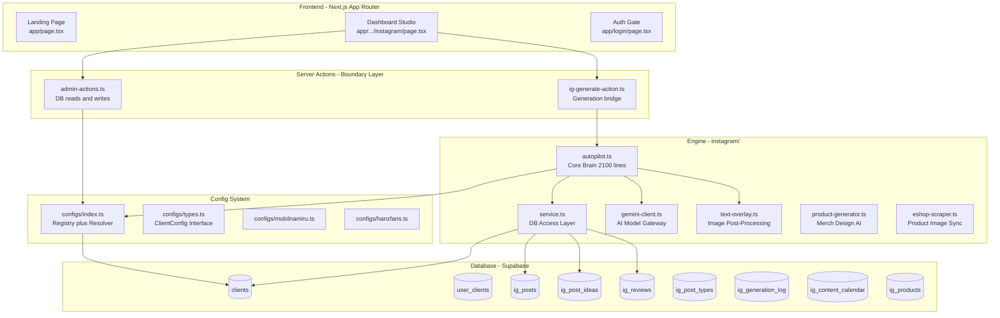
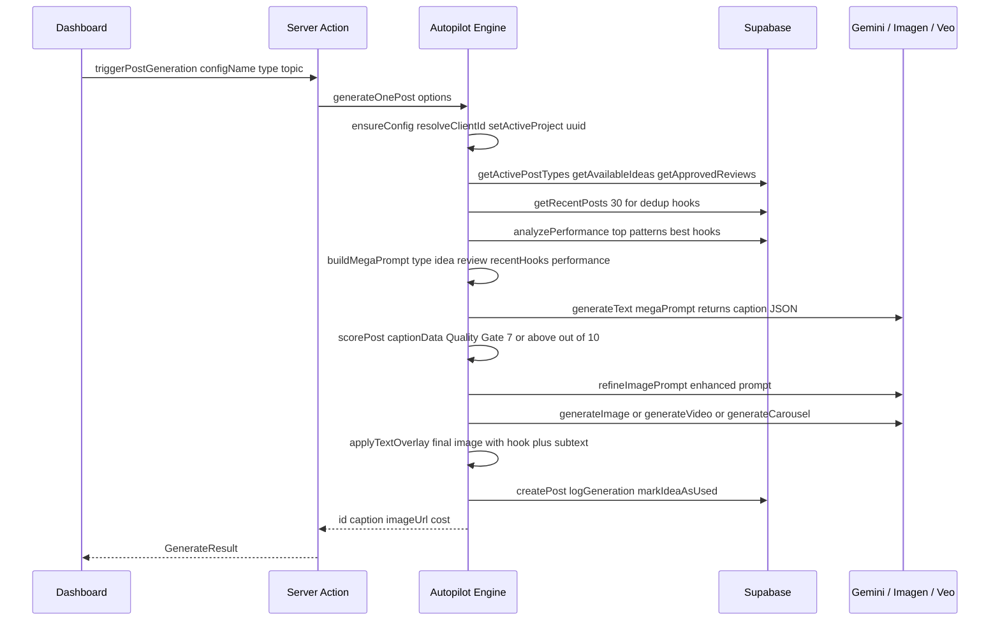
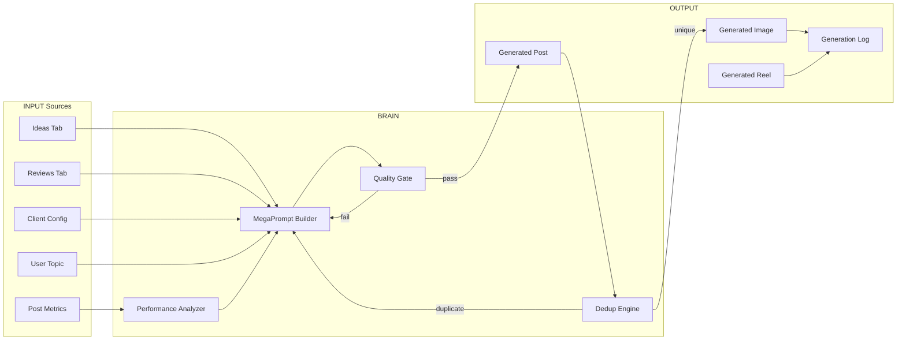
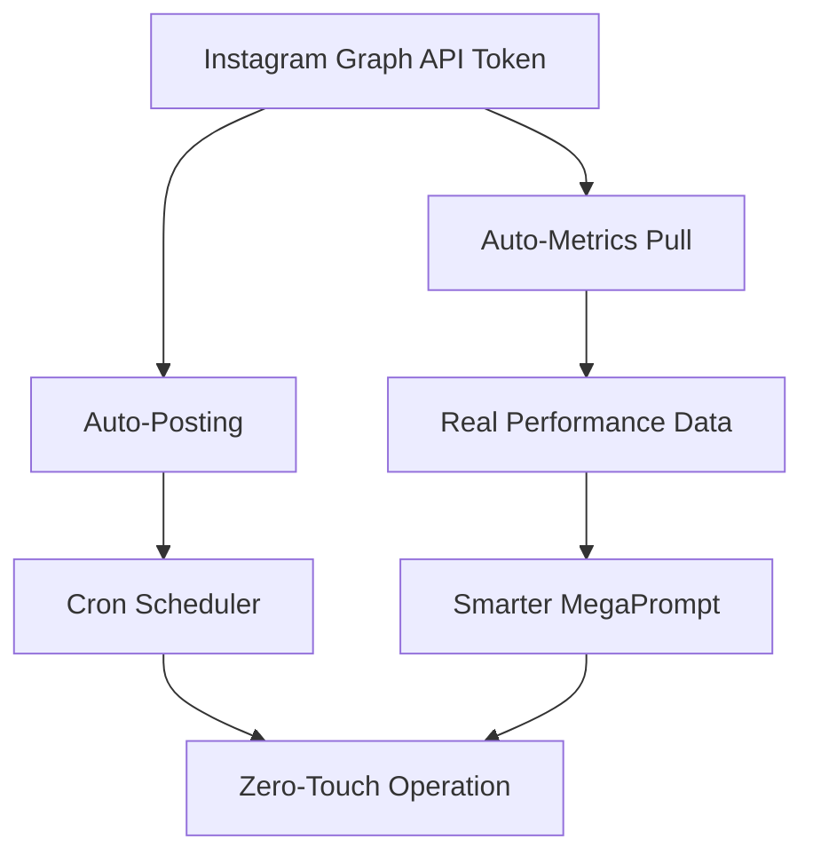

# 🧠 System Knowledge Base — Instagram Autopilot SaaS

> **Codename:** ProdameVas  
> **Stack:** Next.js 16 (App Router) · Supabase (Postgres + Auth + Storage) · Google Gemini 3.1 Pro · Imagen 4 Ultra · Veo 3.1  
> **Last Updated:** 2026-02-20

---

## 1. High-Level Architecture

---

## 2. Multi-Tenancy Model

> [!IMPORTANT]
> **Every `ig_*` table uses `client_id uuid` FK to `clients.id`.** The dashboard passes a human-readable **slug** (e.g. `"mobilnamiru"`), which is resolved to a uuid via `resolveClientId(slug)` at the server-action boundary.

| Layer | Identifier | Type | Example |
|---|---|---|---|
| UI Dropdown | `projectId` | slug string | `"mobilnamiru"` |
| Server Actions | `resolveClientId(slug)` | translator | slug to `"9a3f-..."` |
| DB Queries | `client_id` | uuid FK | `WHERE client_id = '9a3f-...'` |
| Autopilot Engine | `getActiveProject()` | uuid string | Set once per run via `ensureConfig` |

### Adding a New Client

1. Create `instagram/configs/newclient.ts` implementing `ClientConfig`
2. Add to `scripts/seed-configs.ts` and run `npx tsx scripts/seed-configs.ts`
3. Link user via `scripts/setup-user.ts`
4. The dashboard auto-discovers it via `getAvailableClients()`

---

## 3. Generation Pipeline

### Key Decision Points

| Step | What Happens | Fallback |
|---|---|---|
| **Idea Selection** | Picks least-used idea outside 90-day cooldown | Gemini invents its own topic |
| **Quality Gate** | `scorePost()` rates 1-10 | If less than 7, regenerates with criticism feedback |
| **Dedup Check** | Compares hook + body keywords to last 30 posts | If duplicate, regenerates with explicit "avoid this" instruction |
| **Image Gen** | Imagen 4 Ultra 2K or Veo 3.1 reels or multi-slide carousel | Retries on 503 with exponential backoff |
| **Text Overlay** | Canvas-based typography with gradient + logo watermark | Falls back to caption-only post |

---

## 4. Data Flow Map — What Connects to What

---

## 5. File Reference — Critical Files and Their Roles

| File | Role | AI Agent Must Know |
|---|---|---|
| `autopilot.ts` | **Core brain** — generation, scoring, dedup, feedback loop | Queries DB directly in 4 places; rest goes through `service.ts` |
| `service.ts` | **DB access layer** — all CRUD for ig_* tables | Every query filters by `client_id` uuid via `getActiveProject()` |
| `gemini-client.ts` | **AI gateway** — text, image, video generation | Lazy-init so it wont crash if API key missing; built-in retry logic |
| `text-overlay.ts` | **Image post-processing** — hook text + gradient + logo | Uses Canvas API; reads fonts from `instagram/fonts/` |
| `configs/index.ts` | **Config registry** — loads from DB, caches, resolves slug to uuid | `resolveClientId()` is the single entry point for tenant resolution |
| `configs/types.ts` | **Type system** — `ClientConfig` interface with 30+ fields | Any new feature likely needs a config field added here |
| `admin-actions.ts` | **Server actions** — dashboard reads | All queries resolve slug to uuid before querying |
| `ig-generate-action.ts` | **Server actions** — generation + ideas/reviews writes | Bridges UI to autopilot with retry wrapper |
| `page.tsx` (instagram) | **Dashboard UI** — tabs: Generate, Posts, Ideas, Reviews, Logs, Products | Manages `projectId` state, passes it everywhere |
| `database-schema.sql` | **Schema truth** — all tables, FKs, RLS | `client_id uuid` FK on every `ig_*` table |

---

## 6. AI Agent Rules — MUST READ Before Any Change

> [!CAUTION]
> **Every change has cascading effects.** This system is deeply interconnected. Follow these rules strictly.

### Rule 1: Tenant Isolation is Sacred
- **NEVER** query an `ig_*` table without a `client_id` filter
- If adding a new table, it **MUST** have `client_id uuid REFERENCES clients(id) ON DELETE CASCADE`
- Use `resolveClientId(slug)` at the server-action boundary, never in the engine

### Rule 2: The Config is the Source of Truth
- `ClientConfig` drives **everything**: brand voice, post types, pillars, CTAs, aesthetic, products, formats
- If a feature depends on per-client behavior, add a field to `ClientConfig` — dont hardcode
- Config lives in DB (`clients.config` JSONB) but is defined in TypeScript files (`configs/*.ts`) and seeded via `scripts/seed-configs.ts`

### Rule 3: The MegaPrompt is the Heart
- `buildMegaPrompt()` in `autopilot.ts` constructs the entire AI instruction
- It injects: brand voice, performance data, ideas, reviews, recent captions, products, CTA strategy
- **Any new data source** (e.g. competitor analysis, trending topics) must be wired into this function

### Rule 4: Generation Flow is a Pipeline
- `generateOnePost()` is a 600-line pipeline with strict ordering
- Steps: config, type selection, idea/review, dedup check, caption gen, quality gate, image gen, overlay, save
- Dont bypass steps — each exists to prevent bad output

### Rule 5: Two Auth Systems
- **Supabase Auth** (frontend, `supabase/client.ts`) — for user login, RLS
- **Service Role** (`supabase/admin.ts`) — for server actions, bypasses RLS
- The autopilot engine uses the **client** (anon key) for reads, server actions use **admin** for writes

### Rule 6: Schema vs Live DB
- `database-schema.sql` is the **intended** schema but may drift from the live Supabase DB
- Before altering tables, verify column existence first
- Migrations must be run manually via Supabase Dashboard SQL Editor (no direct DB connection string available)

---

## 7. Database Schema — Complete ER

| Table | Key Columns | FK Relations |
|---|---|---|
| `clients` | `id` (uuid PK), `slug` (unique), `config` (jsonb) | — |
| `user_clients` | `user_id`, `client_id`, `role` | to `auth.users`, to `clients` |
| `ig_post_types` | `name`, `display_name`, `emoji`, `frequency` | to `clients` |
| `ig_post_ideas` | `title`, `content`, `category`, `cooldown_days`, `used_count` | to `clients` |
| `ig_reviews` | `quote`, `rating`, `is_approved`, `used_at` | to `clients` |
| `ig_products` | `name`, `slug`, `price`, `image_urls[]` | to `clients` |
| `ig_posts` | `caption`, `image_url`, `status`, `likes`, `saves`, `reach` | to `clients`, to `ig_post_types`, to `ig_post_ideas`, to `ig_reviews`, to `ig_products` |
| `ig_generation_log` | `prompt_used`, `model_used`, `tokens_used`, `generation_time_ms` | to `clients`, to `ig_posts` |
| `ig_content_calendar` | `date`, `time_slot`, `notes` | to `clients`, to `ig_posts`, to `ig_post_types` |

---

## 8. Toward Full Autonomy — What is Needed

### Current State: Semi-Autonomous
- AI generates captions, images, videos, carousels
- Performance feedback loop learns from metrics
- Idea cooldown and dedup prevent repetition
- Quality gate prevents low-quality output
- Posting is manual (copy from dashboard to IG)
- Metrics are manually entered
- No scheduling/cron automation

### Path to Full Autonomy

| Feature | Implementation Path |
|---|---|
| **Auto-posting** | Instagram Graph API integration — `ig_posts.status = 'scheduled'` — cron publishes at `scheduled_for` time |
| **Auto-metrics** | Instagram Insights API — cron pulls likes/comments/saves/reach every 24h for posted content |
| **Cron scheduler** | Vercel Cron or Supabase Edge Function — triggers `generateBatch()` daily at configured time |
| **Content calendar** | `ig_content_calendar` table is ready — wire it to a calendar UI + auto-fill from `weekPlan` config |
| **A/B testing** | Generate 2 variants per slot — post the higher-scored one — track which variant pattern wins |
| **Competitor watch** | Scrape competitor IG feeds — extract trending hooks/topics — inject into MegaPrompt as `trendingTopics` |
| **Client onboarding** | Self-service form — creates `clients` row + empty config — AI interview fills in brand voice fields |

### Critical Dependencies for Autonomy

---

## 9. Environment Variables

| Variable | Required | Used By | Purpose |
|---|---|---|---|
| `NEXT_PUBLIC_SUPABASE_URL` | Yes | All | Supabase project URL |
| `NEXT_PUBLIC_SUPABASE_ANON_KEY` | Yes | Frontend, service.ts | Public API access (RLS-governed) |
| `SUPABASE_SERVICE_ROLE_KEY` | Yes | Server actions | Admin access (bypasses RLS) |
| `GEMINI_API_KEY` | Yes for gen | gemini-client.ts | Google AI Platform key |

---

## 10. Cost Model (Per Generation)

| Operation | Model | Cost |
|---|---|---|
| Caption generation | Gemini 3.1 Pro | ~$0.01 |
| Image refinement prompt | Gemini 3.1 Pro | ~$0.005 |
| Quality scoring | Gemini 3.1 Pro | ~$0.005 |
| Image generation | Imagen 4 Ultra 2K | ~$0.06 |
| Video generation 7s | Veo 3.1 Fast | ~$1.05 |
| **Total per image post** | — | **~$0.08** |
| **Total per reel** | — | **~$1.07** |
| **Total per carousel 4 slides** | — | **~$0.26** |
