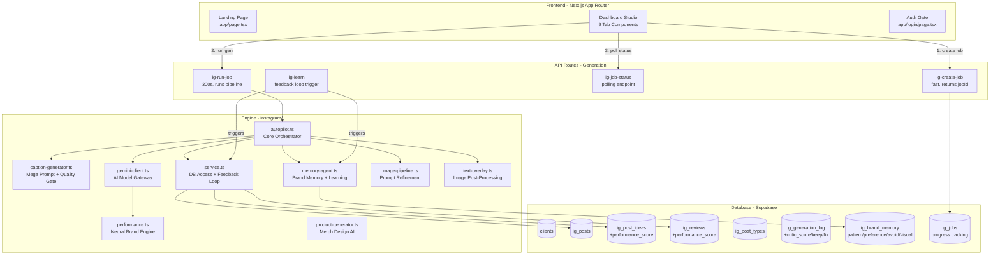
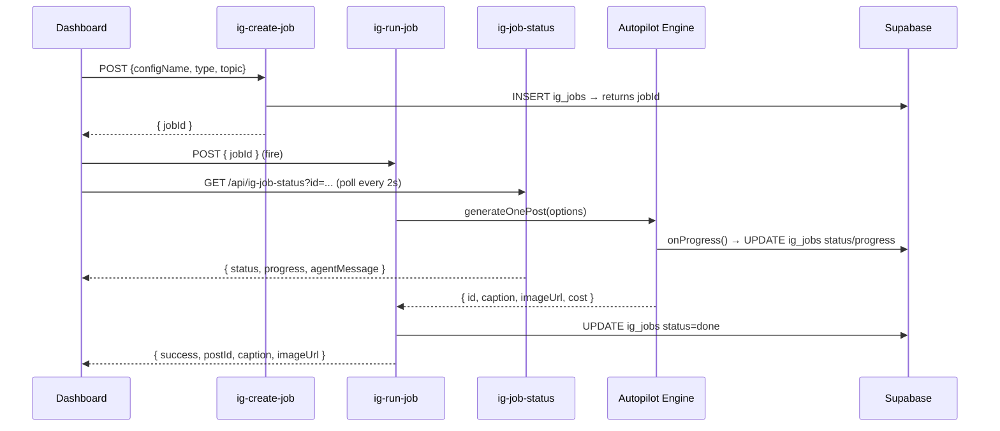

# 🧠 System Knowledge Base — Instagram Autopilot SaaS

> **Codename:** ProdameVas  
> **Stack:** Next.js 16 (App Router) · Supabase (Postgres + Auth + Storage) · Google Gemini 3.1 Pro Preview · Nano Banana Pro · Imagen 4 Ultra · Veo 3.1  
> **Last Updated:** 2026-05-14

---

## 1. High-Level Architecture



---

## 2. Multi-Tenancy Model

> [!IMPORTANT]
> **Every `ig_*` table uses `client_id uuid` FK to `clients.id`.** The dashboard passes a human-readable **slug** (e.g. `"mobilnamiru"`), which is resolved to a uuid via `resolveClientId(slug)` at the API boundary.

| Layer | Identifier | Type | Example |
|---|---|---|---|
| UI Dropdown | `projectId` | slug string | `"mobilnamiru"` |
| API Routes | `resolveClientId(slug)` | translator | slug → `"9a3f-..."` |
| DB Queries | `client_id` | uuid FK | `WHERE client_id = '9a3f-...'` |
| Autopilot Engine | `getActiveProject()` | uuid string | Set once per run via `ensureConfig` |

> [!WARNING]
> Config is stored as JSONB in the `clients.config` column in Supabase DB. There are NO config files in the codebase — only `configs/types.ts` (TypeScript interface) and `configs/index.ts` (DB loader with caching).

---

## 3. Generation Pipeline (2-Step API)



### Agent Pipeline (inside generateOnePost)

| Step | Agent | Model | Progress |
|------|-------|-------|----------|
| 1. Post type selection | Researcher | — | 5% |
| 2. Idea/Review selection | Researcher (weighted) | — | 15% |
| 3. Dedup check | Researcher | — | 20% |
| 4. Performance analysis | Researcher | — | 20% |
| 5. Caption generation | Copywriter | `gemini-3.1-pro-preview` | 25% |
| 6. Quality gate scoring | Critic | `gemini-3.1-pro-preview` | 45% |
| 6b. Targeted repair | Copywriter + Critic dialog | `gemini-3.1-pro-preview` | 50% |
| 7. Image prompt refinement | Art Director | `gemini-3.1-pro-preview` | 60% |
| 8. Image generation | Renderer | `gemini-3-pro-image-preview` / `imagen-4.0-ultra` | 75% |
| 9. Text overlay | Renderer | Satori + resvg-js | 90% |
| 10. Upload + save | Uploader | Supabase Storage | 95% |

---

## 4. Feedback Loop Architecture

The system is **self-improving**. Every generation feeds back into future generations:

```
ig_posts (with metrics)
    ↓
POST /api/ig-learn
    ├── propagateMetricsToSources()
    │       ├── ig_post_ideas.performance_score  (Idea Ranker)
    │       └── ig_reviews.performance_score     (Review Ranker)
    └── analyzeAndLearn()
            └── ig_brand_memory (new pattern/avoid/visual rules)

ig_generation_log
    └── critic_score, critic_keep[], critic_fix[]  (Critic → Memory)

buildSmartWeekPlan()
    └── pillar ratios ×1.5 (top) / ×0.5 (under) based on real engagement
```

### Activating the Feedback Loop
After entering post metrics (likes, saves, comments), call:
```
POST /api/ig-learn { configName: "mobilnamiru" }
```
Returns: `{ ideasUpdated, reviewsUpdated, memoriesCreated, memoriesUpdated }`

---

## 5. AI Model Registry

| Role | Model | Notes |
|------|-------|-------|
| **Text gen (Copywriter, Critic, Art Dir)** | `gemini-3.1-pro-preview` | Flagship, reasoning, agentic |
| **Fallback (503/429)** | `gemini-2.5-flash-lite` | Fast, stable, cheap |
| **Image gen with references** | `gemini-3-pro-image-preview` | Nano Banana Pro — 4K, reasoning core |
| **Image gen without references** | `imagen-4.0-ultra-generate-001` | Best text-to-image |
| **Vision (logo placement)** | `gemini-2.5-pro` | Vision tasks |
| **Video gen** | `veo-3.1-generate-preview` | Reels, 9:16 |

> [!CAUTION]
> `gemini-2.0-flash` is **DEPRECATED** — do NOT use it. Fallback is `gemini-2.5-flash-lite`.

---

## 6. Database Schema

| Table | Key Columns | Notes |
|---|---|---|
| `clients` | `id` (uuid PK), `slug` (unique), `config` (jsonb) | Multi-tenant root |
| `user_clients` | `user_id`, `client_id`, `role` | RBAC |
| `ig_post_types` | `name`, `display_name`, `emoji`, `frequency` | — |
| `ig_post_ideas` | `title`, `content`, `cooldown_days`, **`performance_score`**, `times_used_with_metrics` | Idea Ranker |
| `ig_reviews` | `quote`, `is_approved`, `used_at`, **`performance_score`**, `times_used_with_metrics` | Review Ranker |
| `ig_posts` | `caption`, `image_url`, `status`, `idea_id`, `review_id`, `likes`, `saves`, `reach` | FK to ideas/reviews |
| `ig_generation_log` | `prompt_used`, `model_used`, **`critic_score`**, **`critic_keep`**, **`critic_fix`** | Critic feedback |
| `ig_brand_memory` | `memory_type` (pattern/preference/avoid/**visual**), `content`, `confidence` | Long-term learning |
| `ig_jobs` | `status`, `progress`, `agent_message`, `config`, `result` | Progress tracking |

---

## 7. File Reference

| File | Role | Key Notes |
|---|---|---|
| `autopilot.ts` | **Core orchestrator** | Uses weighted idea/review selection; stores critic data |
| `caption-generator.ts` | **Text engine** — mega prompt, schemas, quality gate | `buildMegaPrompt()` + aggressive `buildSmartWeekPlan()` |
| `service.ts` | **DB access + feedback loop** | `getWeightedIdeas()`, `getWeightedReviews()`, `propagateMetricsToSources()` |
| `gemini-client.ts` | **AI gateway** | Primary: 3.1-pro-preview; Fallback: 2.5-flash-lite |
| `memory-agent.ts` | **Brand Memory** | `getBrandMemories()`, `analyzeAndLearn()`, ilike search |
| `performance.ts` | **Analytics** | Per-pillar engagement, conversion rate, top patterns |
| `image-pipeline.ts` | **Prompt refinement** | Feed aesthetic, carousel visual cohesion |
| `text-overlay.ts` | **Image post-processing** | Satori + resvg-js; fonts in `fonts/`, logos in `assets/` |

### API Routes

| Route | Duration | Purpose |
|-------|----------|---------|
| `POST /api/ig-create-job` | 10s | Create job record, return jobId |
| `POST /api/ig-run-job` | 300s | Run full generation pipeline |
| `GET /api/ig-job-status` | 10s | Poll job progress |
| `POST /api/ig-learn` | 60s | Trigger feedback loop |

---

## 8. AI Agent Rules — MUST READ

> [!CAUTION]
> **Every change has cascading effects.** Follow these rules strictly.

### Rule 1: Tenant Isolation is Sacred
- **NEVER** query an `ig_*` table without a `client_id` filter
- New tables **MUST** have `client_id uuid REFERENCES clients(id) ON DELETE CASCADE`

### Rule 2: Config Lives in DB Only
- Config is JSONB in `clients.config` — **no config files in codebase**
- New per-client behavior → add field to `ClientConfig` in `configs/types.ts`

### Rule 3: The MegaPrompt is the Heart
- `buildMegaPrompt()` in `caption-generator.ts` — new data sources must be wired here
- Brand memories injected via `formatMemoriesForPrompt()` after `buildMegaPrompt()`

### Rule 4: Server-Side Only
- Backend: `supabase/admin` (service role) — never `supabase/client`
- API routes: `resolveClientId(slug)` at the boundary, never inside engine

### Rule 5: No Hardcoding
- Admin emails → `SUPER_ADMIN_EMAILS` env var
- Storage buckets → `config.storageBucket`
- Retry logic → `utils/retry.ts` (single source of truth)

### Rule 6: Feedback Loop Integrity
- When adding new data sources: add `performance_score` column + weighted selection
- When adding new agent steps: log results into `ig_generation_log` or `ig_brand_memory`
- **Never** short-circuit the feedback chain

---

## 9. Environment Variables

| Variable | Required | Used By |
|---|---|---|
| `NEXT_PUBLIC_SUPABASE_URL` | Yes | All |
| `NEXT_PUBLIC_SUPABASE_ANON_KEY` | Yes | Frontend, middleware |
| `SUPABASE_SERVICE_ROLE_KEY` | Yes | Server actions, engine |
| `GEMINI_API_KEY` | Yes for gen | gemini-client.ts |
| `SUPER_ADMIN_EMAILS` | Yes | configs/index.ts |

---

## 10. Cost Model (Per Generation)

| Operation | Model | Cost |
|---|---|---|
| Caption + Critic + ArtDir | gemini-3.1-pro-preview | ~$0.03 |
| Image gen (with refs) | gemini-3-pro-image-preview | ~$0.05 |
| Image gen (no refs) | imagen-4.0-ultra | ~$0.06 |
| Video 8s | veo-3.1-fast | ~$1.20 |
| **Total per image post** | — | **~$0.10** |
| **Total per reel** | — | **~$1.25** |
| **Total per carousel** | — | **~$0.37** |
