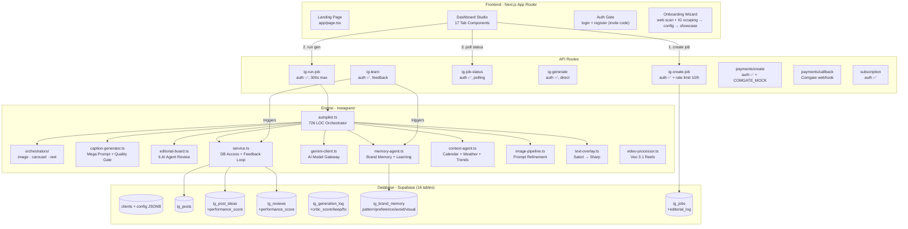
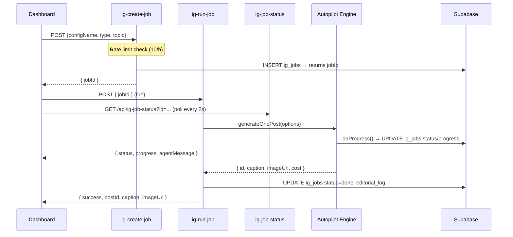

# 🧠 System Knowledge Base — Chrlit Studio

> **Codename:** ProdameVas  
> **Stack:** Next.js 16 (App Router) · Supabase (Postgres + Auth + Storage) · Google Gemini 3.5 Flash · Nano Banana Pro · Veo 3.1  
> **Last Updated:** 2026-06-10 (v4.1 — A/B varianty, dekompozice god files, onboarding + IG scraping)

---

## 1. High-Level Architecture



---

## 2. Multi-Tenancy Model

> [!IMPORTANT]
> **Every `ig_*` table uses `client_id uuid` FK to `clients.id`.** The dashboard passes a **projectId** (UUID), which maps to a client record. Config is stored as JSONB in `clients.config`.

| Layer | Identifier | Type |
|---|---|---|
| UI (StudioContext) | `projectId` | UUID string |
| API Routes | `clientId` from body/params | UUID |
| DB Queries | `client_id` | uuid FK |
| Config loader | `loadConfig(slug)` → `validateConfig()` | slug → ClientConfig |

> [!WARNING]
> Config lives ONLY in DB (`clients.config` JSONB). No config files in codebase — only `configs/types.ts` (TypeScript interface) and `configs/index.ts` (DB loader with caching + runtime validation).

> `ClientConfig.igBaseline` (optional) = snapshot z onboarding IG scrapu (followerCount, avgEngagementRate, topHashtags, contentMix, bestPostingTimes, scrapedAt). Cold-start fallback: `planWeek()` ho použije pro časy postování, dokud nejsou interní performance data.

---

## 3. Generation Pipeline (2-Step API)



### Agent Pipeline (inside generateOnePost)

| Step | Agent | Model | Progress |
|------|-------|-------|----------|
| 1. Post type selection | Researcher | — | 5% |
| 2. Idea/Review selection | Researcher (weighted) | — | 15% |
| 3. Dedup check (Levenshtein) | Researcher | — | 20% |
| 4. Context gathering | Context Agent | `gemini-3.5-flash` | 20% |
| 5. Caption generation | Copywriter | `gemini-3.5-flash` | 25% |
| 6. Quality gate scoring | Critic | `gemini-3.5-flash` | 45% |
| 6b. Editorial Board review | Chief Editor + Copywriter | `gemini-3.5-flash` | 50% |
| 7a. Design brief (native engine, default) | AI Designer | `gemini-3.1-pro` | 55% |
| 7b. Image prompt refinement (overlay engine / fallback) | Art Director | `gemini-3.5-flash` | 60% |
| 8. Image generation | Renderer | Nano Banana Pro (native: incl. Czech typography + logo) | 75% |
| 9a. Vision QA + corrective edit (native) | Renderer | `gemini-3.5-flash` vision → `gemini-3-pro-image` edit | 78% |
| 9b. Text overlay (overlay engine / fallback) | Renderer | Satori + Sharp | 90% |
| 10. Upload + save | Uploader | Supabase Storage | 95% |

---

## 4. Feedback Loop Architecture

The system is **self-improving**. Metrics propagate back into future generations:

```
User enters metrics (likes, comments, saves) → updateIGPostMetrics()
    ↓ AUTO-TRIGGER (fire & forget)
    ├── propagateMetricsToSources()
    │       ├── ig_post_ideas.performance_score  (Idea Ranker)
    │       └── ig_reviews.performance_score     (Review Ranker)
    └── analyzeAndLearn()
            └── ig_brand_memory (new pattern/avoid/visual rules)

ig_generation_log
    └── critic_score, critic_keep[], critic_fix[]
        → autopilot reads last 5 scores → injects keep/fix into mega prompt

buildSmartWeekPlan()
    └── pillar ratios ×1.5 (top) / ×0.5 (under) based on real engagement

A/B Variant Loop (variant-actions.ts)
    generateMultipleVariants() → N draft variant postů (revision_of + link_type='variant')
        → uživatel vybere vítěze: selectVariantWinner()
            ├── winner → draft, losers → rejected
            └── learnFromVariantSelection(winner, losers, clientId)
                    → ig_brand_memory (preference)
    Pozn.: revisePost() linkuje přes revision_of + link_type='revision' —
    revize se do A/B srovnání ani učení NEpočítají.
```

> [!IMPORTANT]
> Learning trigger v `updateIGPostMetrics()` čte předchozí metriky PŘED updatem
> (jinak jsou delty vždy 0 a učení se nikdy nespustí) a běží přes `waitUntil()`
> z `@vercel/functions`, aby ho serverless neukončil s odpovědí.

> [!NOTE]
> Feedback loop is **automatic** — triggered when user saves metrics via `updateIGPostMetrics()`. Manual trigger: `POST /api/ig-learn { configName }`.

---

## 5. AI Model Registry

**Single source of truth: `instagram/models.ts`** (`MODELS` constant + `getModel()`). Per-env override without deploy: `GEMINI_MODEL_<ACTION>` / `GEMINI_MODEL_<ACTION>_FALLBACK`.

| Action | Model | Fallback | Notes |
|------|-------|----------|-------|
| `text` (all agents) | `gemini-3.5-flash` | `gemini-2.5-flash-lite` | On 503/429 |
| `designer` (AI Designer) | `gemini-3.1-pro` | `gemini-3.5-flash` | Design briefs (native engine) |
| `image` | `gemini-3-pro-image` | `gemini-3.1-flash-image` | Nano Banana Pro GA → Nano Banana 2 GA; also editExistingImage() + generateImageWithReferences() |
| `imageCheap` | `gemini-3.1-flash-image` | — | 512px tier |
| `vision` (QA, logo placement, tagging) | `gemini-3.5-flash` | — | detectLogoPlacementArea(), verifyNativeImage(), brand-tagger |
| `videoLite`/`videoFast`/`videoPremium` | `veo-3.1-lite` / `veo-3.1-fast-generate-001` / `veo-3.1-generate-001` | — | ~$0.06 / $0.15 / $0.40 per second; tier via `ClientConfig.videoTier` |
| `tts` (voiceover) | `gemini-3.1-flash-tts-preview` | `gemini-2.5-flash-tts` | Czech narration, voice: Kore, expressive audio tags |

> [!CAUTION]
> `gemini-2.0-flash` is **DEPRECATED**. `imagen-4.0-ultra` was **sunset June 2026**. `gemini-3-pro-image-preview` / `gemini-3.1-flash-image-preview` **shut down June 25, 2026** — replaced by GA IDs. `gemini-3.1-pro-preview` was replaced by `gemini-3.5-flash`.

---

## 6. Database Schema (16 tables)

| Table | Key Columns | Notes |
|---|---|---|
| `clients` | `id` (uuid PK), `slug` (unique), `config` (jsonb) | Multi-tenant root |
| `user_clients` | `user_id`, `client_id`, `role` | RBAC |
| `ig_post_types` | `name`, `display_name`, `emoji`, `frequency` | Per-client post types |
| `ig_post_ideas` | `title`, `content`, `performance_score`, `times_used_with_metrics` | Idea Ranker (weighted) |
| `ig_reviews` | `quote`, `is_approved`, `performance_score`, `times_used_with_metrics` | Review Ranker (weighted) |
| `ig_products` | `name`, `type`, `slug`, `price`, `image_urls[]` | Products + photos |
| `ig_product_ideas` | `name`, `concept`, `design_url` | AI product design concepts |
| `ig_product_categories` | `name`, `client_id` | Product categories |
| `ig_posts` | `caption`, `image_url`, `status`, `idea_id`, `review_id`, `product_id`, `likes`, `saves`, `reach`, `feedback`, `revision_of`, `link_type`, `design_brief` (jsonb) | `revision_of` + `link_type` ('revision'/'variant') link revisions & A/B variants; `design_brief` = AI Designer output (anti-repetition source: concept + `layoutArchetype` + typografie + color fingerprint; archetypy posledních 3 postů jsou pro další post hard-banned) |
| `ig_content_calendar` | `date`, `post_id`, `time_slot` | Calendar scheduling |
| `ig_generation_log` | `prompt_used`, `model_used`, `critic_score`, `critic_keep[]`, `critic_fix[]`, `qa_status` | Critic feedback for learning; `qa_status` = native QA outcome (pass/retry_pass/fallback/overlay) |
| `ig_brand_memory` | `memory_type` (pattern/preference/avoid/visual), `content`, `confidence` | Long-term learning |
| `ig_jobs` | `status`, `progress`, `agent_message`, `editorial_log` (jsonb), `result` (jsonb) | Progress + editorial board log |
| `subscription_plans` | `id`, `name`, `price_czk`, `features` | Plan definitions — v3 growth tiery: `chrlit_start` (490 Kč/15 kr), `chrlit_rust` (990 Kč/40 kr, +post_variant +reel +growth_tracking), `chrlit_dominance` (1990 Kč/100 kr, +product studio +priority). Features JSON nově: `allowed_media[]` (chybí = vše povoleno, legacy), `growth_tracking` bool. Staré `chrlit` deaktivováno (grandfathered) |
| `subscriptions` | `client_id`, `plan_id`, `status`, `plan_posts_unlocked` | Active subscriptions — `activatePaidPlan(clientId, planId, subId?)` aktivuje zaplacený plán (z pending sub) a cancelne ostatní live subs klienta |
| `payments` | `comgate_trans_id`, `amount`, `status` | Comgate payments |
| `ig_growth_snapshots` | `client_id`, `follower_count`, `following_count`, `media_count`, `captured_at` | Týdenní follower snapshoty (cron po 6:00 UTC) pro plány s `growth_tracking` — growth dashboard v PerformanceTab |

---

## 7. File Reference

### AI Engine (`instagram/`)

| File | LOC | Role |
|---|---|---|
| `autopilot.ts` | ~730 | **Core orchestrator** — generateOnePost(), generateBatch() |
| `orchestrators/image-orchestrator.ts` | ~430 | Image rendering pipeline (extracted from autopilot) |
| `orchestrators/carousel-orchestrator.ts` | ~165 | Multi-slide carousel rendering |
| `orchestrators/reel-orchestrator.ts` | ~200 | Veo reel rendering |
| `cli.ts` | ~410 | Dev/management CLI (--stats, --feedback, --generate-ideas…) |
| `caption-generator.ts` | ~890 | Mega prompt builder, caption schemas, scorePost(), reviseCaption() |
| `editorial-board.ts` | 777 | reviewPost(), reviewContentPlan(), reviewOverlayComposition() |
| `text-overlay.ts` | 683 | Satori SVG → Sharp PNG overlay + logo watermark |
| `product-generator.ts` | 643 | Product ideas, design concepts, mockups |
| `service.ts` | 617 | DB access — getWeightedIdeas(), createPost(), propagateMetrics() |
| `memory-agent.ts` | 459 | getBrandMemories(), analyzeAndLearn(), getPostTypeBoosts() |
| `gemini-client.ts` | 455 | AI gateway — generateText(), generateImage(), editExistingImage(), generateVideo(), generateVoiceover() |
| `image-pipeline.ts` | 346 | refineImagePrompt(), refineCarouselPrompts(), getVisualMemoriesSection() |
| `video-processor.ts` | 247 | processReelVideo(), scenesToSubtitles() |
| `context-agent.ts` | 232 | gatherContext() — svátek, počasí, trendy |
| `content-planner.ts` | 223 | planWeek() — AI content planning |
| `performance.ts` | 186 | Per-pillar engagement analytics |
| `idea-generator.ts` | 145 | generateAIIdeas() with brand memory |
| `review-generator.ts` | 142 | generateAIReviews() with brand memory |
| `brand-tagger.ts` | 128 | tagBrandImages() — vision auto-tagging |
| `configs/index.ts` | — | loadConfig(), validateConfig(), resolveClientId(), invalidateConfigCache() |
| `configs/types.ts` | — | ClientConfig interface (brandVoice, contentPillars, feedAesthetic, imageInstructions, ...) |

### API Routes

| Route | Auth | Duration | Purpose |
|-------|------|----------|---------|
| `POST /api/ig-create-job` | ✅ membership + rate limit | 10s | Create job, **charge credit/plan counter** (refunded on failure), return jobId |
| `POST /api/ig-run-job` | ✅ job ownership | 300s | Run full generation pipeline |
| `GET /api/ig-job-status` | ✅ job ownership | 5s | Poll progress + **stuck-job reaper** (>8 min silent → failed + refund) |
| `POST /api/ig-learn` | ✅ membership | 60s | Trigger feedback loop |
| `POST /api/payments/create` | ✅ client membership | 10s | Create Comgate payment (mock disabled on prod) |
| `POST /api/payments/callback` | ❌ (webhook) | 10s | Comgate status callback (server-side verification) |
| `GET /api/payments/return` | ❌ (redirect) | 10s | Post-payment redirect |
| `GET /api/subscription` | ✅ | 10s | Client subscription info (+ `allowedMedia`, `growthTracking`) |
| `GET /api/plans` | ✅ | 10s | Aktivní plány pro pricing UI (bez trial_v2) |
| `GET /api/cron/growth-snapshot` | ❌ (CRON_SECRET bearer) | 300s | Týdenní follower snapshot pro growth_tracking plány (vercel.json cron `0 6 * * 1`) |

> `POST /api/ig-generate` byl odstraněn (v4.1) — obcházel rate limit i kredity a UI ho nepoužívalo.

### Server Actions (`app/actions/`) — decomposed by domain (v4.1)

| File | LOC | Key Exports |
|---|---|---|
| `product-actions.ts` | ~1130 | getProducts(), saveProduct(), deleteProduct(), product ideas |
| `admin-actions.ts` | ~640 | getDashboardStats(), getIGPostsList(), updateIGPostMetrics() (+ learning trigger), getEditorialLog(), checkIsAdmin() |
| `ig-generate-action.ts` | ~520 | triggerBatchGeneration(), triggerIdeaGeneration(), triggerReviewGeneration() |
| `content-plan-actions.ts` | ~420 | generateContentPlan() — levný textový plán před generováním (PlanTab) |
| `variant-actions.ts` | ~400 | revisePost(), generatePostVariant(), generateMultipleVariants(), selectVariantWinner(), getVariantGroup() |
| `config-actions.ts` | ~370 | getClientConfig(), updateClientConfig(), uploadClientLogo(), rescanClientWebsite(), deleteClient() |
| `credit-guard.ts` | ~200 | creditGuard(), creditGuardBatch(), canGenerate() — vše s membership checkem |
| `calendar-actions.ts` | ~180 | planWeekCalendar() |
| `product-brief-actions.ts` | ~155 | analyzeProductForBrief() → DOCX |
| `memory-actions.ts` / `post-actions.ts` | ~100 | brand memory CRUD / post delete |
| `app/onboarding/actions.ts` | ~1900 | analyzeWebsite() (web + HikerAPI IG scraping + vision analýza feedu přes `instagram/feed-vision.ts`), generateConfigPreview() (plní native feedAesthetic pole + `config.igBaseline`), refineConfigSection(), saveReviewedConfig() (+ seed `ig_brand_memory` z onboardingu, confidence 0.45) |
| `instagram/feed-vision.ts` | ~150 | analyzeFeedVisuals() — Gemini vision nad max 8 obrázky scrapnutého feedu → FeedVisualProfile (typographyStyle, accentColorHex, logoPlacementHabit, dominantArchetypes, visualStrengths/Recommendations); fail-open |

---

## 8. Security

| Layer | Protection |
|---|---|
| **Middleware** | Redirects unauthenticated to `/login` for `/dashboard/*`, `/onboarding` |
| **API Routes** | `requireProjectAccess()` (membership, ne jen login) na generovacích routes; job routes ověřují vlastnictví přes `requireClientAccess(job.client_id)` |
| **Server Actions** | Každá akce s `projectSlug` → `requireProjectAccess()`; akce s row id → fetch `client_id` + `requireClientAccess()`. Tenant fallbacky odstraněny — chybějící identifikátor = throw |
| **Rate Limiting** | 10 jobs/hour per client (DB-based, admin bypass) on `ig-create-job` |
| **Credits** | Charge při vytvoření jobu + refund při selhání; idempotence přes unique index `credit_transactions(action, reference_id)` |
| **Supabase RLS** | Enabled on all tables. `subscriptions`/`payments`/`subscription_plans` nemají policies = default-deny — záměr, frontend k nim přistupuje jen přes server (`/api/subscription`) |
| **Service Role** | `supabase/admin.ts` — bypasses RLS for engine operations |
| **Invite Codes** | Registration requires valid invite code (`invite_codes` table) |
| **Mock Payments** | `isMockPaymentMode()` — `COMGATE_MOCK=true` funguje, ale na `VERCEL_ENV=production` je ignorován (kill switch) |
| **Config Validation** | `validateConfig()` fills safe defaults; config cache má 60s TTL (invalidace platí jen pro lokální lambdu) |
| **Env Validation** | `lib/env.ts` přes `instrumentation.ts` — deploy spadne hned při chybějících povinných vars |
| **Monitoring** | `@sentry/nextjs` (aktivní jen s `SENTRY_DSN`) — captureException v ig-run-job |

### Supabase Clients

| Client | File | When to Use |
|--------|------|-------------|
| **Browser** | `supabase/client.ts` | ONLY frontend `"use client"` components |
| **Server** | `supabase/server.ts` | Server actions — has auth context (cookies) |
| **Admin** | `supabase/admin.ts` | Engine backend — service role, bypasses RLS |

---

## 9. Environment Variables

| Variable | Required | Used By |
|---|---|---|
| `NEXT_PUBLIC_SUPABASE_URL` | Yes | All |
| `NEXT_PUBLIC_SUPABASE_ANON_KEY` | Yes | Frontend, middleware |
| `SUPABASE_SERVICE_ROLE_KEY` | Yes | Server actions, engine |
| `GEMINI_API_KEY` | Yes for gen | gemini-client.ts |
| `GEMINI_MODEL_<ACTION>` / `_FALLBACK` | Optional | instagram/models.ts — per-action model override (e.g. `GEMINI_MODEL_DESIGNER`) |
| `SUPER_ADMIN_EMAILS` | Yes | auth-guard.ts, subscription.ts |
| `COMGATE_MERCHANT` | Yes for payments | lib/comgate.ts |
| `COMGATE_SECRET` | Yes for payments | lib/comgate.ts |
| `COMGATE_MOCK` | Optional (ignored on prod) | lib/comgate.ts — isMockPaymentMode() |
| `NEXT_PUBLIC_SITE_URL` | Yes | auth callback, payments |
| `HIKERAPI_KEY` | Optional | IG scraping — onboarding + growth cron (graceful skip), `lib/ig-scraper.ts` |
| `CRON_SECRET` | Optional | auth pro `/api/cron/growth-snapshot` (Vercel cron posílá Bearer automaticky) |
| `SENTRY_DSN` / `NEXT_PUBLIC_SENTRY_DSN` | Optional | error monitoring (server / client) |

---

## 10. Cost Model (Per Generation)

| Operation | Model | Cost |
|---|---|---|
| Caption + Critic + Editorial | gemini-3.5-flash | ~$0.08 |
| Design brief (AI Designer) | gemini-3.1-pro | ~$0.03 |
| Image gen 2K (Nano Banana Pro) | gemini-3-pro-image | ~$0.13 |
| Vision QA per image | gemini-3.5-flash | ~$0.01 |
| Corrective edit (worst case 1×) | gemini-3-pro-image | ~$0.13 |
| Video 8s | veo-3.1 (lite/fast/premium) | ~$0.48 / $1.20 / $3.20 |
| **Total per image post** | — | **~$0.27** |
| **Total per reel (fast)** | — | **~$1.45** |
| **Total per carousel (5 slides)** | — | **~$0.75** |
