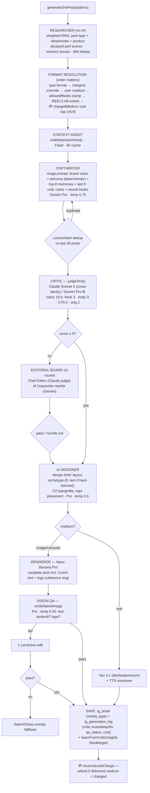
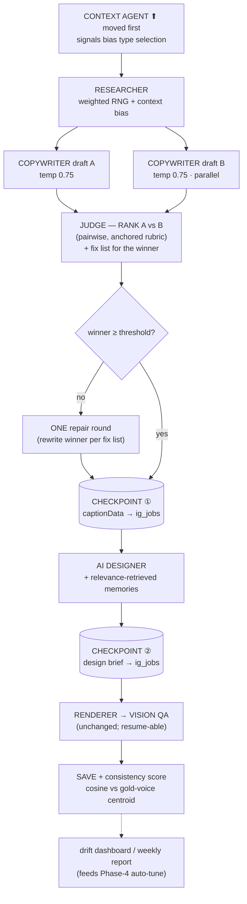

# System Map — how Chrlit works (v6.9) + proposed upgrades

> Diagrams are [Mermaid](https://mermaid.js.org/) — they render on GitHub and in VS Code (Markdown Preview Mermaid Support). Companion to `docs/AGENT_SYSTEM_AND_LOOP_ENGINEERING.md` (loop theory + phases) — this doc is the **current concrete wiring** plus the **proposed pipeline v2**.

---

## 1. The whole system on one page

```mermaid
flowchart TB
    subgraph USER["👤 Customer"]
        LP["Landing + waitlist"]
        OB["Onboarding wizard<br/>web scan + IG scrape → ClientConfig"]
        DASH["Dashboard SPA<br/>~17 tabs · StudioContext"]
    end

    subgraph MONEY["💳 Money path (v6.9)"]
        PAY["payments/create<br/>initRecurring token"]
        CB["payments/callback<br/>idempotent · verifies via getPaymentStatus"]
        BW["cron: billing-worker (daily)<br/>renewal charge · dunning 3× · grace 3d"]
        CRED["Credits — media-weighted<br/>image 1 · carousel 3 · reel 5<br/>plans 20 / 45 / 110"]
    end

    subgraph JOBS["⚙️ Generation entry points"]
        J1["ig-create-job (10s)<br/>rate limit · reel gating ·<br/>CHARGE chargedMedium/chargedCredits"]
        J2["ig-run-job (800s)<br/>runs generateOnePost · reconcile/refund"]
        J3["ig-job-status (poll 2s)<br/>stuck-job reaper >8min → refund"]
        CAMP["ig_campaigns + cron: campaign-worker<br/>lease + cursor resume · per-item charge"]
    end

    subgraph ENGINE["🤖 AI Engine — generateOnePost()"]
        PIPE["Agent pipeline<br/>(diagram §2)"]
    end

    subgraph DB[("Supabase")]
        POSTS["ig_posts · ig_jobs · ig_generation_log"]
        MEM["ig_brand_memory · ig_post_ideas · ig_reviews"]
        SUBS["subscriptions · payments · credit_transactions"]
        CONN["ig_connections (AES-256-GCM tokens)"]
    end

    subgraph IG["📱 Instagram (Meta Graph)"]
        PUB["cron: ig-publisher (1min)<br/>scheduled→posting→posted<br/>image+carousel; handoff modal for reels"]
        MET["cron: ig-metrics-sync (daily)<br/>insights → metrics"]
        TOK["cron: ig-token-refresh (daily)"]
    end

    subgraph LEARN["🔄 Learning loops"]
        L2["propagateMetricsToSources()<br/>→ performance_score → weighted pick"]
        L2B["analyzeAndLearn()<br/>top/flop posts → brand memory"]
        L3["A/B winner + revision feedback<br/>→ preference/avoid memory"]
        L1["Critic keep/fix → last-5 in prompt<br/>+ learnFromCriticInsights (conf 0.3)"]
    end

    LP --> OB --> DASH
    DASH --> J1 --> J2 --> PIPE
    DASH --> CAMP --> PIPE
    DASH --> J3
    DASH --> PAY --> CB --> SUBS
    BW --> SUBS
    CRED -.gates.- J1
    CRED -.gates.- CAMP
    PIPE --> POSTS
    POSTS --> PUB --> MET --> L2 & L2B
    L2 --> MEM
    L2B --> MEM
    L3 --> MEM
    L1 --> MEM
    MEM -.injected.-> PIPE
    CONN -.-> PUB & MET & TOK
```

---

## 2. The agent pipeline per post (current)



**Cost & latency profile (image post):** ~6–10 Pro-class text calls ($0.15–0.25) + 1–2 image renders ($0.13–0.27) + QA. Worst case (3 editorial rounds + corrective edit) ≈ **$0.55 and several minutes**, all inside one 800s lambda with **no intra-post checkpoint** — a crash at render re-burns everything.

---

## 3. Where the current design is weak — and the better solution

The consistency program (temp policy, deterministic persona, cross-family judge) fixed the *variance* problems. What remains are **structural** inefficiencies:

| # | Weakness (verified in code) | Why it hurts | Better solution |
|---|---|---|---|
| 1 | **Repair-loop editorial board**: judge scores one draft, then up to 3 fix→rewrite→re-judge rounds | Iterative repair converges slowly; LLM judges are unreliable at *absolute* scores (a 6 vs a 9 is noisy) but reliable at *ranking*; worst case = 8 Pro calls | **Generate-and-select (best-of-2)**: 2 parallel copywriter drafts → judge **ranks** them + fixes only the winner (≤1 repair round). Fewer calls, lower latency, provably better selection |
| 2 | **No intra-post checkpoints**: one 800s monolith; Veo reels are the longest and most crash-prone | A timeout at render re-generates the caption (cost + different result than what was approved); reaper refunds but the work is lost | **Stage checkpoints in `ig_jobs`**: persist `captionData` after the quality gate and the design brief after the Designer; on retry, resume from the last completed stage |
| 3 | **Memory retrieval = top-8 by confidence** (`getBrandMemories(8)`, ilike only) | The same 8 memories dominate every prompt regardless of topic → stale, topic-irrelevant guidance | **Embedding retrieval**: embed memories once (Gemini embeddings, ~$0), retrieve top-k **by relevance to the selected idea/topic**, keep 2–3 global high-confidence slots |
| 4 | **Judge has no calibration anchors** | Score drift across sessions/models; threshold 9 means different things on different days | Two **gold anchor examples** (a canonical 9 and a 6) pinned in the critic prompt — cheap, no infra; later: judge-vs-engagement correlation in the weekly report (rails exist: `weekly_report` agent task) |
| 5 | **Context gathered *after* type/idea selection** | A holiday/weather signal can't influence *what* gets made, only how it's written | Move `gatherContext()` before the Researcher and add a small context bias to type weights (e.g. holiday → product/promo boost) |
| 6 | **Consistency is not measured** (L4 gap) | "Feels more on-brand" is unfalsifiable; auto-tuning (Phase 4) has no sensor | **Consistency score**: cosine(new caption embedding, gold-voice centroid) logged per post to `ig_generation_log` — shares the embeddings integration with #3 |

### Proposed pipeline v2 (changes highlighted)



**Net effect per post:** worst case drops from ~8 Pro text calls to ~4–5, wall-clock drops by one to two editorial rounds, a Veo crash costs only the render stage, and every post emits a measurable consistency signal.

### What deliberately does NOT change

- **Writer stays Gemini, judge stays Claude** — the cross-family invariant is the quality gate's whole point.
- **No new agent roles.** Every added role is cost, latency, and drift surface; v2 *removes* AI calls.
- **Rendering path untouched** — Nano Banana + vision QA + Satori fallback works and just shipped its QA loop.
- **Learning loops L1–L3 untouched** — they're the moat; v2 only improves what gets *retrieved* into prompts.

### Sequencing recommendation

Per the business plan, launch beats polish — none of this blocks "Ready to Charge". Order after beta customers land:

1. **#2 checkpoints** — do first *if* reels go live (Veo = longest stage, biggest crash cost). Pure reliability, no output change.
2. **#1 best-of-2 + #4 anchors** — one focused change to `caption-generator.ts`/`editorial-board.ts`; A/B it against the repair loop using the existing variant rails before making it default.
3. **#3 + #6 embeddings** (one integration, two wins) — this is the Phase-4 keystone: memory relevance now, the consistency sensor that auto-tuning needs later.
4. **#5 context-first** — small, fold into any engine touch.
