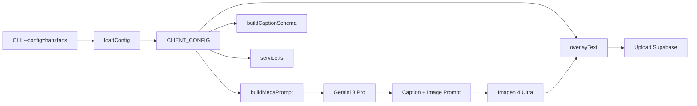

# Instagram Content Engine — Dokumentace

## Přehled

Config-driven AI engine pro generování Instagram obsahu. Každý klient má vlastní konfigurační soubor — engine je univerzální.

## Architektura

```
instagram/
├── autopilot.ts          # Hlavní generační engine (config-driven)
├── gemini-client.ts      # Gemini API wrapper
├── text-overlay.ts       # Text overlay na obrázky (config-driven)
├── service.ts            # Supabase CRUD operace
├── product-generator.ts  # Generátor z produktového katalogu
├── types.ts              # TypeScript typy (BrandVoice, Hooks, Tones)
├── index.ts              # Re-exporty
├── fonts/                # Fonty + logo watermarky per klient
│   ├── Inter-Bold.ttf
│   ├── logo-watermark.png      # Mobilnamiru logo
│   └── logo-hanzfans.png       # HanzFans logo
├── configs/
│   ├── types.ts          # ClientConfig interface
│   ├── index.ts          # Config loader (loadConfig)
│   ├── mobilnamiru.ts    # Config: Mobil na míru
│   └── hanzfans.ts       # Config: HanzFans
└── docs/
    ├── README.md          # Tato dokumentace
    └── new-client-guide.md # Návod na přidání nového klienta
```

## Jak to funguje



1. CLI načte config podle `--config=nazev`
2. Engine čte VŠECHNO z `CLIENT_CONFIG` — žádné hardcoded hodnoty
3. AI generuje obsah na základě brand voice, content pillars, feed aesthetic
4. Obrázky dostanou gradient overlay a text v barvách klienta
5. Hotový post se uloží do Supabase s `project_id = config.id`

## CLI příkazy

```bash
# Generovat 1 post (mobilnamiru = default)
npx tsx instagram/autopilot.ts

# Generovat 3 posty pro HanzFans
npx tsx instagram/autopilot.ts --config=hanzfans --count=3

# Dry run (negeneruje obrázek, neukládá do DB)
npx tsx instagram/autopilot.ts --config=hanzfans --dry-run

# Konkrétní typ postu
npx tsx instagram/autopilot.ts --config=hanzfans --type=product_drop

# S konkrétním tématem
npx tsx instagram/autopilot.ts --config=mobilnamiru --topic="iOS 20 Focus Mode"

# Produktový generátor (pro eshop klienty)
npx tsx instagram/product-generator.ts --config=hanzfans --count=3
```

## Environment Variables

```env
GEMINI_API_KEY=            # Google AI Studio API key
NEXT_PUBLIC_SUPABASE_URL=  # Supabase project URL
SUPABASE_SERVICE_ROLE_KEY= # Supabase service role key (bypasses RLS)
```

## Databázové tabulky

| Tabulka | Účel |
|---------|------|
| `ig_posts` | Vygenerované posty (caption, image_url, score, project_id) |
| `ig_post_ideas` | Banka nápadů per klient |
| `ig_post_types` | Definice typů postů (název, pilíř) |
| `ig_reviews` | AI recenze vygenerovaných postů |
| `ig_content_calendar` | Plánovací kalendář |

Všechny tabulky mají `project_id` sloupec pro multi-tenant filtrování.

## Přidání nového klienta

→ Kompletní návod: [new-client-guide.md](./new-client-guide.md)
